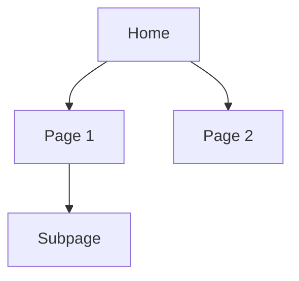

# Navigation IA

## Primary Navigation

```
📊 [Page 1]
├── [Subpage 1.1]
└── [Subpage 1.2]
🔍 [Page 2]
📁 [Page 3]
⚙️ [Settings]
```

## Navigation Groups

| Group | Pages | Target Persona |
|-------|-------|----------------|
| [Group 1] | [Page list] | [Persona] |
| [Group 2] | [Page list] | [Persona] |

## Permission-Based Visibility

| Navigation Item | Required Permission | Fallback |
|-----------------|---------------------|----------|
| [Item 1] | `[scope]:read` | Hidden |
| [Item 2] | `[scope]:admin` | Hidden |

## Page Hierarchy



## Breadcrumb Patterns

| Page | Breadcrumb |
|------|------------|
| [Page 1] | Home |
| [Subpage] | Home → Page 1 → Subpage |
