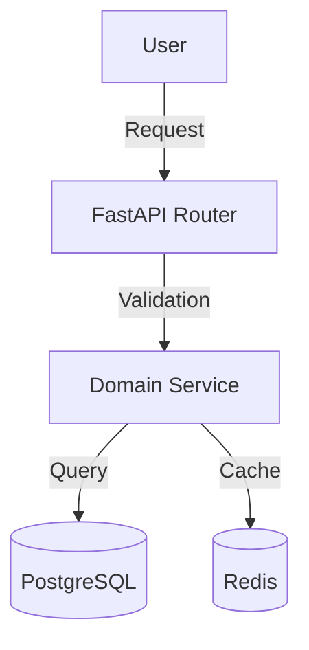

# Architecture

## Data Flow

## Key Components

| Component | File | Description |
|-----------|------|-------------|
| **Router** | `routers/[name].py` | HTTP endpoints |
| **Service** | `services/[name].py` | Business logic |
| **Model** | `models/[name].py` | SQLAlchemy entities |
| **Schema** | `schemas/[name].py` | Pydantic models |

## Key Business Rules

- **Rule 1**: [Description]
- **Rule 2**: [Description]

## Observability

### Audit Logs

| Event | Payload |
|-------|---------|
| `[event.name]` | `actor_id`, `target_id`, `changes` |

### Metrics

- `[metric_name]` - [Description]

## Testing

### Critical Scenarios

| Scenario | Expected |
|----------|----------|
| `[test_case]` | [Result] |

### Test Location

- `backend/tests/e2e_api/.../test_[feature].py`

## Dependencies

- **Internal**: [Other modules]
- **External**: [Stripe, Firebase, etc.]
- **Env Vars**: `[VAR_NAME]`
