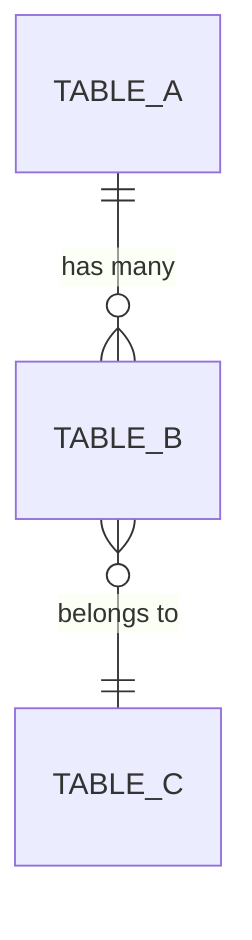

# Database Schema

**Schema**: `[schema_name]`

## Tables

### [table_name]

| Column | Type | Description |
|--------|------|-------------|
| `id` | UUID | Primary key |
| `tenant_id` | UUID | FK to tenants (RLS) |
| `[column]` | [type] | [description] |
| `created_at` | TIMESTAMP | Creation time |
| `updated_at` | TIMESTAMP | Last update |

**Indexes:**
- `idx_[table]_tenant_id` on `tenant_id`
- `idx_[table]_[column]` on `[column]`

**RLS Policy:**
- Enabled, filtered by `tenant_id`

---

### [another_table]

*(Repeat structure)*

---

## Relationships

