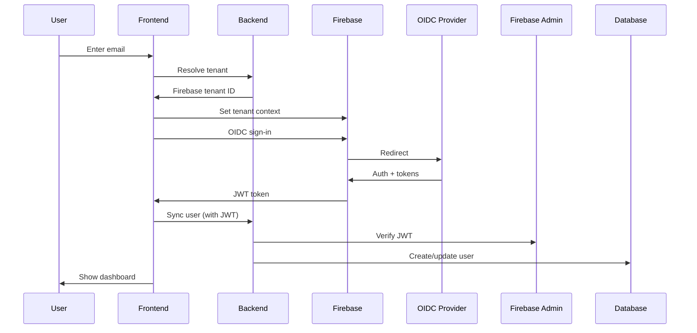

# Enterprise SSO - Multi-Tenant SaaS with Automated Onboarding

Enterprise-grade multi-tenant SaaS application with **automated tenant provisioning**, SSO using OIDC, and Firebase Identity Platform.

## 🎯 Key Features

- **Automated Tenant Onboarding** - CLI-driven tenant provisioning with zero manual configuration
- **Multi-Tenant Architecture** - Complete data isolation per tenant
- **Firebase GCIP** - Google Cloud Identity Platform for enterprise SSO
- **OIDC Integration** - Auth0, Okta, Azure AD, Google Workspace support
- **Activation Workflow** - Self-service tenant activation via email link
- **Invitation System** - Role-based user invitations with email workflow
- **Stateless JWT Auth** - No session management, fully scalable

---

## 🏗️ Architecture Overview

### Tech Stack

**Backend:**
- **FastAPI** - Modern async Python web framework
- **PostgreSQL** - Multi-tenant data storage with SQLAlchemy ORM
- **Firebase Admin SDK** - JWT validation & tenant management
- **Resend** - Transactional email service
- **Docker** - Containerized deployment

**Frontend:**
- **React 18** - Modern UI framework
- **Firebase SDK** - Client-side authentication
- **React Router** - SPA routing

### Multi-Tenancy Model

```
Company A (tenant_id=1)                     Company B (tenant_id=2)
├── Firebase Tenant: CompanyA-abc123       ├── Firebase Tenant: CompanyB-xyz789
├── OIDC Provider: Auth0                    ├── OIDC Provider: Okta
├── Domain: companya.com                    ├── Domain: companyb.com
├── Users:                                  ├── Users:
│   ├── admin@companya.com (admin)         │   ├── admin@companyb.com (admin)
│   └── user@companya.com (member)         │   └── user@companyb.com (member)
└── Data: Isolated in PostgreSQL            └── Data: Isolated in PostgreSQL
```

---

## 🚀 Quick Start

### Prerequisites
- Docker & Docker Compose
- Node.js 16+ (use `nvm use`)
- Firebase Admin SDK credentials
- Auth0/Okta/Azure tenant (for OIDC)

### 1. Initial Setup

```bash
# Clone and setup environment
git clone <repo>
cd enterprisesso
make setup

# Edit environment files
nano .env              # Database credentials
nano backend/.env      # Firebase project ID, secrets
nano frontend/.env     # Firebase web config

# Add Firebase credentials
# Download from Firebase Console → Project Settings → Service Accounts
# Save as: secrets/firebase-credentials.json
```

### 2. Start Services

```bash
# Start backend (PostgreSQL + FastAPI)
make up

# Run database migrations
make migrate

# Start frontend (new terminal)
cd frontend && npm start
```

**Access:**
- Frontend: http://localhost:3000
- Backend API: http://localhost:8000
- API Docs: http://localhost:8000/docs

---

## 📝 Tenant Provisioning Workflow

### Sales Team Creates Tenant

The sales team uses the CLI to provision a new tenant:

```bash
docker-compose exec backend python -m cli.tenant_cli create \
  --company "Acme Corporation" \
  --domain "acme.com" \
  --admin-email "admin@acme.com" \
  --oidc-provider "auth0" \
  --oidc-client-id "your_client_id" \
  --oidc-client-secret "your_secret" \
  --oidc-issuer "https://acme.auth0.com"
```

**What happens automatically:**
1. ✅ Creates Firebase GCIP tenant
2. ✅ Configures OIDC provider in Firebase
3. ✅ Generates secure activation token
4. ✅ Creates database records (tenant, invitation)
5. ✅ Sends activation email to admin

**Output:**
```
======================================================================
✅ TENANT PROVISIONED SUCCESSFULLY
======================================================================
Company:          Acme Corporation
Firebase Tenant:  AcmeCorporation-abc123
OIDC Provider:    oidc.auth0
Activation URL:   http://yourapp.com/activate/TOKEN
Expires:          2025-11-25 12:00 UTC
======================================================================
```

### Admin Activates Account

1. **Admin receives email** with activation link
2. **Clicks link** → Validates token, shows welcome screen
3. **Clicks "Get Started"** → SSO login popup opens
4. **Logs in via OIDC** → Firebase creates user
5. **Clicks "Activate Account"** → Tenant goes live!
6. **Redirected to dashboard** → Ready to use

---

## 🔧 Development & Testing

### Quick Testing Iteration

For rapid testing without creating new Firebase tenants:

```bash
# Interactive reset & create
make reset-db

# When prompted:
# - Create tenant? y
# - Firebase Tenant ID: <existing tenant ID>
# - OIDC Provider ID: oidc.auth0
# - Company: Test Company
# - Domain: test.com
# - Admin Email: admin@test.com

# Copy activation URL from console
# Test activation flow in browser
```

### Available Commands

```bash
make help            # Show all commands
make up              # Start backend services
make down            # Stop services
make logs            # View backend logs
make migrate         # Run database migrations
make reset-db        # Reset DB (interactive)
make shell           # Backend shell
make db-shell        # PostgreSQL shell
make frontend-start  # Start frontend dev server
make status          # Show service status
```

### Testing Workflow

See comprehensive guides:
- **[Development Guide](./docs/development-guide.md)** - Setup, database, CLI, testing
- **[Testing Workflow](./docs/testing-workflow.md)** - Tenant creation, activation flow
- **[E2E Test Guide](./docs/e2e-activation-test.md)** - Step-by-step activation testing

---

## 🏢 How It Works

### 1. Tenant Resolution

User enters email → System looks up tenant by domain:

```python
email: "user@acme.com"
→ domain: "acme.com"
→ tenant: Acme Corporation
→ firebase_tenant_id: "AcmeCorporation-abc123"
→ oidc_provider_id: "oidc.auth0"
```

### 2. SSO Authentication Flow



### 3. Multi-Tenant Data Isolation

All database queries scoped by `tenant_id`:

```sql
-- Users can only access their tenant's data
SELECT * FROM users WHERE tenant_id = {current_tenant_id};
SELECT * FROM invitations WHERE tenant_id = {current_tenant_id};
```

JWT tokens contain tenant information for automatic filtering.

---

## 📊 Database Schema

### Core Tables

**tenants**
- Stores company information
- Links to Firebase GCIP tenant
- Activation status & tokens

**users**
- Multi-tenant user records
- Maps email → firebase_uid
- Role-based access (admin/manager/member)

**invitations**
- Pending user invitations
- Role assignment
- Email-based workflow

See [Database Migrations](./backend/app/migrations/) for complete schema.

---

## ✨ Features

### Authentication & Authorization
- 🔐 **Firebase GCIP Integration** - Multi-tenant SSO with OIDC
- 🏢 **Tenant Management** - Isolated workspaces per organization
- 👤 **Role-Based Access** - Admin, Manager, Member roles
- 🎫 **JWT Validation** - Secure token-based authentication

### Admin Dashboard
- 📊 **Statistics Dashboard** - Real-time user & invitation metrics
- 🎨 **Professional UI** - Sidebar navigation, clean design
- 👥 **User Management** - View, search, filter all users
- 📧 **Invitation System** - Send, track, manage user invitations
- 🏷️ **Color-Coded Badges** - Role and status visualization
- 🔍 **Advanced Filters** - Search by name, email, role, status

### User Invitations
- ✉️ **Email Invitations** - Invite users via email
- 🔗 **Secure Tokens** - URL-safe invitation links
- ⏰ **Expiration Management** - 7-day invitation expiry
- 🔄 **Resend Capability** - Re-send pending invitations
- ✅ **SSO Integration** - Seamless login after acceptance

### Developer Experience
- 🐳 **Docker Compose** - One-command deployment
- 🛠️ **CLI Tools** - Tenant provisioning utilities
- 📝 **SQLAlchemy ORM** - Type-safe database operations
- 🔄 **Hot Reload** - Fast development iteration

## 🔐 Security Features

- **JWT-based auth** - Stateless, scalable authentication
- **Firebase Admin SDK** - Cryptographically verified tokens
- **PKCE flow** - Automatic in Firebase SDK
- **Multi-tenant isolation** - Data scoping by tenant_id
- **Role-based access** - Admin/manager/member permissions
- **Activation tokens** - Time-limited, single-use
- **Invitation tokens** - Secure user onboarding

---

## 🎓 Project Structure

```
enterprisesso/
├── backend/
│   ├── app/
│   │   ├── routers/          # API endpoints
│   │   │   ├── auth.py       # Authentication
│   │   │   └── activation.py # Tenant activation
│   │   ├── services/         # Business logic
│   │   │   ├── tenant_service.py
│   │   │   ├── user_service.py
│   │   │   └── invitation_service.py
│   │   ├── middleware/       # Auth middleware
│   │   ├── migrations/       # SQL migrations
│   │   ├── db_models.py      # SQLAlchemy models
│   │   └── main.py           # FastAPI app
│   ├── cli/
│   │   ├── tenant_cli.py     # Provisioning CLI
│   │   └── email_service.py  # Email sending
│   └── Dockerfile
├── frontend/
│   ├── src/
│   │   ├── components/
│   │   │   ├── LoginPage.js
│   │   │   ├── Dashboard.js
│   │   │   └── ActivationPage.js
│   │   ├── services/
│   │   │   ├── api.js
│   │   │   └── firebaseAuthService.js
│   │   └── App.js
│   └── package.json
├── secrets/
│   ├── firebase-credentials.json  # Firebase Admin SDK
│   └── README.md
├── docs/
│   ├── development-guide.md       # Development & testing
│   ├── testing-workflow.md        # Testing procedures
│   └── e2e-activation-test.md     # E2E test guide
├── Makefile                       # Development commands
├── docker-compose.yml
└── README.md
```

---

## 🔧 CLI Tools

### Tenant Management

```bash
# Create tenant (full setup)
docker-compose exec backend python -m cli.tenant_cli create \
  --company "..." --domain "..." --admin-email "..." \
  --oidc-provider "auth0" --oidc-client-id "..." \
  --oidc-client-secret "..." --oidc-issuer "..."

# Create tenant (testing - reuse Firebase)
docker-compose exec backend python -m cli.tenant_cli create-local \
  --firebase-tenant-id "Existing-abc123" \
  --oidc-provider-id "oidc.auth0" \
  --company "..." --domain "..." --admin-email "..."

# List tenants
docker-compose exec backend python -m cli.tenant_cli list-tenants \
  --domain company.com
```

---

## 📚 Documentation

- **[Development Guide](./docs/development-guide.md)** - Complete development & testing guide
- **[Testing Workflow](./docs/testing-workflow.md)** - Tenant provisioning & testing procedures
- **[E2E Test Guide](./docs/e2e-activation-test.md)** - Step-by-step activation flow testing
- **[API Documentation](http://localhost:8000/docs)** - Interactive Swagger docs (when running)

---

---

## 📝 Recent Updates (Nov 2025)

### ✅ Invitation System Fixes
- **Fixed:** New users no longer need to login twice to accept invitations
- **Fixed:** UUID type validation errors resolved
- **Improved:** Simplified invitation endpoint logic for better performance

See [CHANGELOG.md](./CHANGELOG.md) for complete details.

---

## 🐛 Troubleshooting

### Recent Issues (Fixed)

**"User not found" when accepting invitation**
- ✅ **Fixed in latest version** - Users are now created automatically when accepting invitations
- No longer requires second login attempt

**UUID validation errors**
- ✅ **Fixed in latest version** - All backend services now use correct UUID types

### Backend Issues

```bash
# View logs
make logs

# Check database
make db-shell

# Restart services
make restart
```

### Activation Issues

**"Invalid activation token"**
- Token expired (48-hour limit)
- Database reset invalidated token
- Solution: Create new tenant or new activation token

**"Only admins can activate tenants"**
- User created with wrong role
- Invitation not found before SSO login
- Solution: Ensure invitation exists before user logs in

### Common Tasks

```bash
# Reset database (testing)
make reset-db

# View user roles
docker-compose exec -T postgres psql -U sso_user -d sso_db -c \
  "SELECT email, role FROM users;"

# Check activation status
docker-compose exec -T postgres psql -U sso_user -d sso_db -c \
  "SELECT name, activation_status, activated_at FROM tenants;"
```

See [Development Guide](./docs/development-guide.md) for complete troubleshooting.

---

## 🚢 Production Deployment

### Environment Configuration

1. **Secure secrets** - Use environment variables or secret managers
2. **Firebase credentials** - Mounted read-only, proper permissions
3. **RESEND_API_KEY** - Configure for email delivery
4. **Database** - Use managed PostgreSQL (RDS, Cloud SQL)
5. **HTTPS** - Required for production SSO
6. **Firebase domains** - Add authorized domains in console

### Pre-Launch Checklist

- [ ] Strong database passwords
- [ ] Production Firebase project
- [ ] Resend API configured
- [ ] HTTPS enabled
- [ ] OIDC redirect URIs configured
- [ ] Database backups enabled
- [ ] Monitoring/logging setup
- [ ] Load testing completed

---

## 📄 License

MIT

---

## 🆘 Support

- **Issues:** Check [troubleshooting section](#-troubleshooting)
- **Docs:** See [documentation](#-documentation)
- **API:** http://localhost:8000/docs (interactive)
- **Development:** See [Development Guide](./docs/development-guide.md)

---

**Built with ❤️ for enterprise multi-tenant SaaS**
