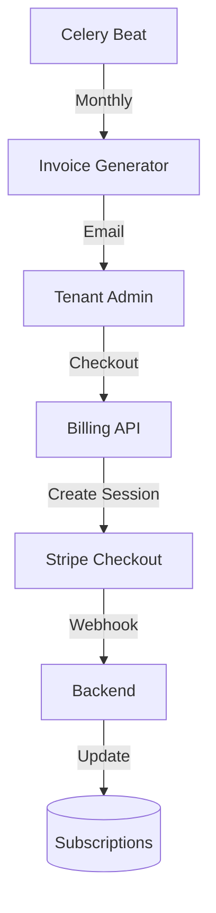

# Billing & Subscriptions (B2B)

## 1. Context
### Goal
Manage tenant-level subscriptions, invoice generation, and payment processing, supporting both localized Stripe payments and manual invoicing.

### User Stories
- **As a Tenant Admin**, I want to subscribe to a tier so that I can access premium features.
- **As a System Admin**, I want to generate invoices automatically so that I don't have to manually calculate costs.
- **As a CFO**, I want to download invoices in PDF format so that I can process expenses.

### Key Business Rules
**1. Pricing Model**:
- **Formula**: `Base Price + (Active Seats × Per-Seat Price)`.
- **Tiers**:
  - **Starter**: Free, limited features.
  - **Professional**: $50/mo + $20/seat. Invoice or Card.
  - **Enterprise**: $200/mo + $50/seat.
- **Yearly Discount**: 2 months free.

**2. Seat Management**:
- Active Seats (`is_active=true`) are counted daily.
- Mid-cycle additions are billed in the next cycle (Snapshot model).

**3. Payment Modes**:
- **Card**: Auto-charged via Stripe.
- **Invoice**: Net 30 terms, manual wire/check.

## 2. Architecture
### Data Flow

### Invoice Lifecycle
Values: `draft` -> `sent` -> `paid` | `overdue` -> `void`.
- **Generation**: 1st of month.
- **Overdue**: Past due date (automated check).

## 3. Database Schema
**Schema**: `b2b`

| Table Name | Description | Key Columns |
| :--- | :--- | :--- |
| `subscriptions` | Active plans | `id`, `tenant_id`, `tier`, `status`, `current_period_end` |
| `invoices` | Billing records | `id`, `subscription_id`, `amount_due`, `status`, `invoice_url` |
| `coupons` | Discounts | `code`, `discount_type`, `amount` |

## 4. API Reference
| Method | Endpoint | Description | Permission |
| :--- | :--- | :--- | :--- |
| **Tenant** | | | |
| `GET` | `/api/b2b/billing/subscription` | Get status | `billing:read` |
| `POST` | `/api/b2b/billing/checkout` | Start Stripe flow | `billing:write` |
| `GET` | `/api/b2b/billing/invoices` | List invoices | `billing:read` |
| **Platform** | | | |
| `GET` | `/api/platform/billing/profiles` | Search tenants | `platform:admin` |
| `POST` | `/api/platform/billing/invoices/{id}/send` | Email invoice | `platform:admin` |

## 5. Dependencies
- **Internal**: `services.tenants`, `tasks.billing`
- **External**: Stripe (Payments/Webhooks)
- **Env Vars**: `STRIPE_SECRET_KEY`, `STRIPE_WEBHOOK_SECRET`
