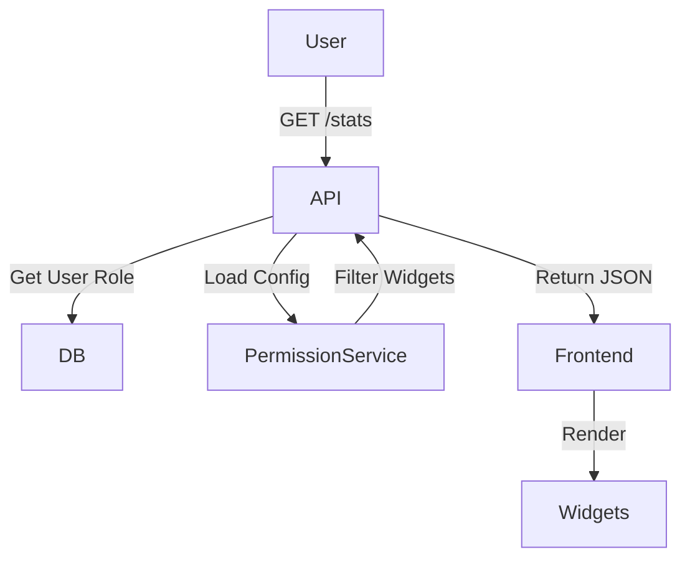

# Dashboard (B2B)

## 1. Context
### Goal
Provide role-appropriate views for all users, highlighting relevant information and actions based on responsibilities.

### Target Platform
- [x] Web
- [x] Mobile (iOS/Android)
- [ ] Backend API Only

### User Stories
- **As an Owner**, I want an Billing & Health overview.
- **As an Admin**, I want to see pending User Invites.
- **As a Member**, I want to see **My Teams** and **My Tasks**.

### Key Business Rules
**1. Progressive Disclosure**:
- Members should NOT see Billing or Org Health.
- Only show widgets relevant to the user's role.

**2. Widget Permissions**:
- **Owner**: Full visibility (Org Health, Billing, Audit).
- **Admin**: Ops visibility (Users, Teams, Activity).
- **Member**: Team Scoped (My Teams, My Tasks).

## 2. Architecture
### Data Flow


### Widget Configuration
Backend returns a JSON structure defining which widgets to render.

## 3. API Reference
| Method | Endpoint | Description | Permission |
| :--- | :--- | :--- | :--- |
| `GET` | `/api/b2b/dashboard/stats` | Get Dynamic Stats | `dashboard:read` |

### Response Structure (Concept)
```json
{
  "role": "member",
  "widgets": {
    "my_teams": [...],
    "my_tasks": {"assigned": 5}
  }
}
```

## 4. UI Requirements (Optional)
### Components
- `DashboardGrid`: Responsive grid container.
- `StatCard`: Standard metric display.
- `ActivityFeed`: List of recent events.

### UX Rules
- **Empty States**: If a user has no tasks, show "Create your first task" CTA.
- **Loading**: Show skeleton loaders for specific widgets.

## 5. Observability & Audit
*(If not applicable, write "Not Applicable")*

### Not Applicable
(Dashboard is read-only visualization)

## 6. Testing
### Critical Scenarios
- `Stats_Owner`: Verify Org Health + Billing visible.
- `Stats_Member`: Verify only Team widgets visible.
- `Stats_Viewer`: Verify Read-Only widgets.

### Test Location
- `backend/tests/e2e_api/b2b/test_dashboard.py`

## 7. Extensions
*(If not applicable, write "Not Applicable")*

### Not Applicable

## 8. Dependencies
- **Internal**: `services.dashboard_service`, `services.b2b.rbac`
