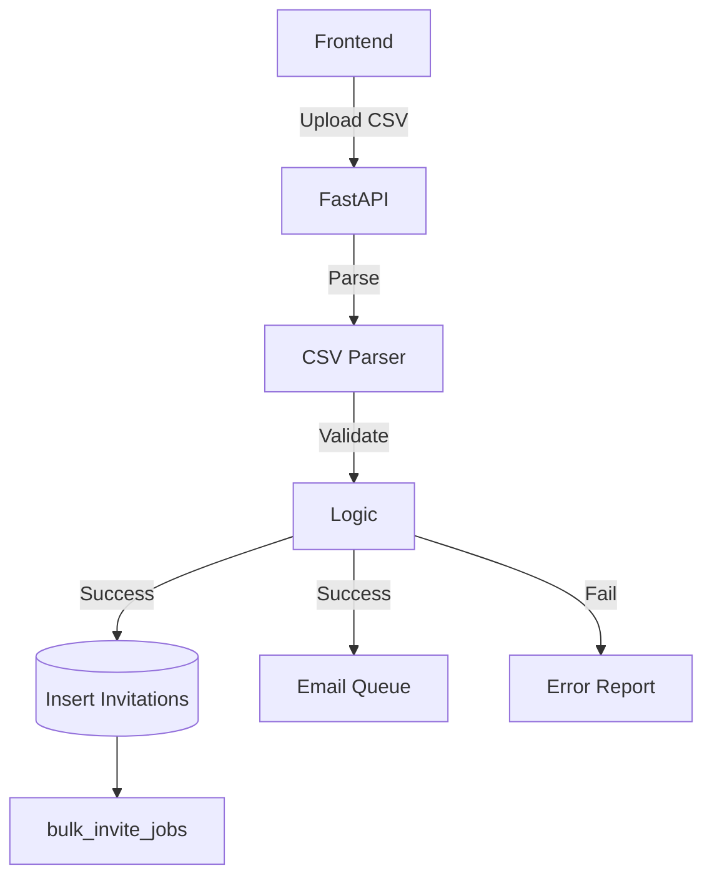

# Bulk User Invitations (B2B)

## 1. Context
### Goal
Enable administrators to invite multiple users simultaneously via CSV file upload, streamlining the onboarding process for teams with many users.

### User Stories
- **As an Admin**, I want to invite multiple users at once so that I can onboard entire teams efficiently.
- **As an Admin**, I want to see validation errors before sending invites so that I can correct mistakes.
- **As an Admin**, I want to assign different roles and teams to different users in bulk so that I have flexibility in team organization.

### Key Business Rules
**1. CSV Format Requirements**:
- Required: `email`, `role` (owner, admin, member, viewer).
- Optional: `team_name` (auto-creates if missing), `team_role`, `name`.
- Limit: Max 100 rows, 2MB file size.

**2. Validation Logic**:
- Emails must match Tenant Domain.
- Emails must not be already registered or pending.
- Users cannot invite roles higher than their own (RBAC).

**3. Processing Logic**:
- **Partial Processing**: Valid rows are processed; invalid rows are reported.
- **No File Storage**: CSV is parsed in memory and discarded. Results stored in `bulk_invite_jobs`.

## 2. Architecture
### Data Flow

## 3. Database Schema
**Schema**: `b2b`

| Table Name | Description | Key Columns |
| :--- | :--- | :--- |
| `invitations` | Pending invites | `id`, `email`, `token`, `status`, `expires_at` |
| `bulk_invite_jobs` | Audit record of bulk ops | `id`, `results` (JSON), `successful_count`, `failed_count` |

## 4. API Reference
| Method | Endpoint | Description | Permission |
| :--- | :--- | :--- | :--- |
| `POST` | `/api/b2b/invitations/bulk` | Upload CSV for processing | `users:invite` |
| `GET` | `/api/b2b/invitations/bulk/{job_id}` | Get bulk job status | `users:invite` |
| `POST` | `/api/b2b/invitations` | Single user invite | `users:invite` |

## 5. Observability & Audit
### Audit Logs
- **Event**: `user.invited`
- **Payload**: `[actor_id, tenant_id, target_email, role]`
- **Event**: `bulk_invite.processed`
- **Payload**: `[job_id, success_count, fail_count]`

## 6. Testing
### Critical Scenarios
- `BulkInvite_Success`: Large clean CSV.
- `BulkInvite_ValidationErrors`: CSV with duplicates/bad domains.
- `BulkInvite_RoleEscalation`: Member trying to invite Admin (Deny).
- `Accept_Success`: Valid token acceptance.
- `Accept_Expired`: Invalid token handling.

### Test Location
- `backend/tests/e2e_api/b2b/test_invitations.py`

## 7. Dependencies
- **Internal**: `modules.b2b.services.invitation_service`
- **External**: Celery (Email sending), SendGrid/SMTP
