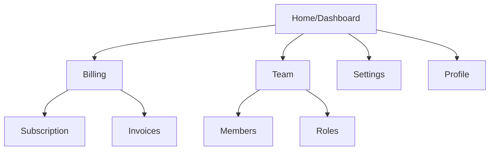

# Navigation IA

## Primary Navigation

```
📊 Dashboard
👥 Team
├── Members
├── Roles
└── Groups
💳 Billing
├── Subscription
├── Invoices
└── Payment Methods
⚙️ Settings
├── General
├── Security
└── Audit Logs
👤 Profile
```

## Navigation Groups

| Group | Pages | Target Persona |
|-------|-------|----------------|
| **Admin** | Billing, Team, Settings (General, Security) | Tenant Owner |
| **User** | Dashboard, Profile | All Users |

## Permission-Based Visibility

| Navigation Item | Required Permission | Fallback |
|-----------------|---------------------|----------|
| Billing | `billing:read` | Hidden |
| Team | `users:read` | Hidden |
| Settings | `tenant:admin` | Hidden |
| Audit Logs | `audit:read` | Hidden |

## Page Hierarchy



## Breadcrumb Patterns

| Page | Breadcrumb |
|------|------------|
| Dashboard | Home |
| Invoices | Home → Billing → Invoices |
| Members | Home → Team → Members |
