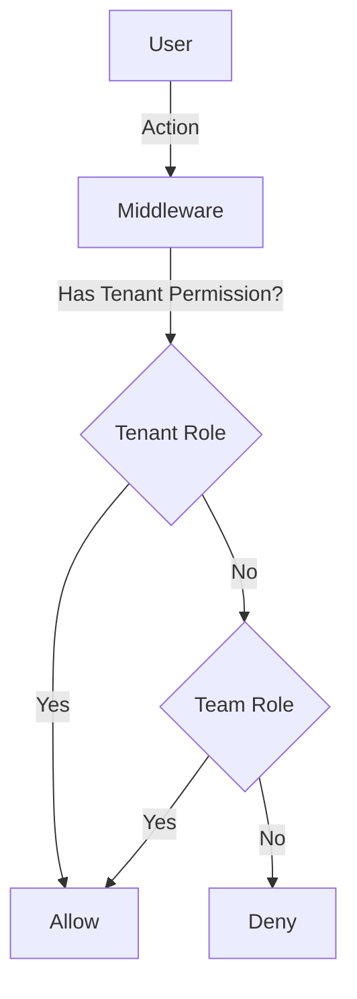

# Role-Based Access Control (RBAC)

## 1. Context
### Goal
Provide a flexible, two-dimensional access control system (Permission + Scope) that supports complex Enterprise scenarios (Banks, Healthcare) as well as simple SME setups (Agencies).

### User Stories
- **As a System Admin**, I want to define custom roles so that I can match the client's organizational hierarchy.
- **As a Compliance Officer**, I want to ensure IT Admins cannot see Business Data (Separation of Duties).
- **As a Team Manager**, I want to assign specific roles within my team (e.g., Reader vs Contributor).

### Key Business Rules
**1. Two-Dimensional Access**:
- **Permission**: "Can I do X?" (Controlled by Tenant Role).
- **Scope**: "On which data?" (Controlled by Team Membership).

**2. Separation of Duties (SoD)**:
- Critical for Regulated Industries (e.g., Bank).
- `IT Admin` has Platform Permissions (Billing, Users) but NO Business Access.
- `Business User` has Business Access (Reports, Alerts) but NO Platform Access.
  
**3. Configuration Loading**:
- Roles are seeded from YAML files (`backend/scripts/b2b`).
- **Loading Order**: `core/` (Base) -> `use_cases/` OR `domain/` (Custom).

## 2. Architecture
### Data Model
**Schema**: `b2b`

| Table Name | Description | Key Columns |
| :--- | :--- | :--- |
| `role_templates` | Global definitions | `name`, `permissions` (JSONB), `is_system_role` |
| `roles` | Tenant-specific instances | `id`, `tenant_id`, `name`, `permissions` |
| `team_role_definitions` | Team-level role defs | `id`, `tenant_id`, `name`, `permissions` |
| `users` | User Assignment | `id`, `role_id` (Tenant Role) |
| `team_members` | Team Assignment | `users_id`, `team_id`, `team_role_id` |

### JSONB Permissions
```json
{
  "permissions": [
    { "resource": "investigations", "actions": ["read", "approve"] }
  ]
}
```

### Permission Check Flow


```python
if has_tenant_permission(user, "investigations", "approve"):
    # Allow Tenant-wide action
if has_team_permission(user, team_id, "tasks", "write"):
    # Allow Team-specific action
```

## 3. Configuration & Plugin Architecture
The system supports "Use Case Plugins" to adapt RBAC for different industries (Banks, Agencies, SaaS).

### Directory Structure
```
backend/scripts/b2b/
├── core/                # Base Roles (Owner, Admin)
├── domain/              # Current Production Config
└── use_cases/           # Plugins (Bank, Marketing, etc.)
```

### Plugin Mechanism
1. **Selection**: Set `USE_CASE=bank_surveillance`.
2. **Seeding**: The script loads `use_cases/bank_surveillance/tenant_roles.yaml` instead of base roles.
3. **Outcome**: The Tenant gets industry-specific roles (e.g., `surveillance_chief`) while keeping core platform capabilities.

## 4. Dependencies
- **Internal**: `middleware.rbac`, `services.authentication`
- **External**: None
