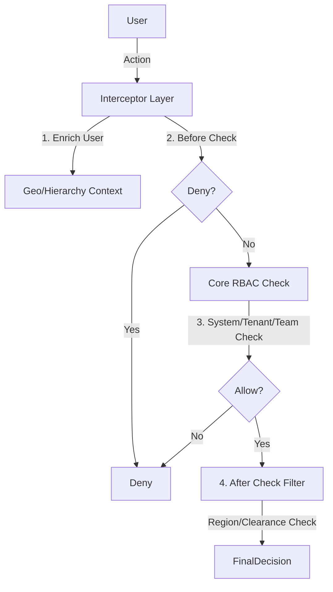

# Role-Based Access Control (RBAC)

## 1. Context
### Goal
Provide a flexible, 3-Layer access control system that scales from simple Agency models to complex Banking hierarchies.

### User Stories
- **As a Compliance Officer**, I want to ensure IT Admins cannot see Investigation Data (Separation of Duties).
- **As a Regional Director**, I want to oversee all desks in my region without joining them (Hierarchy).
- **As a System Admin**, I want to restrict access based on Data Sensitivity (Classification).

### Key Business Rules
**1. Three-Layer Model**:
- **Layer 1: System Role** (Can Login?).
- **Layer 2: Business Role** (Action + Data Scope).
- **Layer 3: Plugins** (Enterprise Constraints).

**2. Separation of Duties**:
- Critical for Regulated Industries.
- `IT Admin` != `Business User`.

## 2. Architecture
### Permission Check Flow


### Database Schema
**Schema**: `b2b` (Core Tables)
- `roles` (Tenant Roles)
- `team_roles` (Team Definitions)
- `team_members` (Assignments)

**Schema**: `tenant_settings` (Plugin Config)
- `enabled_plugins` (List[String])
- `plugin_config` (JSONB)

## 3. Plugin Architecture (Extensions)
The system uses an **Interceptor-based Plugin Layer** to handle complex enterprise logic.

### Interface
All plugins implement `RBACPlugin`:
1.  `enrich_user_context()`: Add scopes (e.g. `accessible_teams`).
2.  `before_permission_check()`: Short-circuit logic.
3.  `after_permission_check()`: Filter result (e.g. Geo Deny).

### Available Plugins
| Plugin | Purpose | Mechanism |
| :--- | :--- | :--- |
| **Hierarchical Teams** | Manager visibility | Auto-inherits access to child teams via `enrich_context` |
| **Geographic Boundaries** | Data Sovereignty | Compares User Region vs Data Region in `after_check` |
| **Data Classification** | Clearance Levels | Enforces Clearance >= Sensitivity in `before_check` |

### Configuration
Plugins are configured in `backend/scripts/b2b/use_cases/{case}/plugins.yaml`.
**Example (Bank Surveillance)**:
```yaml
hierarchical_teams:
  max_depth: 3
geographic_boundaries:
  regions: ["APAC", "EMEA"]
  strict: true
```

## 4. Dependencies
- **Internal**: `middleware.rbac`, `services.plugin_service`
