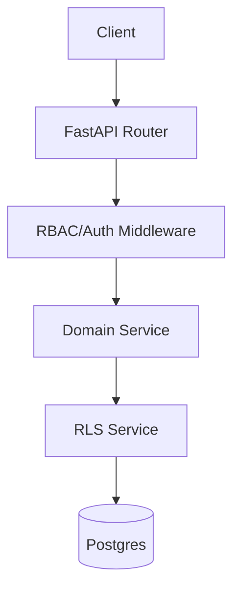

# B2B Architecture

## Overview

The B2B module follows a **Layered Architecture** with strict Multi-Tenant Isolation.



## Security & Isolation

### Row Level Security (RLS)
We enforce tenant isolation at dinner database level. Every connection is scoped:

```python
await rls_service.set_tenant_context(db, tenant_id)
# Queries without tenant_id will fail
```

### RBAC Plugin Layer
We use an Interceptor-based Plugin Layer for complex permission logic (Geo-fencing, Hierarchies).

## Components

| Component | Responsibility | Key Dependencies |
|-----------|----------------|------------------|
| **Auth Service** | Identity, SSO, Firebase Sync | Firebase Admin |
| **RBAC Service** | Permission Checks, Role Management | Plugin Service |
| **Billing Service** | Subscriptions, Invoicing | Stripe |
| **Tenant Service** | Onboarding, Activation | SendGrid |

## Testing

| Scope | Location | Focus |
|-------|----------|-------|
| **E2E API** | `tests/e2e_api/b2b/` | Full flow validation (Signup -> Billing) |
| **Unit** | `tests/units/b2b/` | Business logic (Pricing formula, Permissions) |
