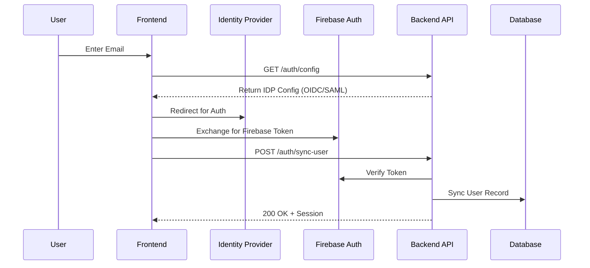

# Authentication Technical Spec

## Data Flow



## Security (RLS)
The database enforces isolation via `app.current_tenant_id`.
```python
await rls_service.set_tenant_context(db, tenant_id)
# Only then query execution is allowed
```

## Database Schema

**Schema**: `b2b`

| Table Name | Description | Key Columns |
| :--- | :--- | :--- |
| `users` | User Identity | `id`, `email`, `firebase_uid`, `tenant_id`, `role_id` |
| `tenants` | Tenant Config | `id`, `domain`, `oidc_config`, `saml_config` |

## Dependencies
- **Internal**: `services.rls_service`, `services.user_service`
- **External**: Firebase / Google Cloud Identity Platform (GCIP)

## Observability
- **Event**: `user.login` (`[user_id, tenant_id, source(web/mobile), ip]`)
- **Event**: `user.synced` (`[uid, email, is_new]`)
