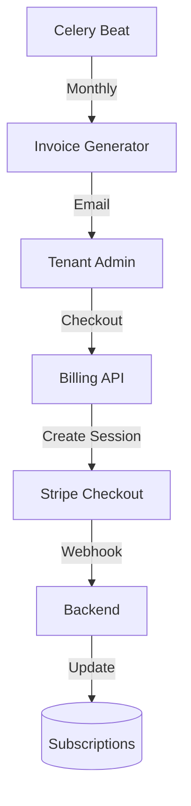

# Billing Technical Spec

## Data Flow

## Invoice Lifecycle
Values: `draft` -> `sent` -> `paid` | `overdue` -> `void`.
- **Generation**: 1st of month.
- **Overdue**: Past due date (automated check).

## Database Schema

**Schema**: `b2b`

| Table Name | Description | Key Columns |
| :--- | :--- | :--- |
| `subscriptions` | Active plans | `id`, `tenant_id`, `tier`, `status`, `current_period_end` |
| `invoices` | Billing records | `id`, `subscription_id`, `amount_due`, `status`, `invoice_url` |
| `coupons` | Discounts | `code`, `discount_type`, `amount` |

## Dependencies
- **Internal**: `services.tenants`, `tasks.billing`
- **External**: Stripe (Payments/Webhooks)
- **Env Vars**: `STRIPE_SECRET_KEY`, `STRIPE_WEBHOOK_SECRET`

## Observability
- **Event**: `subscription.upgrade` (`[user_id, tenant_id, old_tier, new_tier, amount]`)
- **Event**: `invoice.paid` (`[invoice_id, amount, currency]`)
- **Metric**: `active_subscriptions_total` (Gauge)
- **Metric**: `mrr_total` (Gauge)
