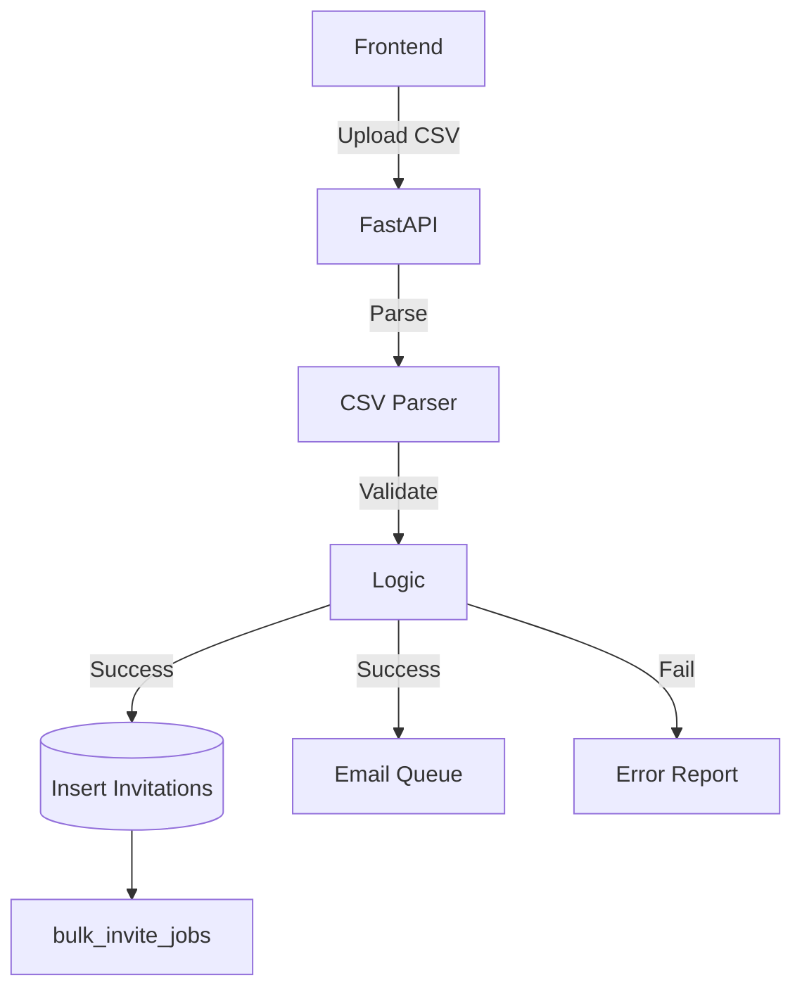

# Invitations Technical Spec

## Data Flow (Bulk Invite)

## Database Schema

**Schema**: `b2b`

| Table Name | Description | Key Columns |
| :--- | :--- | :--- |
| `users` | Tenant Members | `id`, `email`, `role_id`, `is_active` |
| `invitations` | Pending invites | `id`, `email`, `token`, `status`, `expires_at` |
| `bulk_invite_jobs` | Audit record of bulk ops | `id`, `results` (JSON), `successful_count`, `failed_count` |

## Security
- **RLS**: Strict tenant isolation on `users` table.
- **RBAC**: Endpoints protected by `users:write`, `users:invite`.
- **Validation**:
  - Emails must match Tenant Domain (if enforced).
  - Users cannot invite roles higher than their own.

## Observability
- **Event**: `user.invited` (`[actor_id, tenant_id, target_email, role]`)
- **Event**: `bulk_invite.processed` (`[job_id, success_count, fail_count]`)
- **Event**: `user.role_changed` (`[actor_id, target_user_id, old_role, new_role]`)
