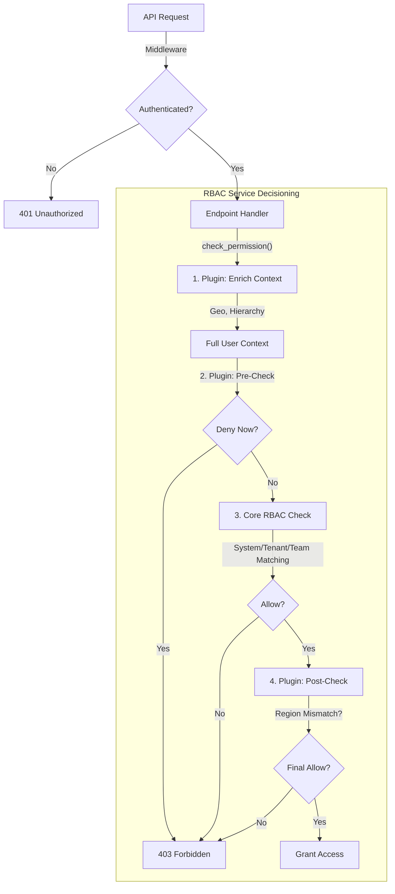

# RBAC Technical Specification & Feature Guide

**Target Audience:** Backend Developers & Architects  
**Scope:** B2B Module (Core + Enterprise Plugins)

## 1. Overview: The 3-Layer permission Model

The B2B module uses a **3-Layer RBAC Model** to handle complex enterprise requirements (Tenants, Teams, Geographies, Data Sensitivity) while keeping the core simple.

| Layer | Type | Responsibility | Example | Source of Data |
|-------|------|----------------|---------|----------------|
| **1** | **System Role** | Authentication & Billing | `tenant_owner` vs `member` | `users.role` column |
| **2** | **Business Role** | Functional Access | `surveillance_analyst` (Team Scope) | `team_members` table |
| **3** | **Plugin Layer** | Enterprise Constraints | `geographic_boundaries` (APAC-only) | `plugin_hooks` & `user_context` |

---

## 2. Permission Check Flow

The decisioning flow moves from global context down to specific data attributes.



### Data Sources & Storage

| Attribute | Storage Location | Loaded By |
|-----------|------------------|-----------|
| **Accessible Teams** | `teams.parent_team_id` (FK, recursion) | `HierarchicalTeamsPlugin` — adds `accessible_teams` (direct + managed children) |
| **Geography** | `users.geographic_scopes` (DB column, fallback) or derived from `accessible_teams` | `GeographicBoundariesPlugin` — reads scopes; validates in after-check |
| **Clearance** | `team_role_definitions.clearance_level` (Integer) | `DataClassificationPlugin` — takes **max** across user's team roles (default: 1/INTERNAL) |
| **Plugin Config** | `tenants.features['plugins']` (JSONB) | `TenantService` (at startup) |

### Enrichment Process
1.  **Login**: User authenticates via Firebase.
2.  **Middleware** (`b2b_auth.py`): Sets RLS context, looks up user, then calls `plugin_registry.enrich_user()`.
3.  **Plugin Enrichment** (runs once per request, result cached on `context_enriched` flag):
    - **Hierarchy**: `HierarchicalTeamsPlugin` queries `team_members → teams` to find direct memberships + child teams for manager roles. Injects `accessible_teams` list.
    - **Geography**: `GeographicBoundariesPlugin` validates plugin dependencies. It reads `geographic_scopes` from the user context (sourced from `user.geographic_scopes` DB column, or derived from `accessible_teams` when `hierarchical_teams` is enabled). Does **not** inject scopes — validates them in the after-check.
    - **Clearance**: `DataClassificationPlugin` queries all `team_role_definitions` the user belongs to and derives `clearance_level = max(team_role.clearance_level)`.
4.  **Ready**: Enriched user dict (with `accessible_teams`, `clearance_level`, `context_enriched=True`) is available to all permission checks in this request.

---

## 3. Real Example: Accessing an Alert

**Scenario**: A "Compliance Officer" in "APAC" tries to view a "Trading Alert" (High Sensitivity) from the "EMEA" region.

### Step 1: Router Call
```python
# routers/alerts.py
from modules.b2b.rbac.decorators import require_permission

@router.get("/alerts/{alert_id}")
async def get_alert(
    alert_id: UUID,
    current_user: dict = require_permission("alerts", "read"),
    db: AsyncSession = Depends(get_db)
):
    # require_permission runs the full 3-layer check including plugin hooks.
    # Plugin post-checks (geographic_boundaries, data_classification) receive
    # the resource object via extra_context if the router passes it.
    alert = await alert_service.get(db, alert_id)
    ...
```

### Step 2: Plugin Evaluation

1.  **Enrichment**:
    - `current_user.geographic_scopes` = `['APAC']` (Loaded from User profile)
    - `current_user.clearance_level` = `2` (Officer Level)

2.  **Pre-Check (Data Classification)**:
    - **Check**: User Level (2) vs Alert Level (3).
    - **Result**: `FAIL`. Level 2 < 3.
    - **Action**: Short-circuit -> **403 Forbidden**.

3.  **Post-Check (Geographic - if Pre-Check passed)**:
    - **Check**: User Scope (`APAC`) vs Resource Region (`EMEA`).
    - **Result**: `FAIL`. Mismatch.
    - **Action**: **403 Forbidden**.

---

## 4. Plugin Architecture

Plugins are **interceptors** that hook into the permission lifecycle.

### Interface `RBACPlugin`

```python
class RBACPlugin(ABC):
    async def enrich_user_context(self, user: Dict, db) -> Dict:
        """Add attributes like 'accessible_teams' or 'geographic_scopes'"""
        pass

    async def before_permission_check(self, context, db) -> Optional[bool]:
        """Short-circuit: Return False to DENY immediately before core check"""
        pass

    async def after_permission_check(self, context, core_result, db) -> bool:
        """Filter: Return False to DENY even if core check passed"""
        pass
```

### Supported Plugins

#### A. Hierarchical Teams
**Problem**: A Regional Director needs to see cases from all desks under them, without being an explicit member of every single desk.
**Solution**:
- **Storage**: standard `teams` table with `parent_team_id`.
- **Enrich**: logic finds all child teams of the user's teams.
- **Result**: User gets access to `team_id: [1, 2, 3]` (explicit + implicit).

#### B. Geographic Boundaries
**Problem**: An "APAC Analyst" must not access "EMEA" data, even if they have the `read:cases` permission.
**Solution**:
- **Storage**: Defined in `teams` (User inherits via membership).
- **Requirements**: Resource Model must have `data_region_id` (FK to `geographic_regions`) OR pass it in check context.
- **Post-Check**:
    - Validates `user.geographic_scopes` (e.g., `['APAC']`).
    - Against `resource.data_region` (e.g., `EMEA`).
    - If mismatch -> **DENY**.

#### C. Data Classification
**Problem**: "Confidential" reports should not be visible to "Junior" staff.
**Solution**:
- **Storage**: Defined in `roles` (System Role).
- **Pre-Check**:
    - Checks `user.clearance_level` (e.g., 2).
    - Checks `resource.sensitivity` (e.g., 3).
    - If user < resource -> **DENY**.

---

## 4. Dependencies & Configuration

### Dependencies
- **Middleware**: `modules.b2b.middleware.b2b_auth` — authenticates user, sets RLS context, enriches user via plugins
- **Permission Checker**: `modules.b2b.rbac.permission_checker.has_permission_with_plugins()` — main entry point for 3-layer checks
- **Plugin Registry**: `core.rbac.plugin_registry` — orchestrates enrichment and plugin hook execution
- **Decorator**: `modules.b2b.rbac.decorators.require_permission` — FastAPI dependency that calls `has_permission_with_plugins()`
- **Database**:
    - `tenants.features['plugins']` (JSONB): Stores enabled plugin list per tenant.
    - `b2b.teams`: Stores hierarchy (`parent_team_id`).
    - `b2b.geographic_regions`: Stores region definitions.
    - `b2b.team_role_definitions`: Stores team role permissions (JSONB) and `clearance_level`.

### Configuration Example
Plugins are configured via `plugins.yaml` and loaded into `tenant_settings` JSONB column.

```yaml
# scripts/b2b/use_cases/bank_surveillance/plugins.yaml

hierarchical_teams:
  max_depth: 3

geographic_boundaries:
  enforce_strict: true
  global_roles: ["surveillance_chief"]  # Bypass for CSO
  default_regions:
    - code: "APAC"
    - code: "EMEA"

data_classification:
  enforce_strict: true
  sensitivity_levels:
    - name: "TOP_SECRET"
      level: 4
```

## 5. Development Guidelines

1.  **Keep Plugins Stateless**: Logic should rely on the `db` session and `context` passed in.
2.  **Fail Safe**: If a plugin errors, `plugin_registry` catches the exception, logs it, and returns `False` (DENY). This is enforced by the registry — individual plugins do not need to handle this themselves.
3.  **Performance**: `enrich_user_context` runs on every request. Cache aggressive lookups (e.g., team hierarchy) in Redis.
4.  **Enrichment Caching**: The middleware calls `plugin_registry.enrich_user()` once and sets `context_enriched=True` on the returned dict. `has_permission_with_plugins()` checks this flag and reuses the enriched context rather than re-fetching from DB. If enrichment failed, the flag is `False` and the permission checker re-enriches as a fallback. Never rely on the presence of `geographic_scopes` as a proxy for enrichment — use `context_enriched` only.
5.  **Plugin Dependencies**: `geographic_boundaries` calls `check_dependencies()` and warns if `hierarchical_teams` is absent. Without `hierarchical_teams`, geographic scopes fall back to the `user.geographic_scopes` DB column (manually assigned), and hierarchy-derived scopes won't work. Always enable both together for full geographic enforcement.
