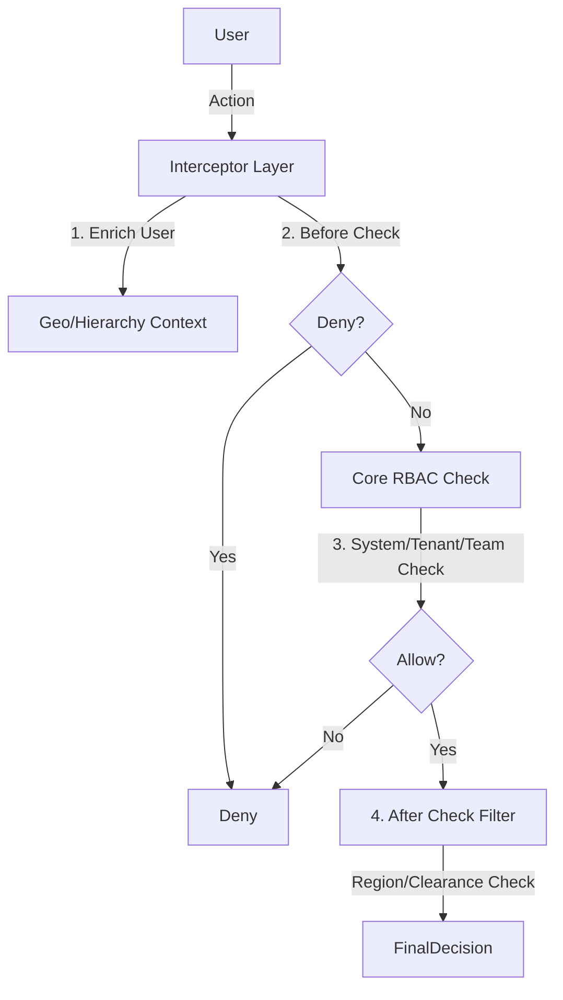

# RBAC Technical Spec

## Permission Check Flow

## Plugin Architecture
Interface `RBACPlugin`:
1.  `enrich_user_context()`: Add scopes (e.g. `accessible_teams`).
2.  `before_permission_check()`: Short-circuit logic.
3.  `after_permission_check()`: Filter result (e.g. Geo Deny).

Plugins: **Hierarchical Teams**, **Geographic Boundaries**, **Data Classification**.

## Database Schema

**Schema**: `b2b` (Core Tables)
- `roles` (Tenant Roles)
- `team_roles` (Team Definitions)
- `team_members` (Assignments)

**Schema**: `tenant_settings` (Plugin Config)
- `enabled_plugins` (List[String])
- `plugin_config` (JSONB)

## Observability
- **Event**: `role.assigned` (`[actor_id, target_user, role_name, scope]`)

## Dependencies
- **Internal**: `middleware.rbac`, `services.plugin_service`
