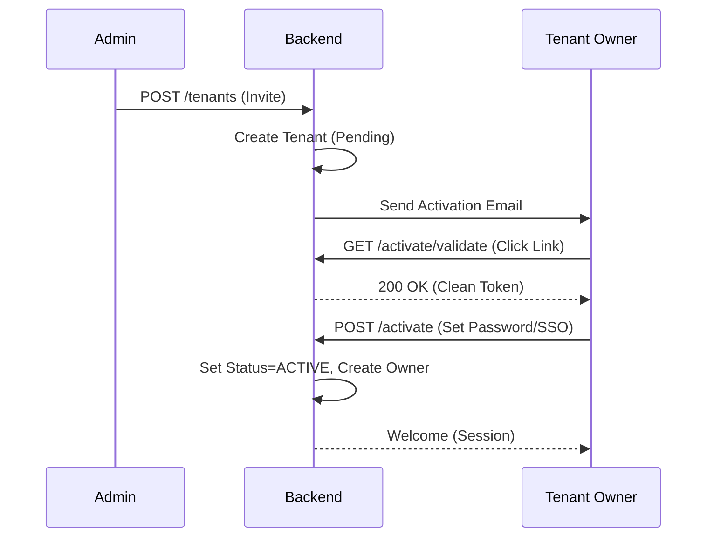

# Tenant Onboarding (B2B)

## 1. Context
### Goal
Automate the provisioning and activation of new Tenants via a vetted, invitation-based process (Not self-service).

### Target Platform
- [x] Web
- [ ] Mobile (iOS/Android)
- [ ] Backend API Only

### User Stories
- **As a Platform Admin**, I want to invite a company (Tenant) so that I can control who joins.
- **As a Tenant Owner**, I want to click a secure email link to activate my account.

### Key Business Rules
**1. Invitation Only**:
- Provisioning is triggered ONLY by Platform Admin.
- Tenants start in `PENDING` state.

**2. Activation Flow**:
- Link expire in 48 hours.
- Requires SSO Auth (OIDC) to verify identity during activation.
- Successful activation updates Tenant to `ACTIVE` and creates the `Owner` user.

**3. Multi-Platform Support**:
- Activation links must support Deep Linking (Open App if installed).

## 2. Architecture
### Activation Flow

## 3. Database Schema
**Schema**: `b2b`

| Table Name | Description | Key Columns |
| :--- | :--- | :--- |
| `tenants` | Tenant Config | `id`, `name`, `status` (`PENDING`/`ACTIVE`), `activation_token` |
| `users` | Owner created here | `id`, `email`, `role` (`owner`) |

## 4. API Reference
| Method | Endpoint | Description | Permission |
| :--- | :--- | :--- | :--- |
| **Platform** | | | |
| `POST` | `/api/platform/tenants` | Create & Invite Tenant | `platform:admin` |
| **Public** | | | |
| `GET` | `/api/b2b/activate/validate/{token}` | Validate Token | Public |
| `POST` | `/api/b2b/activate` | Complete Activation | Public (Auth req) |

## 5. UI Requirements
*(If not applicable, write "Not Applicable")*

### Components
- `AdminInviteForm`: Simple input for Company Name/Email.
- `ActivationLanding`: Public page prompting for Password.

## 6. Observability & Audit
### Audit Logs
- **Event**: `tenant.invited`
- **Payload**: `[admin_id, tenant_name, owner_email]`
- **Event**: `tenant.activated`
- **Payload**: `[tenant_id, owner_id, timestamp]`

## 6. Testing
### Critical Scenarios
- `Invite_Success`: Admin creates pending tenant.
- `Activate_Success`: User completes flow, check Owner Role.
- `Activate_Expired`: Token expiry check.
- `Activate_Idempotent`: Double activation fails gracefully.

### Test Location
- `backend/tests/e2e_api/platform/test_tenants.py`

## 8. Extensions
*(If not applicable, write "Not Applicable")*

### Not Applicable

## 9. Dependencies
- **Internal**: `services.tenant_service`, `services.email_service`
- **External**: Deep Linking (Universal Links)
