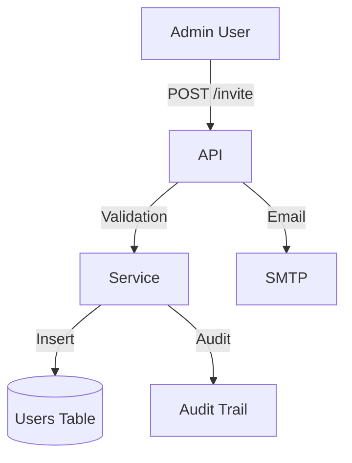

# User Management (B2B)

## 1. Context
### Goal
Manage the lifecycle of users within a Tenant Organization, including invitation, role assignment, status management, and removal.

### Target Platform
- [x] Web
- [x] Mobile (iOS/Android)
- [ ] Backend API Only

### User Stories
- **As an Admin**, I want to list all users so that I can see who has access.
- **As an Admin**, I want to change a user's role so that I can promote them.
- **As an Owner**, I want to deactivate a user so that they can no longer access the system.

### Key Business Rules
**1. User Lifecycle**:
- **Invitation**: Email-based token flow.
- **Active**: Can login.
- **Inactive**: Blocked, but data preserved.

**2. Role Constraints**:
- `owner` cannot be removed if they are the last one.
- `member`/`viewer` roles cannot invite or update other users.

## 2. Architecture
### Data Flow

### Security
- **RLS**: Strict tenant isolation on `users` table.
- **RBAC**: Endpoints protected by `users:write`, `users:invite`.

## 3. Database Schema
**Schema**: `b2b`

| Table Name | Description | Key Columns |
| :--- | :--- | :--- |
| `users` | Tenant Members | `id`, `email`, `role_id`, `is_active` |
| `invitations` | Pending access | `id`, `email`, `role_id`, `token` |

## 4. API Reference
| Method | Endpoint | Description | Permission |
| :--- | :--- | :--- | :--- |
| `GET` | `/api/b2b/users` | List tenant users | `users:read` |
| `POST` | `/api/b2b/invitations` | Invite user (Single) | `users:invite` |
| `PUT` | `/api/b2b/users/{id}/role` | Update role | `users:write` |
| `DELETE` | `/api/b2b/users/{id}` | Remove user | `users:delete` |
| `GET` | `/api/b2b/roles` | List available roles | `roles:read` |

## 5. UI Requirements (Optional)
### Components
- `UserTable`: Filterable list (Role, Status).
- `InviteModal`: Form for single/bulk invites.
- `RoleSelector`: Dropdown with descriptions.

## 6. Observability & Audit
### Audit Logs
- **Event**: `user.role_changed`
- **Payload**: `[actor_id, target_user_id, old_role, new_role]`
- **Event**: `user.deactivated`
- **Payload**: `[actor_id, target_user_id]`

## 7. Testing
### Critical Scenarios
- `ListUsers_Pagination`: Verify limits.
- `UpdateRole_Self`: Prevent self-demotion from last Admin (if rule exists).
- `Deactivate_Validation`: Ensure Owner isn't deactivated.
- `Invite_Duplicate`: Check email uniqueness.

### Test Location
- `backend/tests/e2e_api/b2b/test_users.py`

## 8. Extensions
*(If not applicable, write "Not Applicable")*

### Not Applicable

## 9. Dependencies
- **Internal**: `services.invitation_service`, `services.rbac_service`
