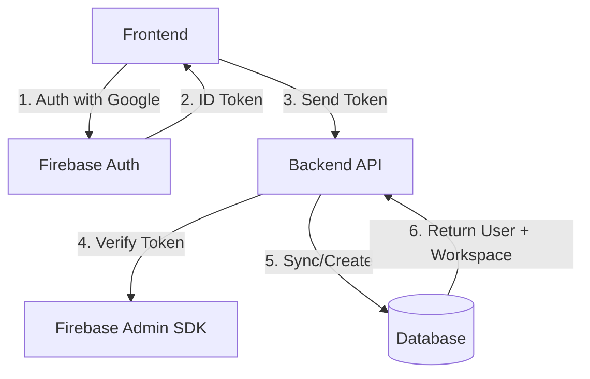

# Authentication (B2C)

## 1. Context
### Goal
Provide secure authentication for individual users, ensuring every user has a Personal Workspace upon entry.

### Target Platform
- [x] Web
- [x] Mobile (iOS/Android)
- [ ] Backend API Only

### User Stories
- **As a User**, I want to sign up with Google so I don't have to remember passwords.
- **As a User**, I want my account to be ready (with a workspace) immediately after signup.

### Key Business Rules
**1. Auto-Provisioning**:
- Every B2C user MUST have a Personal Workspace (`default_workspace_id`).
- Signup/Login endpoints automatically create this if missing.

**2. Identity**:
- Managed by Firebase Auth.
- Backend verifies `id_token` and syncs to `b2c.users`.

**3. Idempotency**:
- `POST /login` handles "Get or Create" logic, ensuring smooth onboarding if the explicit Signup step was skipped (e.g. Social Login).

## 2. Architecture
### Data Flow

### Database Schema
**Schema**: `b2c`
- `users`: `id`, `email`, `firebase_uid`, `default_workspace_id`.

## 3. API Reference
**Base Path**: `/api/b2c/auth`

| Method | Endpoint | Description | Auth |
| :--- | :--- | :--- | :--- |
| `POST` | `/signup` | Create Account + Workspace | ID Token |
| `POST` | `/login` | Login (Get or Create) | ID Token |
| `GET` | `/me` | Get Profile + Workspaces | Session |

## 5. UI Requirements
*(If not applicable, write "Not Applicable")*

### Components
- `GoogleButton`: Branded "Sign in with Google".
- `OnboardingLayout`: Centered card for signup flow.

## 6. Observability & Audit
### Audit Logs
- **Event**: `b2c.user.signup`
- **Payload**: `[uid, email, source]`
- **Event**: `b2c.user.login`
- **Payload**: `[uid, email, is_new]`

## 6. Testing
### Critical Scenarios
- `Signup_Success`: New user + Personal Workspace creation.
- `Login_Idempotency`: Existing user login returns same workspace.
- `InvalidToken`: Verify Firebase ID token validation.
- `Me_Profile`: Verify correct workspaces returned.

### Test Location
- `backend/tests/e2e_api/b2c/test_auth.py`

## 8. Extensions
*(If not applicable, write "Not Applicable")*

### Not Applicable

## 9. Dependencies
- **Internal**: `services.auth_service`
- **External**: Firebase Auth
