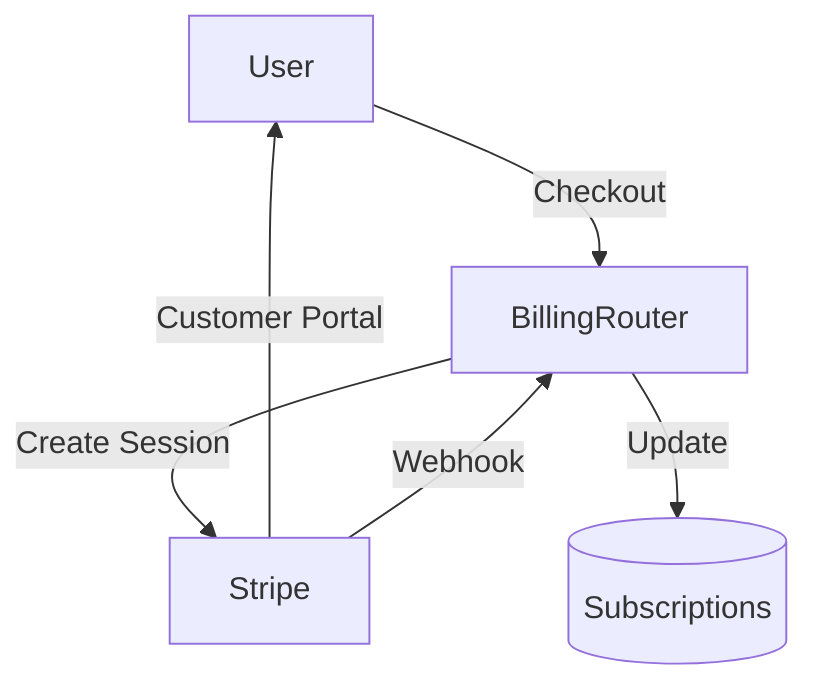

# Billing & Subscriptions (B2C)

## 1. Context
### Goal
Provide self-service billing for B2C users, allowing them to upgrade workspaces, view invoices, and redeem coupons.

### Target Platform
- [x] Web
- [x] Mobile (iOS/Android)
- [ ] Backend API Only

### User Stories
- **As a User**, I want to upgrade my workspace to Premium so I can invite members.
- **As a Subscriber**, I want to download my invoice PDF for reimbursement.
- **As a User**, I want to apply a discount code during checkout.

### Key Business Rules
**1. Subscription Model**:
- **Tiers**: `Premium`, `Ultimate`.
- **Intervals**: Monthly, Yearly.

**2. Integrations**:
- **Stripe**: Primary provider for Checkout and Customer Portal.
- **Razorpay/Xendit**: Supported for regional payment processing.

**3. Checkouts**:
- Session-based (Stripe Checkout).
- Users can manage their own billing address and Tax IDs via the Profile API.

## 2. Architecture
### Data Flow

### Database Schema
**Schema**: `b2c`
- `subscriptions`
- `invoices`
- `coupons`

## 3. API Reference
**Base Path**: `/api/b2c/billing`

| Method | Endpoint | Description | Role |
| :--- | :--- | :--- | :--- |
| **Subscription** | | | |
| `POST` | `/checkout` | Create Stripe Session | Owner |
| `GET` | `/subscription` | Get Status | Owner |
| `POST` | `/cancel` | Cancel Plan | Owner |
| `POST` | `/portal` | Open Stripe Portal | Owner |
| **Invoice** | | | |
| `GET` | `/invoices` | List History | Any |
| `GET` | `/invoices/{id}/download` | Get PDF | Any |
| **Coupons** | | | |
| `POST` | `/coupons/validate` | Check Code | Any |
| `GET` | `/coupons/available` | List Promos | Any |
| **Profile** | | | |
| `GET` | `/profile` | Get Tax/VAT Info | Any |
| `PATCH` | `/profile` | Update Tax/VAT | Any |

## 5. UI Requirements
*(If not applicable, write "Not Applicable")*

### Components
- `BillingHistory`: Table of invoices.
- `PaymentMethods`: List of saved cards.
- `UpgradeModal`: Plan selection + Checkout.

## 6. Observability & Audit
### Audit Logs
- **Event**: `b2c.billing.checkout_created`
- **Payload**: `[uid, tier, session_id]`
- **Event**: `b2c.subscription.updated`
- **Payload**: `[uid, status, plan]`

## 6. Testing
### Critical Scenarios
- `Checkout_Link`: Verify Stripe session redirection.
- `Webhook_Paid`: Verify subscription state update.
- `Coupon_Validate`: Valid vs Invalid code check.
- `Invoice_List`: Verify ownership access only.

### Test Location
- `backend/tests/e2e_api/b2c/test_billing.py`

## 8. Extensions
*(If not applicable, write "Not Applicable")*

### Not Applicable

## 9. Dependencies
- **Internal**: `services.subscription_service`, `services.coupon_service`
- **External**: Stripe, Razorpay
