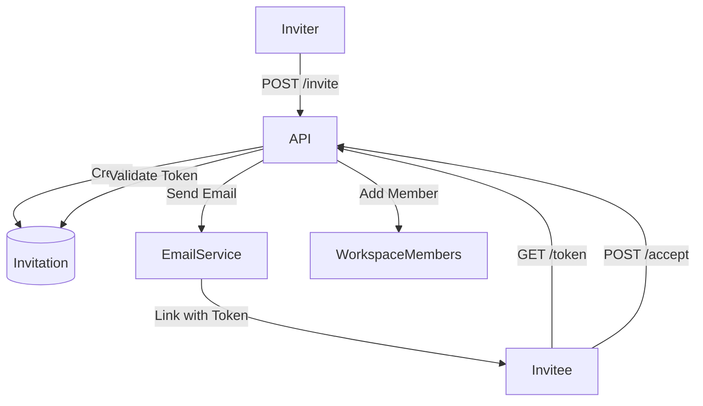

# Invitations (B2C)

## 1. Context
### Goal
Allow Workspace Owners and Admins to invite other users to collaborate in Team Workspaces.

### Target Platform
- [x] Web
- [x] Mobile (iOS/Android)
- [ ] Backend API Only

### User Stories
- **As a Team Owner**, I want to invite my colleague by email so they can access the workspace.
- **As a User**, I want to accept an invitation so I can join the team.
- **As an Admin**, I want to revoke a pending invitation if I made a mistake.

### Key Business Rules
**1. Eligibility**:
- Only **Team Workspaces** support invitations (Personal is single-user).
- Inviter must have `admin` or higher role.

**2. Token Flow**:
- Invitations generate a secure random token.
- Token expires (e.g., 7 days).
- Token is one-time use.

**3. State Transitions**:
- `PENDING` -> `ACCEPTED` (Member added).
- `PENDING` -> `EXPIRED` (Time elapsed).
- `PENDING` -> `CANCELLED` (Revoked by Admin).

## 2. Architecture
### Data Flow

### Database Schema
**Schema**: `b2c`

| Table Name | Description | Key Columns |
| :--- | :--- | :--- |
| `workspace_invitations` | Pending Invites | `id`, `workspace_id`, `email`, `token`, `role`, `expires_at` |
| `workspace_members` | Membership | `workspace_id`, `user_id`, `role` |

## 3. API Reference
**Base Path**: `/api/b2c`

| Method | Endpoint | Description | Auth |
| :--- | :--- | :--- | :--- |
| `POST` | `/workspaces/{id}/invite` | Create Invitation | Admin |
| `GET` | `/workspaces/{id}/invitations` | List Pending | Admin |
| `GET` | `/invitations/{token}` | Get Details | Public |
| `POST` | `/invitations/{token}/accept` | Accept Invite | User |
| `DELETE` | `/invitations/{id}` | Cancel/Revoke | Admin |
| `POST` | `/invitations/{id}/resend` | Resend Email | Admin |

## 4. UI Requirements (Optional)
### Components
- `InviteMemberModal`: Form with Email and Role selector.
- `PendingInvitesList`: Table showing email, role, sent date, and actions (Resend/Revoke).
- `AcceptInvitePage`: Public page showing "You've been invited to X", with "Accept" button.

### UX Rules
- **Feedback**: Show success toast "Invitation sent to [email]".
- **Validation**: Prevent inviting existing members.

## 5. Observability & Audit
### Audit Logs
- **Event**: `b2c.invitation.created`
- **Payload**: `[actor_id, workspace_id, target_email, role]`
- **Event**: `b2c.invitation.accepted`
- **Payload**: `[user_id, workspace_id, invitation_id]`
- **Event**: `b2c.invitation.revoked`
- **Payload**: `[actor_id, invitation_id]`

## 6. Testing
### Critical Scenarios
- `Invite_Success`: Admin invites new email -> Token created -> Email sent.
- `Invite_NonAdmin`: Member tries to invite -> 403 Forbidden.
- `Accept_Success`: Valid user accepts -> Added to workspace -> Invitation deleted.
- `Accept_Expired`: Token expired -> 400 Bad Request.
- `Public_Details`: Get token details without auth (for landing page).

### Test Location
- `backend/tests/e2e_api/b2c/test_invitations.py`

## 8. Extensions
*(If not applicable, write "Not Applicable")*

### Not Applicable

## 9. Dependencies
- **Internal**: `services.invitation_service`, `services.workspace_service`
- **External**: Email Provider (SendGrid/SMTP)
