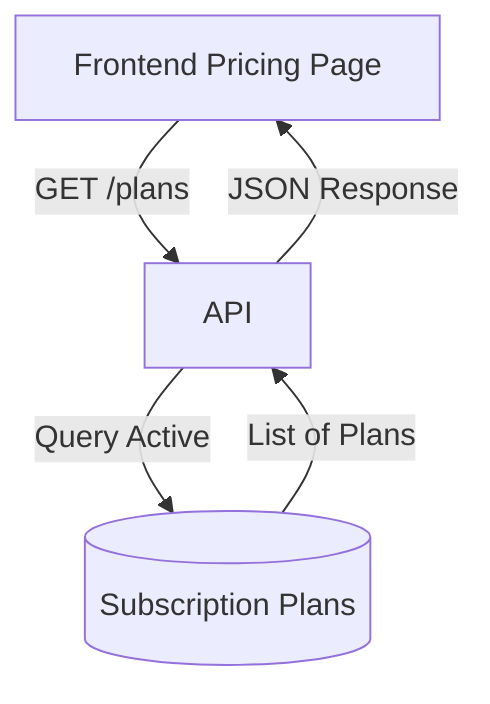

# Subscription Plans (B2C)

## 1. Context
### Goal
Provide a public catalog of available subscription tiers (Price, Features) for the Frontend "Pricing Page".

### Target Platform
- [x] Web
- [x] Mobile (iOS/Android)
- [ ] Backend API Only

### User Stories
- **As a Visitor**, I want to see the price of Premium vs Ultimate so I can decide what to buy.
- **As a Product Manager**, I want to create a new "Holiday Special" plan and have it appear automatically.

### Key Business Rules
**1. Visibility**:
- Only active plans (`archived_at=NULL`) are returned.
- Upcoming plans (`effective_from > Now`) are hidden.

**2. Sorting**:
- Plans are sorted by Price (ascending) by default.

## 2. Architecture
### Data Flow


### Database Schema
**Schema**: `b2c` / `common` (Shared with B2B potentially, or distinct)
*Note: Code references `modules.b2c.models.subscription_plan`*

| Table Name | Description | Key Columns |
| :--- | :--- | :--- |
| `subscription_plans` | Plan Definitions | `id`, `tier_key`, `name`, `price_monthly`, `price_yearly`, `effective_from`, `archived_at` |

## 3. API Reference
**Base Path**: `/api/b2c/plans`

| Method | Endpoint | Description | Auth |
| :--- | :--- | :--- | :--- |
| `GET` | `/` | List active public plans | Public |

### Response Example
```json
[
  {
    "id": "item_123",
    "tier_key": "premium",
    "name": "B2C Premium",
    "price_monthly": 1500,
    "currency": "usd",
    "features": ["teams", "analytics"]
  }
]
```

## 4. UI Requirements (Optional)
### Components
- `PricingCard`: Displays Tier Name, Price, Feature List, and "Subscribe" button.
- `Toggle`: Monthly/Yearly switch.

### UX Rules
- **Best Value**: Highlight the Yearly option.
- **Current Plan**: If logged in, show "Current" instead of "Subscribe".

## 5. Observability & Audit
### Metrics
- `plans_view_count`: Counter (optional).

## 6. Testing
### Critical Scenarios
- `List_ActiveOnly`: Verify archived plans are hidden.
- `List_EffectiveDate`: Verify future plans are hidden.
- `List_Ordering`: Verify cheap -> expensive sort.

### Test Location
- `backend/tests/e2e_api/b2c/test_plans.py`

## 8. Extensions
*(If not applicable, write "Not Applicable")*

### Not Applicable

## 9. Dependencies
- **Internal**: `modules.b2c.models`
- **External**: None (Stripe Product Sync is separate).
