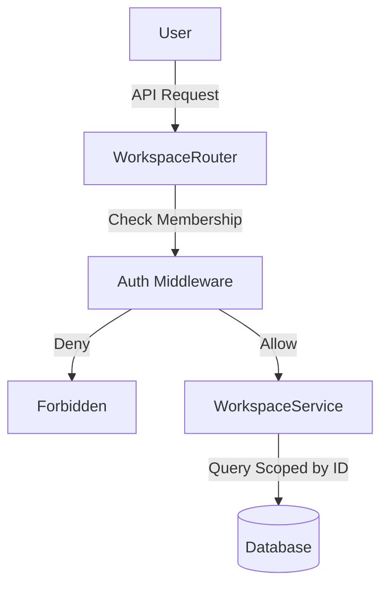

# Workspaces (B2C)

## 1. Context
### Goal
Provide isolated environments for users to manage their resources, supporting both Personal (Single-User) and Team (Multi-User) collaboration.

### Target Platform
- [x] Web
- [x] Mobile (iOS/Android)
- [ ] Backend API Only

### User Stories
- **As a User**, I want a Personal Workspace auto-created on signup so I can start immediately.
- **As a Power User**, I want to create a Team Workspace so I can collaborate with others.
- **As a Team Owner**, I want to invite members and assign roles (Admin/Viewer) to control access.

### Key Business Rules
**1. Workspace Types**:
- **Personal**: Auto-created, Single User, Free.
- **Team**: Created by user, Multi-user, Requires Premium Subscription.

**2. Membership Roles**:
- **Owner**: Full control, Billing responsibilities. Cannot be removed.
- **Admin**: Manage members and settings.
- **Member**: Create/Edit resources.
- **Viewer**: Read-only.

**3. Isolation**:
- Resources are scoped to `workspace_id`.
- Users can only access workspaces they are members of (RLS).

## 2. Architecture
### Database Schema
**Schema**: `b2c`

| Table Name | Description | Key Columns |
| :--- | :--- | :--- |
| `workspaces` | Workspace Entity | `id`, `owner_id`, `type` (personal/team) |
| `workspace_members` | Membership | `workspace_id`, `user_id`, `role` |

### Data Flow

### RLS Strategy
Queries are scoped by `workspace_id`.
Middleware ensures user is a valid member before allowing access.

## 3. API Reference
**Base Path**: `/api/b2c/workspaces`

| Method | Endpoint | Description | Role Req |
| :--- | :--- | :--- | :--- |
| `GET` | `/` | List my workspaces | Any |
| `POST` | `/` | Create Team Workspace | Premium |
| `GET` | `/{id}` | Get Details + Members | Member |
| `PATCH` | `/{id}` | Update Settings | Admin |
| `DELETE` | `/{id}` | Delete Workspace | Owner |
| **Members** | | | |
| `GET` | `/{id}/members` | List Members | Member |
| `PATCH` | `/{id}/members/{uid}` | Update Role | Admin |
| `DELETE` | `/{id}/members/{uid}` | Remove Member | Admin |

## 4. UI Requirements (Optional)
### Components
- `WorkspaceSwitcher`: Dropdown in navbar.
- `MembersTable`: Management UI for Team Workspaces.
- `CreateWorkspaceModal`: Form for new team creation.

## 5. Observability & Audit
### Audit Logs
- **Event**: `b2c.workspace.created`
- **Payload**: `[uid, workspace_id, type]`
- **Event**: `b2c.member.added`
- **Payload**: `[actor_id, workspace_id, target_uid, role]`

## 6. Testing
### Critical Scenarios
- `Create_Team_Premium`: Verify premium check.
- `Access_Isolation`: User A cannot access Workspace B.
- `Member_Management`: Admin adds Member (Success) vs Member adds Member (Deny).
- `Leave_Workspace`: Owner cannot leave last workspace.

### Test Location
- `backend/tests/e2e_api/b2c/test_workspaces.py`

## 8. Extensions
*(If not applicable, write "Not Applicable")*

### Not Applicable

## 9. Dependencies
- **Internal**: `services.workspace_service`, `services.auth_service`
