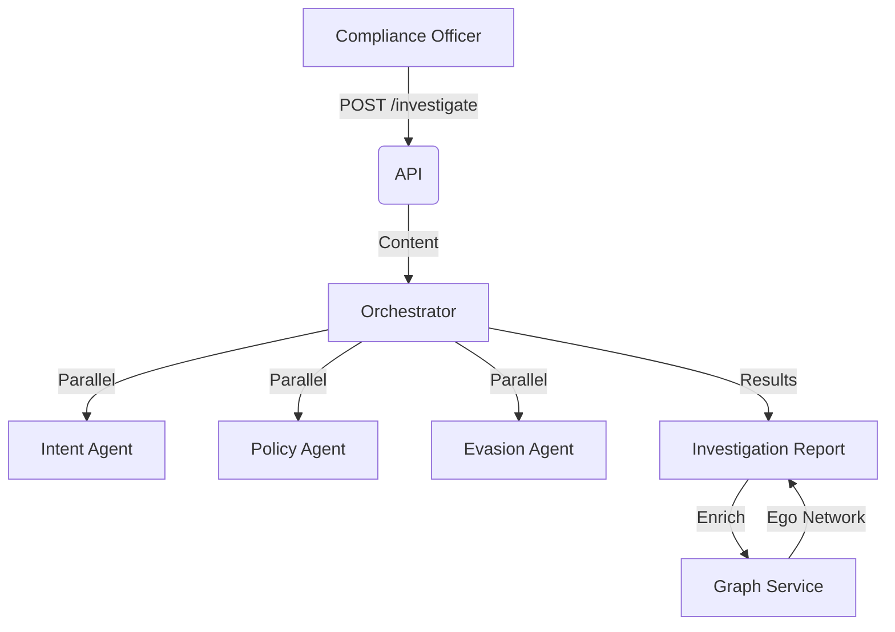

# Bank Surveillance (Worldwide Bank)

> **An enterprise-grade surveillance platform for a Global Systemically Important Bank (G-SIB).**

## 📚 Documentation

| Document | Description |
|----------|-------------|
| [Product Overview](./docs/README.md) | Comparison to simpler tools, key differentiators |
| [Page Specifications](./docs/pages/) | Per-page specs with user stories and wireframes |
| [Navigation IA](./docs/navigation.md) | Information architecture and page hierarchy |
| [User Personas](./docs/personas.md) | Deep dive into the 11-role ecosystem |
| [Demo Scripts](./docs/demos/README.md) | **Scripted demos for Global, Analyst, and Audit flows** |
| [RBAC Spec](./docs/technical/architecture.md#rbac-specification) | **Definitive Guide to Roles, Resources & Hierarchy** |

---

## 1. Context

### Goal
Provide "Worldwide Bank" with a surveillance workbench that balances **Global Risk Oversight** with strict **Data Sovereignty** and **Information Security**. The platform must detect financial misconduct (Insider Trading, Collusion) while enforcing "Chinese Walls" and "Need-to-Know" access.

### Enterprise Constraints
*   **Geo-Fencing**: Data must remain within its jurisdiction (e.g., Singapore data stays in SG). Only "Global" roles can bridge these silos.
*   **Information Barriers**: Investment Banking data must remain invisible to Public Side employees.
*   **Clearance**: Sensitive data (e.g., Whistleblower Tips, Merger Intel) must be **Redacted** for users with insufficient clearance.

### Core Ecosystem (11 Roles)
The system supports a complex hierarchy. See [RBAC Spec](./docs/technical/architecture.md#rbac-specification) for full details.

| Category | Typical Roles | Focus |
| :--- | :--- | :--- |
| **Global Command** | `surveillance_chief`, `head_compliance`, `risk_officer` | Cross-Border Strategy, Board Reporting, Policy Tuning |
| **Regional Management** | `regional_director`, `surveillance_country_lead` | Regional Operations, Team Approval |
| **Front Line** | `surveillance_analyst`, `operations_maker`, `operations_checker` | Daily Investigations, Case Processing |
| **System & Audit** | `surveillance_ops`, `guest_analyst` | Pipeline Health, External Regulatory Audit |

---

## 2. User Stories

### Global Command & Control
*   **As the Global CSO**, I want to aggregate risk alerts across New York, London, and Singapore so that I can see the institution's total risk posture.
*   **As the Global CSO**, I want to "drill down" into the Singapore desk's data so that I can investigate cross-border collusion that a local analyst creates.

### Advanced Investigation
*   **As a Senior Analyst**, I want AI to explain *why* an alert triggered (contextual reasoning) so that I don't waste time on false positives.
*   **As an Ops Maker**, I want to prepare a high-risk case for review so that a "Checker" can approve it (4-Eyes Principle).
*   **As an Analyst**, I want to visualize the "Social Graph" to find hidden cliques using personal devices.

### Fortified Security (Internal Threat)
*   **As a Junior Analyst**, I should see **[REDACTED]** content when viewing a "Top Secret" alert so that I am not exposed to material non-public information (MNPI).
*   **As an IT Admin**, I want to assign users to specific "Regions" so that they physically cannot access foreign data.

### Regulatory Governance
*   **As an External Auditor (Guest)**, I want strictly read-only access to "Chain of Custody" reports without being able to search raw email data.
*   **As a Risk Officer**, I want to configure the "Off-Channel Comms" policy differently for the US (SEC) vs Germany (Works Council).

---

## 3. Enterprise Capabilities

### Hierarchical Teams (Plugin)
Enforces a strict 3-Tier organizational structure.
*   **Global**: Worldwide visibility.
*   **Regional**: Continent-level visibility.
*   **Country**: Legal jurisdiction visibility.

### Data Classification (Plugin)
Enforces 5 levels of data sensitivity.
*   **Level 4 (Top Secret)**: Whistleblower, Executive Comm.
*   **Level 3 (Restricted)**: Active Investigations.
*   **Level 2 (Confidential)**: Closed Cases.
*   **Level 1 (Internal)**: General Business.
*   **Level 0 (Public)**: System Status.

---

## 4. Navigation Structure

```
📊 Dashboard (Context-Aware: Global vs Local)
⚠️ Alerts → Alert Detail (Redaction-Aware)
🔍 Investigations → Investigation Workspace
📁 Cases → Case Detail (Maker/Checker Workflow)
🔎 Search & RAG
📥 Ingestion
📋 Policies (Region-Specific Config)
👥 Teams & Access (Hierarchy Tree)
📈 Audit & Reports
⚙️ Admin / Settings
```

See [Navigation IA](./docs/navigation.md) for complete hierarchy.

---

## 5. Architecture

### Data Flow


### Key Components
| Component | File | Description |
| :--- | :--- | :--- |
| **API** | `routers/communications.py` | Messages & Search Endpoints |
| **API** | `routers/investigations.py` | AI Investigation Endpoints |
| **API** | `routers/graph.py` | Network Analysis Endpoints |
| **Service** | `services/orchestrator.py` | Coordinates AI Agents & Case Assembly |
| **Service** | `services/graph.py` | NetworkX Logic (Cliques, Centrality) |
| **Service** | `services/rag.py` | Vector Search over Message Content |
| **Model** | `models/investigation.py` | `Investigation` (Case) entity |
| **Model** | `models/communication.py` | Unified Message Entity |

---

## 6. Database Schema
**Schema**: `bank_surveillance`

| Table Name | Description | Key Columns |
| :--- | :--- | :--- |
| `communications` | **Central Message Store** (Email/Chat/Voice) | `id`, `message_id`, `sender`, `recipients`, `content`, `channel` |
| `investigations` | Active Cases | `id`, `title`, `priority`, `status`, `assigned_to` |

---

## 7. API Reference
**Base Path**: `/api/b2b/domain/bank_surveillance`

### Investigation
| Method | Path | Description | Permission |
| :--- | :--- | :--- | :--- |
| `GET` | `/search` | RAG Search | `surveillance:read` |
| `POST` | `/investigate` | Run AI Analysis | `surveillance:write` |
| `GET` | `/messages/{id}` | Get Raw Message | `surveillance:read` |

### Graph Analysis
| Method | Path | Description | Permission |
| :--- | :--- | :--- | :--- |
| `POST` | `/graph/build` | Rebuild Network | `surveillance:admin` |
| `GET` | `/graph/summary` | Stats (Nodes/Edges) | `surveillance:read` |
| `GET` | `/graph/cliques` | Detect Collusion | `surveillance:read` |
| `GET` | `/graph/ego/{email}` | User's Network | `surveillance:read` |

---

## 8. UI Requirements

### Key Pages
| Page | Purpose | Wireframe |
|------|---------|-----------|
| Dashboard | Executive risk overview | [View](./docs/wireframes/dashboard.png) |
| Alerts | Daily analyst workflow | [View](./docs/wireframes/alerts.png) |
| Investigation | 3-panel analysis workspace | [View](./docs/wireframes/investigation.png) |
| Search & RAG | Guided + free-form search | [View](./docs/wireframes/search_rag.png) |
| Case Management | Lifecycle tracking | [View](./docs/wireframes/case_management.png) |

### UX Rules
- **Risk Indicators**: Use Red/Amber/Green badges for Risk Level.
- **Drill-down**: Clicking a specific "Evasion Term" in the report should highlight it in the email body.
- **AI Explainability**: Always show why alerts triggered, not just that they did.

---

## 9. Observability & Audit

### Audit Logs
- **Event**: `investigate_email` (Tracks usage of AI tokens).
- **Event**: `create_case` (When data is promoted to Investigation).

### Metrics
- `ai_token_usage`
- `investigation_latency_ms`

---

## 10. Dependencies
- **Artificial Intelligence**: `langchain`, `openai` (for Agents).
- **Graph**: `networkx` (In-memory analysis).
- **Vector DB**: `pgvector` (via Postgres).
