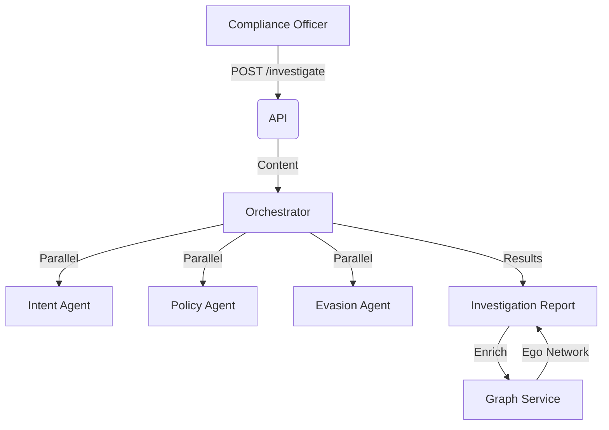

# Bank Surveillance (Enron Demo)

## 1. Context
### Goal
Provide Compliance Officers with an AI-powered surveillance workbench to detect, investigate, and visualize financial misconduct (Insider Trading, Collusion, Evasion) using the Enron Email dataset as a Proof of Concept.

### Target Platform
- [x] Web
- [ ] Mobile (iOS/Android)
- [ ] Backend API Only

### User Stories
- **As a Compliance Officer**, I want to search for emails mentioning "loss" or "cover up".
- **As a Compliance Officer**, I want to "Investigate" a suspicious email to get an AI Risk Assessment.
- **As an Analyst**, I want to visualize the "Social Graph" of a user to identify hidden collusion rings.

### Key Business Rules
- **1. Multi-Agent Analysis**: Every investigation runs 3 agents: Intent (Fraud?), Policy (Rules?), Evasion (Code words?).
- **2. Graph Persistence**: Social graphs are built lazily from email metadata to detect rigid communication structures (Cliques).
- **3. Case Management**: High-risk findings are promoted to "Investigations" (Cases) linked to a Tenant/Team.

## 2. Architecture
### Data Flow

### Key Components
| Component | File | Description |
| :--- | :--- | :--- |
| **API** | `routers/enron.py` | Search, Investigate, Graph endpoints |
| **Service** | `services/orchestrator.py` | Coordinates AI Agents & Case Assembly |
| **Service** | `services/graph.py` | NetworkX Logic (Cliques, Centrality) |
| **Service** | `services/rag.py` | Vector Search over Email Body |
| **Model** | `models/investigation.py` | `Investigation` (Case) entity |
| **Model** | `models/enron_email.py` | Read-only Dataset (Enron) |

## 3. Database Schema
**Schema**: `bank_surveillance`

| Table Name | Description | Key Columns |
| :--- | :--- | :--- |
| `enron_emails` | Ingested Dataset | `id`, `sender`, `recipients`, `body`, `embedding` |
| `investigations` | Active Cases | `id`, `title`, `priority`, `status`, `assigned_to` |
| `communications` | Linked Evidence | `investigation_id`, `email_id` |

## 4. API Reference
**Base Path**: `/api/b2b/domain/bank_surveillance`

### Investigation
| Method | Path | Description | Permission |
| :--- | :--- | :--- | :--- |
| `GET` | `/search` | RAG Search | `surveillance:read` |
| `POST` | `/investigate` | Run AI Analysis | `surveillance:write` |
| `GET` | `/emails/{id}` | Get Raw Email | `surveillance:read` |

### Graph Analysis
| Method | Path | Description | Permission |
| :--- | :--- | :--- | :--- |
| `POST` | `/graph/build` | Rebuild Network | `surveillance:admin` |
| `GET` | `/graph/summary` | Stats (Nodes/Edges) | `surveillance:read` |
| `GET` | `/graph/cliques` | Detect Collusion | `surveillance:read` |
| `GET` | `/graph/ego/{email}` | User's Network | `surveillance:read` |

## 5. UI Requirements
### Components
- **Surveillance Dashboard**: High-level stats (Open Cases, High Risk Alerts).
- **Investigation Detail**: "Report Card" showing Risk Level, AI Summary, and Timeline.
- **Graph Visualizer**: Interactive network node-link diagram (e.g., using React Force Graph).

### UX Rules
- **Risk Indicators**: Use Red/Amber/Green badges for Risk Level.
- **Drill-down**: Clicking a specific "Evasion Term" in the report should highlight it in the email body.

## 6. Observability & Audit
### Audit Logs
- **Event**: `investigate_email` (Tracks usage of AI tokens).
- **Event**: `create_case` (When data is promoted to Investigation).

### Metrics
- `ai_token_usage`
- `investigation_latency_ms`

## 7. Extensions
### Architecture
- **Agents**: New agents (e.g., "Sentiment Agent") can be added to `OrchestratorService`.

### Configuration
- **Dataset**: Depends on `scripts/ingest_enron.py`.

## 8. Testing
### Critical Scenarios
- **Evasion Detection**: "Let's take this offline" should trigger Evasion Agent.
- **Graph Build**: Should handle disconnected nodes gracefully.

### Test Location
- `backend/tests/e2e_api/b2b/use_cases/bank_surveillance/test_enron_api.py`

## 9. Dependencies
- **Artificial Intelligence**: `langchain`, `openai` (for Agents).
- **Graph**: `networkx` (In-memory analysis).
- **Vector DB**: `pgvector` (via Postgres).
