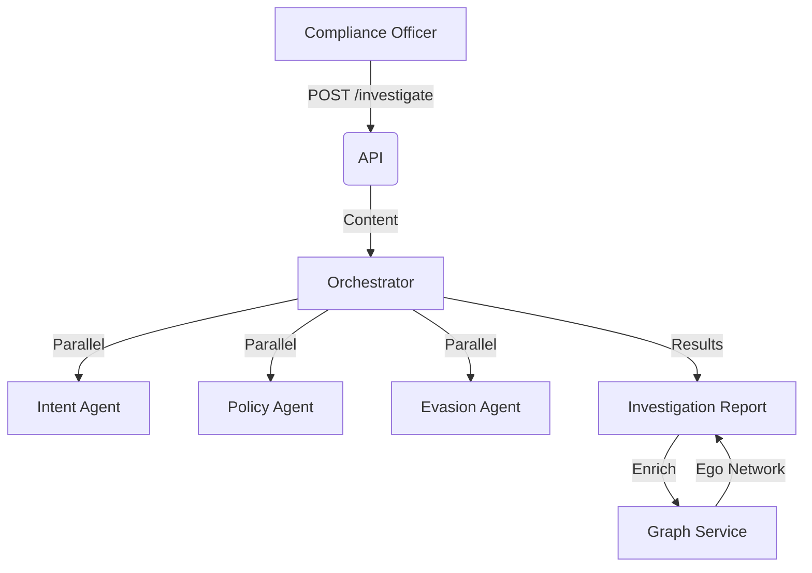

# Bank Surveillance (Enron Demo)

> **An enterprise-grade communication surveillance platform — demonstrated using the Enron dataset.**

## 📚 Documentation

| Document | Description |
|----------|-------------|
| [Product Overview](./docs/README.md) | Comparison to simpler tools, key differentiators |
| [Page Specifications](./docs/pages/) | Per-page specs with user stories and wireframes |
| [Navigation IA](./docs/navigation.md) | Information architecture and page hierarchy |
| [User Personas](./docs/personas.md) | Core personas with workflows and priorities |
| [Demo Scripts](./docs/demos/README.md) | Scripted demos for each persona type |
| [Wireframes](./docs/wireframes/) | Visual designs for 5 key pages |

---

## 1. Context

### Goal
Provide Compliance Officers with an AI-powered surveillance workbench to detect, investigate, and visualize financial misconduct (Insider Trading, Collusion, Evasion) using the Enron Email dataset as a Proof of Concept.

### Target Platform
- [x] Web
- [ ] Mobile (iOS/Android)
- [ ] Backend API Only

### Core Personas

| Persona | Role | Primary Focus |
|---------|------|---------------|
| **Sarah Chen** | Head of Compliance | Strategic oversight, regulatory proof |
| **Marcus Johnson** | Surveillance Analyst | Daily alert triage, investigations |
| **Dr. Priya Sharma** | Risk Officer | Policy configuration, pattern detection |

### User Stories

#### Surveillance Workflow
- **As a Surveillance Analyst**, I want to filter alerts by risk type so that I can focus on my assigned category.
- **As a Surveillance Analyst**, I want AI-generated conversation summaries so that I can quickly understand long threads.
- **As a Surveillance Analyst**, I want to escalate alerts with one click so that I can quickly involve senior reviewers.

#### Investigation & Cases
- **As a Compliance Officer**, I want to search for emails mentioning "loss" or "cover up".
- **As a Compliance Officer**, I want to "Investigate" a suspicious email to get an AI Risk Assessment.
- **As a Compliance Manager**, I want decision rationale required at closure so that we maintain audit quality.

#### Analytics & Compliance
- **As an Analyst**, I want to visualize the "Social Graph" of a user to identify hidden collusion rings.
- **As a Compliance Executive**, I want emerging risk themes highlighted so that I can proactively address systemic issues.
- **As a Compliance Officer**, I want access logs so that I can respond to regulator inquiries.

#### Administration
- **As a Risk Officer**, I want to customize risk detection rules so that I can adapt to our specific business context.
- **As an IT Administrator**, I want to assign roles by region so that I can enforce data access policies.

### Key Business Rules
- **1. Multi-Agent Analysis**: Every investigation runs 3 agents: Intent (Fraud?), Policy (Rules?), Evasion (Code words?).
- **2. Graph Persistence**: Social graphs are built lazily from email metadata to detect rigid communication structures (Cliques).
- **3. Case Management**: High-risk findings are promoted to "Investigations" (Cases) linked to a Tenant/Team.

---

## 2. Navigation Structure

```
📊 Dashboard
⚠️ Alerts → Alert Detail
🔍 Investigations → Investigation Workspace
📁 Cases → Case Detail
🔎 Search & RAG
📥 Ingestion
📋 Policies
👥 Teams & Access
📈 Audit & Reports
⚙️ Admin / Settings
```

See [Navigation IA](./docs/navigation.md) for complete hierarchy and permission rules.

---

## 3. Architecture

### Data Flow


### Key Components
| Component | File | Description |
| :--- | :--- | :--- |
| **API** | `routers/enron.py` | Search, Investigate, Graph endpoints |
| **Service** | `services/orchestrator.py` | Coordinates AI Agents & Case Assembly |
| **Service** | `services/graph.py` | NetworkX Logic (Cliques, Centrality) |
| **Service** | `services/rag.py` | Vector Search over Email Body |
| **Model** | `models/investigation.py` | `Investigation` (Case) entity |
| **Model** | `models/enron_email.py` | Read-only Dataset (Enron) |

---

## 4. Database Schema
**Schema**: `bank_surveillance`

| Table Name | Description | Key Columns |
| :--- | :--- | :--- |
| `enron_emails` | Ingested Dataset | `id`, `sender`, `recipients`, `body`, `embedding` |
| `investigations` | Active Cases | `id`, `title`, `priority`, `status`, `assigned_to` |
| `communications` | Linked Evidence | `investigation_id`, `email_id` |

---

## 5. API Reference
**Base Path**: `/api/b2b/domain/bank_surveillance`

### Investigation
| Method | Path | Description | Permission |
| :--- | :--- | :--- | :--- |
| `GET` | `/search` | RAG Search | `surveillance:read` |
| `POST` | `/investigate` | Run AI Analysis | `surveillance:write` |
| `GET` | `/emails/{id}` | Get Raw Email | `surveillance:read` |

### Graph Analysis
| Method | Path | Description | Permission |
| :--- | :--- | :--- | :--- |
| `POST` | `/graph/build` | Rebuild Network | `surveillance:admin` |
| `GET` | `/graph/summary` | Stats (Nodes/Edges) | `surveillance:read` |
| `GET` | `/graph/cliques` | Detect Collusion | `surveillance:read` |
| `GET` | `/graph/ego/{email}` | User's Network | `surveillance:read` |

---

## 6. UI Requirements

### Key Pages
| Page | Purpose | Wireframe |
|------|---------|-----------|
| Dashboard | Executive risk overview | [View](./docs/wireframes/dashboard.png) |
| Alerts | Daily analyst workflow | [View](./docs/wireframes/alerts.png) |
| Investigation | 3-panel analysis workspace | [View](./docs/wireframes/investigation.png) |
| Search & RAG | Guided + free-form search | [View](./docs/wireframes/search_rag.png) |
| Case Management | Lifecycle tracking | [View](./docs/wireframes/case_management.png) |

### UX Rules
- **Risk Indicators**: Use Red/Amber/Green badges for Risk Level.
- **Drill-down**: Clicking a specific "Evasion Term" in the report should highlight it in the email body.
- **AI Explainability**: Always show why alerts triggered, not just that they did.

---

## 7. Observability & Audit

### Audit Logs
- **Event**: `investigate_email` (Tracks usage of AI tokens).
- **Event**: `create_case` (When data is promoted to Investigation).

### Metrics
- `ai_token_usage`
- `investigation_latency_ms`

---

## 8. Extensions

### Architecture
- **Agents**: New agents (e.g., "Sentiment Agent") can be added to `OrchestratorService`.

### Configuration
- **Dataset**: Depends on `scripts/ingest_enron.py`.

---

## 9. Testing

### Critical Scenarios
- **Evasion Detection**: "Let's take this offline" should trigger Evasion Agent.
- **Graph Build**: Should handle disconnected nodes gracefully.

### Test Location
- `backend/tests/e2e_api/b2b/use_cases/bank_surveillance/test_enron_api.py`

---

## 10. Dependencies
- **Artificial Intelligence**: `langchain`, `openai` (for Agents).
- **Graph**: `networkx` (In-memory analysis).
- **Vector DB**: `pgvector` (via Postgres).

