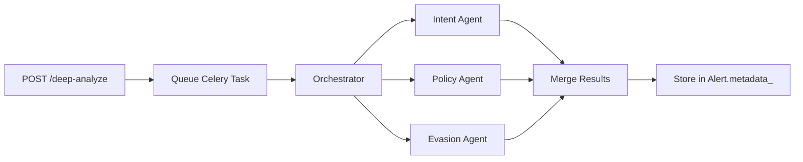

# Feature: Agentic Investigation (AI Deep Analysis)

> **Status**: 📝 Documented (Design Phase)  
> **Module**: `bank_surveillance`  
> **Priority**: Medium (Post-Demo Enhancement)  
> **Depends On**: [Risk Detection Workflow](./risk-detection-workflow.md)

---

## Summary

AI-powered deep analysis of alerts using multi-agent architecture. Analysts can trigger "Deep Analyze" on high-severity alerts to get intent inference, regulatory mapping, and evasion detection.

```
Alert → Analyst clicks "Deep Analyze" → Orchestrator → 3 Agents in parallel → AI Summary
```

---

## Quick Reference

| Document | Path |
|----------|------|
| Architecture | [technical/architecture.md](../technical/architecture.md#tier-4-agentic-investigation) |
| Parent Feature | [Risk Detection Workflow](./risk-detection-workflow.md) |

---

## AI Agents

| Agent | Role | Output |
|-------|------|--------|
| **Intent Agent** | Infers willful misconduct vs. accident | Intent score (0-100) + reasoning |
| **Policy Agent** | Maps content to regulatory clauses | List of potential violations with citations |
| **Evasion Agent** | Detects surveillance circumvention | Evasion flags + evidence snippets |

---

## Workflow

### Trigger: "Deep Analyze" Button
- **UI Action**: Analyst clicks "Deep Analyze" on Alert Details page
- **API**: `POST /api/b2b/domain/bank_surveillance/alerts/{id}/deep-analyze`

### Processing Flow


### Response
```json
{
  "job_id": "analysis-xyz",
  "status": "completed",
  "results": {
    "intent": {
      "score": 85,
      "reasoning": "Phrases suggest deliberate coordination..."
    },
    "policy": {
      "matches": [
        {"regulation": "MAS Notice 610", "clause": "§4.2", "description": "..."}
      ]
    },
    "evasion": {
      "flags": ["channel_switching"],
      "evidence": ["'let's talk on WhatsApp'"]
    }
  }
}
```

---

## Implementation Checklist

### New Services (Priority 1)
- [ ] `services/agents/orchestrator.py` - Coordinates 3 agents
- [ ] `services/agents/intent.py` - LLM-based intent analysis
- [ ] `services/agents/policy.py` - RAG against regulatory library
- [ ] `services/agents/evasion.py` - Pattern matching + LLM

### New Endpoints (Priority 2)
- [ ] `POST /alerts/{id}/deep-analyze` - Trigger analysis
- [ ] `GET /alerts/{id}/analysis` - Fetch stored results

### Updates (Priority 3)
- [ ] `models/alert.py` - Add `analysis_results` JSONB column

### Dependencies
- [ ] OpenAI/LLM API key configured
- [ ] Regulatory Library populated with MAS/SEC/FCA docs

---

## How to Implement

Tell Claude:

> **"Implement the Agentic Investigation feature for bank_surveillance"**

---

## Design Decisions

| Topic | Decision |
|-------|----------|
| Trigger Mode | On-demand (analyst clicks button) |
| Processing | Async via Celery (LLM calls are slow) |
| Storage | Results stored in `Alert.metadata_` |
| Agent Execution | Parallel (all 3 run simultaneously) |

---

## Related Features

- [x] [Risk Detection Workflow](./risk-detection-workflow.md) - Must be implemented first
- [ ] Regulatory Library CRUD - Needed for Policy Agent RAG
