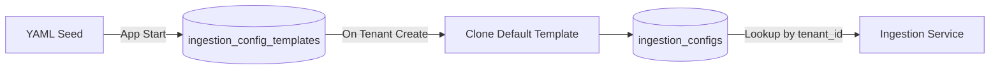

# Feature: Risk Detection Workflow

> **Status**: 📝 Documented (Ready for Implementation)  
> **Module**: `bank_surveillance`  
> **Priority**: High  

---

## Summary

A 3-tier risk detection system that transforms high-volume communications into actionable analyst alerts.

```
Communication → RiskEvent → Incident → Alert
```

## Quick Reference

| Document | Path |
|----------|------|
| Architecture | [technical/architecture.md](./technical/architecture.md) |
| Database Schema | [technical/schema.md](./technical/schema.md) |
| API Reference | [technical/api.md](./technical/api.md) |

---

## Workflows

### Workflow A: Ingest + Detect
- **Trigger**: `POST /api/b2b/domain/bank_surveillance/ingestion/trigger`
- **Processing**: Celery Worker
- **Output**: `RiskEvent` records for matched messages

### Workflow B: Group + Alert
- **Trigger**: `POST /api/b2b/domain/bank_surveillance/alerts/generate`
- **Processing**: Celery Worker
- **Output**: `Incident` and `Alert` records

---

## Implementation Checklist

### New Models (Priority 1)
- [ ] `models/risk_event.py` - Individual detection match
- [ ] `models/incident.py` - Aggregated signals per sender/day

### New Services (Priority 2)
- [ ] `services/detection.py` - Keyword/Regex detection via ES
- [ ] `services/aggregation.py` - Grouping logic (Events → Incidents)

### New Tasks (Priority 3)
- [ ] `tasks/alerting.py` - Celery task for Workflow B

### Updates (Priority 4)
- [ ] `models/communication.py` - Add `analyzed`, `thread_id`, `channel`
- [ ] `models/alert.py` - Link to Incidents (1:N relationship)

### Database Migration
- [ ] Create `bank_surveillance.risk_events` table
- [ ] Create `bank_surveillance.incidents` table
- [ ] Add columns to `bank_surveillance.communications`

### API Endpoints
- [ ] `GET /risk-events` - List events
- [ ] `GET /incidents` - List incidents
- [ ] `POST /alerts/generate` - Trigger aggregation

---

## How to Implement

Tell Claude:

> **"Implement the Risk Detection Workflow feature for bank_surveillance"**

Or be specific:

> **"Implement components marked [NEW] in bank_surveillance/docs/technical/architecture.md"**

---

## Design Decisions

| Topic | Decision |
|-------|----------|
| Message Storage | ES (content) + PG (metadata) |
| Alert Hierarchy | 1 Alert : N Incidents |
| Detection | Keyword + Regex via Elasticsearch |
| Processing | Async via Celery workers |
| Thread Limit | 10 messages (demo) |

---

## Plugin Integration

### Overview

Region and Classification are assigned to communications during ingestion via a **pluggable detection strategy**. The system supports multiple detection methods with configurable defaults.

### Detection Strategies

| Strategy | Description | When to Use |
|----------|-------------|-------------|
| **Default** | Static values from config | Demo, bulk import |
| **Sender-based** | Lookup sender domain → region | Production with known employee list |
| **Content-based** | AI/Rules scan for sensitive terms | MNPI detection, PII detection |
| **Channel-based** | Channel type → classification | Bloomberg = Confidential |

### Strategy Configuration

Configuration is **database-driven per tenant**, seeded from a global YAML template.

#### Database Schema

**Two-table pattern**: Global template table + Per-tenant config table.

```sql
-- Table 1: Global Template (seeded from YAML, shared across all tenants)
CREATE TABLE bank_surveillance.ingestion_config_templates (
    id UUID PRIMARY KEY DEFAULT gen_random_uuid(),
    name VARCHAR(100) NOT NULL UNIQUE,  -- e.g., "default", "financial_institution"
    description TEXT,
    
    -- Region Detection
    region_strategy VARCHAR(50) DEFAULT 'default',
    sender_domain_map JSONB DEFAULT '{}',
    
    -- Classification Detection
    classification_strategy VARCHAR(50) DEFAULT 'default',
    channel_map JSONB DEFAULT '{}',
    content_rules JSONB DEFAULT '[]',
    
    is_default BOOLEAN DEFAULT false,  -- One template marked as default
    created_at TIMESTAMPTZ DEFAULT CURRENT_TIMESTAMP,
    updated_at TIMESTAMPTZ DEFAULT CURRENT_TIMESTAMP
);

-- Table 2: Per-Tenant Config (cloned from template during onboarding)
CREATE TABLE bank_surveillance.ingestion_configs (
    id UUID PRIMARY KEY DEFAULT gen_random_uuid(),
    tenant_id UUID NOT NULL REFERENCES b2b.tenants(id) ON DELETE CASCADE,
    template_id UUID REFERENCES bank_surveillance.ingestion_config_templates(id),
    
    -- Region Detection (copied from template, tenant can customize)
    region_strategy VARCHAR(50) DEFAULT 'default',
    default_region_id UUID REFERENCES b2b.geographic_regions(id),
    fallback_region_id UUID REFERENCES b2b.geographic_regions(id),
    sender_domain_map JSONB DEFAULT '{}',
    
    -- Classification Detection
    classification_strategy VARCHAR(50) DEFAULT 'default',
    default_level_id UUID REFERENCES b2b.sensitivity_levels(id),
    channel_map JSONB DEFAULT '{}',
    content_rules JSONB DEFAULT '[]',
    
    created_at TIMESTAMPTZ DEFAULT CURRENT_TIMESTAMP,
    updated_at TIMESTAMPTZ DEFAULT CURRENT_TIMESTAMP,
    
    UNIQUE(tenant_id)
);
```

#### YAML Seed Template

```yaml
# backend/modules/domains/b2b/bank_surveillance/scripts/seeds/ingestion_config_template.yaml
# Seeded via seed_meta.py → inserts into bank_surveillance.ingestion_config_templates

ingestion_config_templates:
  - name: "default"
    description: "Default configuration for demo and bulk import scenarios"
    is_default: true
    region_strategy: "default"
    sender_domain_map: {}
    classification_strategy: "default"
    channel_map:
      bloomberg: "confidential"
      symphony: "confidential"
      email: "internal"
    content_rules:
      - pattern: "MNPI|material non-public"
        level: "restricted"
      - pattern: "earnings|quarterly results"
        level: "confidential"
  
  - name: "financial_institution"
    description: "Production config for banks with sender-based region detection"
    is_default: false
    region_strategy: "sender_lookup"
    sender_domain_map: {}
    classification_strategy: "content_rules"
    channel_map: {}
    content_rules: []
```

#### Seed Integration

**File**: `scripts/seeds/seed_meta.py`

```python
# Added to seed_meta.py
async def seed_ingestion_config_templates(db: AsyncSession):
    """Seeds global ingestion config templates from YAML."""
    yaml_path = os.path.join(os.path.dirname(__file__), "ingestion_config_template.yaml")
    with open(yaml_path, "r") as f:
        data = yaml.safe_load(f)
    
    for template in data.get("ingestion_config_templates", []):
        # Check if exists by name
        existing = await db.execute(
            select(IngestionConfigTemplate).where(IngestionConfigTemplate.name == template["name"])
        )
        if existing.scalar_one_or_none():
            continue
        
        db.add(IngestionConfigTemplate(
            name=template["name"],
            description=template.get("description"),
            is_default=template.get("is_default", False),
            region_strategy=template.get("region_strategy", "default"),
            sender_domain_map=template.get("sender_domain_map", {}),
            classification_strategy=template.get("classification_strategy", "default"),
            channel_map=template.get("channel_map", {}),
            content_rules=template.get("content_rules", []),
        ))
    await db.commit()
```

#### Tenant Provisioning Flow



**Clone Process (during tenant onboarding):**
1. Find template where `is_default = true`
2. Copy all fields to `ingestion_configs`
3. Set `tenant_id` and `template_id`
4. Resolve `default_region_id` → tenant's first region
5. Resolve `default_level_id` → "Internal" sensitivity level

### Service Interface

```python
# services/plugin_detection.py
class PluginDetectionService:
    def __init__(self, db: AsyncSession, tenant_id: UUID):
        self.db = db
        self.tenant_id = tenant_id
        self.config = None  # Lazy loaded from DB
    
    async def load_config(self) -> IngestionConfig:
        """Load tenant's ingestion config from database."""
        if not self.config:
            self.config = await self.db.execute(
                select(IngestionConfig).where(IngestionConfig.tenant_id == self.tenant_id)
            ).scalar_one_or_none()
        return self.config
    
    async def detect_region(self, communication: Communication) -> UUID:
        """Detect region based on tenant's configured strategy."""
        config = await self.load_config()
        if config.region_strategy == "sender_lookup":
            return self._lookup_sender_domain(communication.sender, config.sender_domain_map)
        return config.default_region_id or config.fallback_region_id
    
    async def detect_classification(self, communication: Communication) -> UUID:
        """Detect sensitivity level based on tenant's configured strategy."""
        config = await self.load_config()
        if config.classification_strategy == "channel_map":
            return config.channel_map.get(communication.channel, config.default_level_id)
        if config.classification_strategy == "content_rules":
            return self._match_content_rules(communication, config.content_rules)
        return config.default_level_id
```

### Demo Defaults

For the Enron demo dataset, the tenant's config is seeded with:
```python
region_strategy = "default"
default_region_id = tenant.regions[0].id  # First region
classification_strategy = "default"
default_level_id = "Internal"
```

### Geographic Boundaries
| Entity | Column | Type | Propagation |
|--------|--------|------|-------------|
| Communication | `data_region_id` | UUID | Set during ingestion via detection strategy |
| Incident | `data_region_ids` | UUID[] | Unique regions from grouped events |
| Alert | — | — | Inherits via incidents JOIN |

### Data Classification
| Entity | Column | Type | Propagation |
|--------|--------|------|-------------|
| Communication | `sensitivity_level_id` | UUID | Set during ingestion via detection strategy |
| Incident | `sensitivity_level_id` | UUID | MAX classification from grouped events |
| Alert | — | — | Inherits via incidents JOIN |

---

## Related Features (Future)

- [ ] **Tier 4: Agentic Investigation** - Intent/Policy/Evasion agents
- [ ] **Reprocessing Strategy** - Version-based control tracking
