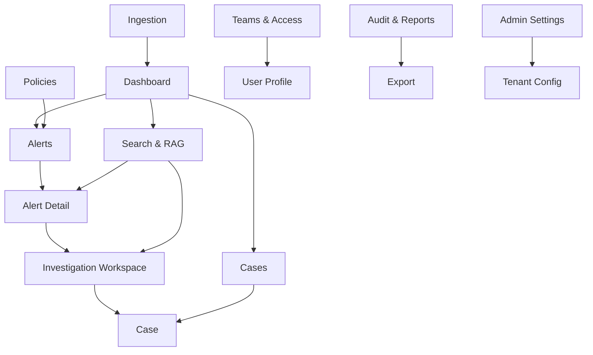

# Navigation Information Architecture

## Primary Navigation Structure

The navigation follows a **task-based** mental model, grouping features by workflow stage rather than system components.

```
┌─────────────────────────────────────────────────────────────────┐
│  🏢 Tenant Logo                        🔔 Alerts  👤 Profile   │
├─────────────────────────────────────────────────────────────────┤
│                                                                 │
│  📊 Dashboard                    ┌─────────────────────────────┐│
│                                  │                             ││
│  ─── SURVEILLANCE ───            │     [MAIN CONTENT AREA]     ││
│  ⚠️ Alerts                       │                             ││
│  🔍 Investigations               │                             ││
│  📁 Cases                        │                             ││
│                                  │                             ││
│  ─── DISCOVERY ───               │                             ││
│  🔎 Search & RAG                 │                             ││
│                                  │                             ││
│  ─── OPERATIONS ───              │                             ││
│  📥 Ingestion                    │                             ││
│  📋 Policies                     │                             ││
│                                  │                             ││
│  ─── GOVERNANCE ───              │                             ││
│  👥 Teams & Access               │                             ││
│  📈 Audit & Reports              │                             ││
│                                  │                             ││
│  ─── PLATFORM ───                │                             ││
│  ⚙️ Admin Settings               │                             ││
│                                  └─────────────────────────────┘│
└─────────────────────────────────────────────────────────────────┘
```

---

## Navigation Groups

| Group | Pages | Target Persona |
|-------|-------|----------------|
| **Core** | Dashboard | All users |
| **Surveillance** | Alerts, Investigations, Cases | Analysts, Managers |
| **Discovery** | Search & RAG | Analysts, Risk Officers |
| **Operations** | Ingestion, Policies | Risk Officers, Admins |
| **Governance** | Teams & Access, Audit & Reports | Managers, Compliance |
| **Platform** | Admin Settings | Platform Admins only |

---

## Page Hierarchy



---

## Breadcrumb Patterns

| Page | Breadcrumb |
|------|------------|
| Dashboard | Home |
| Alert List | Home → Alerts |
| Alert Detail | Home → Alerts → Alert #12345 |
| Investigation | Home → Investigations → INV-2024-001 |
| Case Detail | Home → Cases → CASE-2024-042 |
| Search Results | Home → Search → "earnings leak" |

---

## Permission-Based Visibility

| Navigation Item | Required Permission | Fallback |
|-----------------|---------------------|----------|
| Dashboard | `surveillance:read` | Always visible |
| Alerts | `surveillance:read` | Hidden |
| Investigations | `surveillance:read` | Hidden |
| Cases | `surveillance:read` | Hidden |
| Search & RAG | `rag_enron:read` | Hidden |
| Ingestion | `surveillance:admin` | Hidden |
| Policies | `surveillance:admin` | Hidden |
| Teams & Access | `iam:read` | Hidden |
| Audit & Reports | `audit:read` | Hidden |
| Admin Settings | `platform:admin` | Hidden |

---

## Mobile Responsive Behavior

| Breakpoint | Navigation Style |
|------------|------------------|
| Desktop (>1024px) | Fixed sidebar |
| Tablet (768-1024px) | Collapsible sidebar |
| Mobile (<768px) | Bottom navigation + hamburger menu |

---

## Quick Navigation Shortcuts

| Shortcut | Action |
|----------|--------|
| `Ctrl+K` | Global search |
| `Ctrl+/` | Open command palette |
| `G then A` | Go to Alerts |
| `G then C` | Go to Cases |
| `G then D` | Go to Dashboard |
