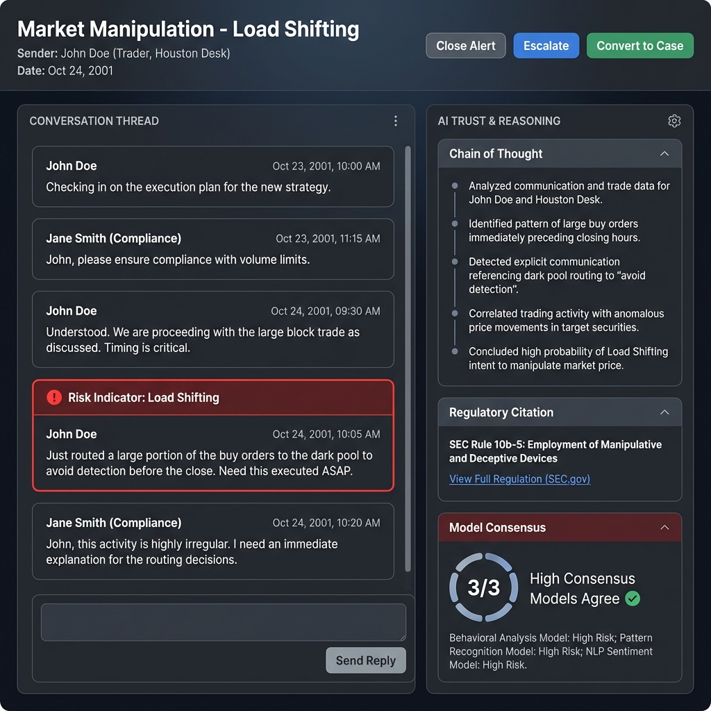

# Alert Details View

## Overview

| Attribute | Details |
|-----------|---------|
| **Goal** | Provide a comprehensive, trust-backed view of an aggregated alert for analyst review |
| **Pivots** | Sender, Risk Indicator, Date |
| **Key Actions** | Close (False Positive/No Action), Escalate, Convert to Case |

## Page Structure

### 1. Alert Header (The "What & Who")
- **Risk Identity**: Displays **Risk Typology** (e.g., Market Manipulation) and **Risk Indicator** (e.g., Load Shifting).
- **Consensus Badge**: High-level trust indicator (e.g., "AI Verify: 3/3 Models Agree").
- **Sender Info**: Name, Role, Desk, and Region of the primary actor.
- **Timeline**: Date of the aggregated batch.

### 2. Evidence Thread (The "Conversation")
- **Full Thread View**: Displays the entire email/chat thread surrounding the flagged events.
- **Signal Highlighting**: Messages that specifically triggered a Risk Signal are highlighted in **Amber/Red** with inline labels.
- **Multimodal Support**: If the thread contains different formats (e.g., Email followed by a Chat), they are merged into a single chronological view.

### 3. AI Trust Panel (The "Why")
- **Reasoning Sidebar**: A slide-out panel that explains the AI's logic Step-by-Step.
- **Clause Linking**: Direct citations to the **[Regulatory Library](./regulatory_library.md)**.
- **Ground Truth Match**: Shows how this pattern compares to known Enron misconduct examples (e.g., "92% similarity to 'Death Star' scheme").

### 4. Risk Profile (The "Incident History")
- **Sender History**: Small sparkline/widget showing previous Risk Signals for this sender over the last 30 days.
- **Cross-Indicator Hits**: Shows if the same sender triggered other indicators (e.g., Secrecy) on the same day.

## User Stories

1. **As an Analyst**, I want to see the **highlighted phrases** in a 50-email thread so I don't waste time looking for the needle in the haystack.
2. **As an Analyst**, I want to click **"View Clause"** and see exactly which MAS or SEC regulation the AI says we are violating.
3. **As a Senior Reviewer**, I want to see a **"Model Consensus"** score to decide if I can trust the AI's classification or if I need to perform a deep-dive.

## UX Rules

- **Context is King**: Never show a message in isolation; always show the 3 messages before and after.
- **Trust as a Sidebar**: AI reasoning shouldn't clutter the evidence; it should be an expandable "Expert Opinion."
- **One-Click Actions**: Analysts should be able to resolve or escalate without leaving the page.

## Wireframe

## Technical implementation

- **Enrichment**: The `Alerting Service` fetches all related `Risk Signals` and their `Reasoning` metadata.
- **Threading**: Uses the `communication_id` and `thread_id` to build the conversation chronology.

See [Alerts List](./alerts.md)
