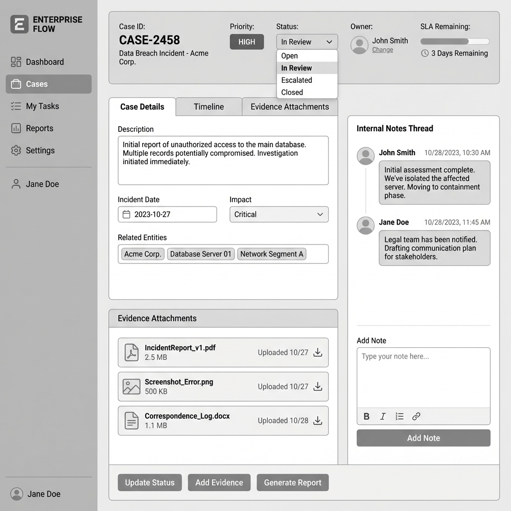

# Case Management

## Overview

| Attribute | Details |
|-----------|---------|
| **Goal** | Replace spreadsheets with enterprise-grade case lifecycle management |
| **Target Persona** | Sarah Chen (Compliance Executive), Marcus Johnson (Analyst) |
| **Permission** | `surveillance:read`, `surveillance:write` |

## Case Lifecycle

```
Open → In Review → Escalated → Closed
         ↓           ↓
      On Hold    External Referral
```

## Features/Widgets

| Feature | Description |
|---------|-------------|
| Case Status Board | Kanban view of case pipeline |
| Owner Assignment | Assign to analyst with SLA tracking |
| Internal Notes | Timestamped discussion thread |
| Evidence Attachments | Linked emails, documents, screenshots |
| Decision Rationale | Required field for case closure |
| SLA Tracking | Days open, target closure date |

## User Stories

1. **As a Surveillance Manager**, I want to track case lifecycle stages so that I can manage team workload.
2. **As a Surveillance Analyst**, I want to add internal notes so that I can document my investigation reasoning.
3. **As a Compliance Officer**, I want decision rationale required at closure so that we maintain audit quality.
4. **As a Surveillance Manager**, I want SLA tracking so that I can identify bottlenecks.
5. **As a Legal Counsel**, I want evidence attachments preserved so that we have complete case records.

## UX Rules

- Decision rationale is mandatory at closure
- SLA warnings at 80% and 100% of target
- Evidence attachments are immutable once added

## Demo Hook

> "Case: Pre-earnings information leakage – Closed (post-mortem analysis) | Decision: Confirmed policy violation | Evidence: 23 linked emails | SLA: Closed in 4 days"

## Wireframe



## Technical Implementation

See [API Reference](../technical/api.md#investigations--cases)
