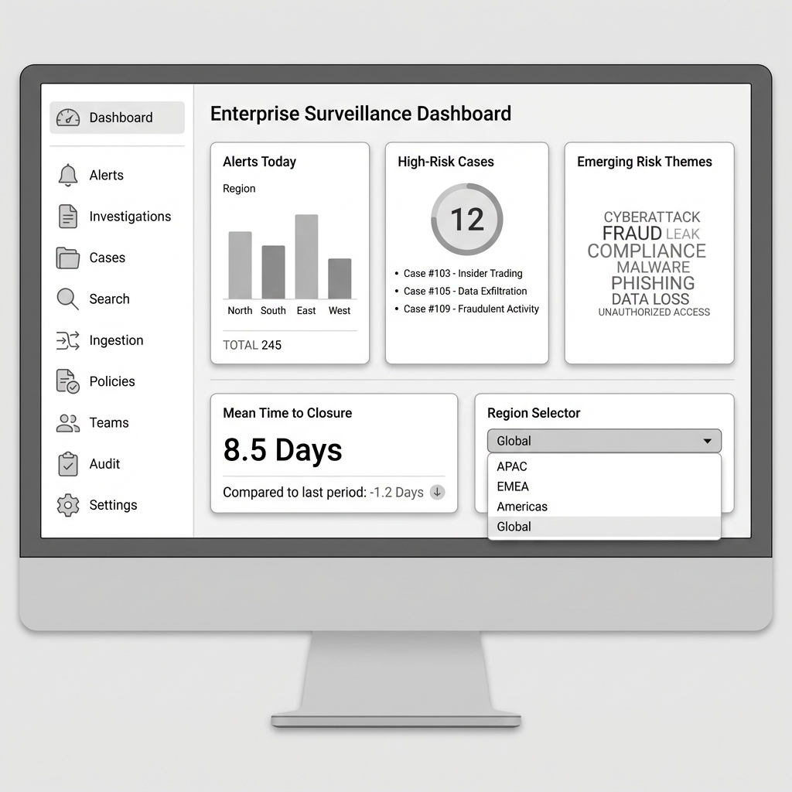

# Dashboard

## Overview

| Attribute | Details |
|-----------|---------|
| **Goal** | Immediately demonstrate this is a real SaaS platform, not a dataset viewer |
| **Target Persona** | Sarah Chen (Compliance Executive) |
| **Permission** | `surveillance:read` |

## Features/Widgets

| Widget | Description | Data Source |
|--------|-------------|-------------|
| Alerts Today | Regional breakdown | `alerts` table |
| High-Risk Cases | Priority cases requiring attention | `investigations` table |
| Emerging Risk Themes | AI-detected trending risks | `orchestrator` service |
| Mean Time to Closure | Case resolution metrics | `investigations` table |
| Region Selector | APAC / EMEA / Americas / Global | Tenant context |

## User Stories

- **As a Compliance Executive**, I want to see today's risk landscape at a glance so that I can prioritize my team's focus areas.
- **As a Compliance Executive**, I want to filter dashboard metrics by region so that I can compare regional risk profiles.
- **As a Surveillance Manager**, I want to see case closure velocity so that I can forecast team workload.
- **As a Compliance Executive**, I want emerging risk themes highlighted so that I can proactively address systemic issues.

## UX Rules

- Region selector persists across session
- Auto-refresh every 5 minutes
- Click-through to detail pages from all widgets

## Demo Hook

> "Risk spike detected before Q3 2001 earnings call – 47% increase in secrecy-coded language"

## Wireframe

## Technical Implementation

See [API Reference](../technical/api.md#dashboard)
