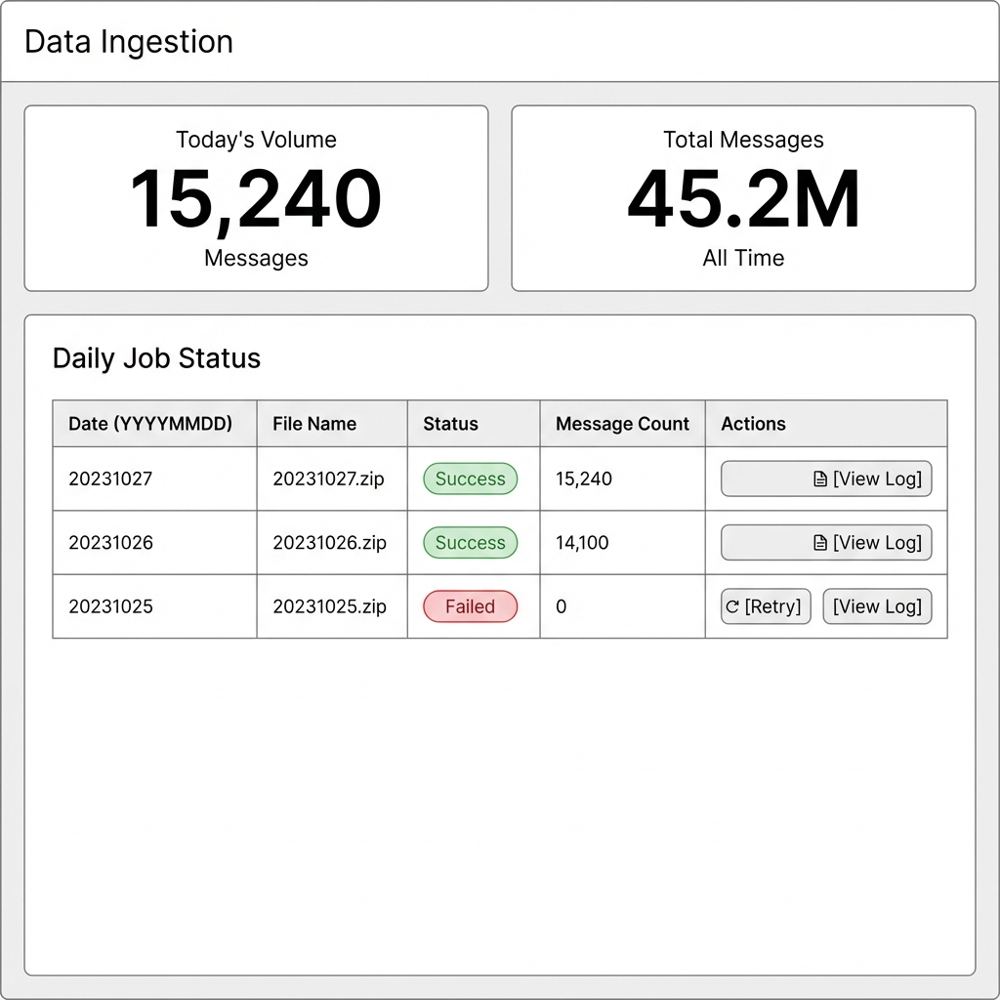

# Ingestion

## Overview

| Attribute | Details |
|-----------|---------|
| **Goal** | Monitor and manage the daily ingestion pipeline for communication data |
| **Target Persona** | David Zheng (IT Admin), Dr. Priya Sharma (Risk Officer) |
| **Permission** | `surveillance:admin` |

## Features/Widgets

| Feature | Description | Data Source |
|---------|-------------|-------------|
| Pipeline Status | Real-time status of daily jobs (Running, Completed, Failed) | `ingestion_logs` |
| File Watcher | Source path monitoring for `YYYYMMDD` patterns | File System / S3 |
| Volume Metrics | Today's Volume and Total Messages processed | Ingestion Metrics |
| **Multi-Format Ingestion**| Support for Email, Chat Logs, Voice Transcripts | Universal Connector |
| **Entity Resolution** | Fuzzy matching of external IDs (email) to Internal Profiles | Directory Service |
| **Risk Tagging** | Auto-apply risk classifiers during ingestion | Model Service |

## User Stories

<!-- Page-Specific Interactions & UI Needs -->
1. **As an IT Admin**, I want to see the status of today's `YYYYMMDD` ingestion job so that I can confirm data freshness.
2. **As an IT Admin**, I want to manually retry failed file segments so that I can resolve transient network errors.
3. **As a Risk Officer**, I want to see daily volume charts so that I can detect anomalous spikes in communication traffic.
4. **As a Data Engineer**, I want confirmation that indexed data is available for both RAG and Keyword search engines.
5. **As a Surveillance Ops Officer**, I want the system to automatically map external email addresses to internal employee profiles so that risk history is tracked against the right person.
6. **As a Compliance Officer**, I want every message scanned for risk signals immediately upon ingestion so that no critical alert is delayed.

## UX Rules

- Status indicators use traffic light colors (Green=Healthy, Red=Failed)
- Failed jobs must show clear error messages (e.g., "Corrupt archive", "Permission denied")
- "Force Re-ingest" requires double confirmation

## Demo Hook

> "System auto-detects '20011023.zip', processes 15k messages in 45s, and immediately flags 12 high-risk items."

## Wireframe

## Technical Implementation

See [API Reference](../technical/api.md#ingestion)
