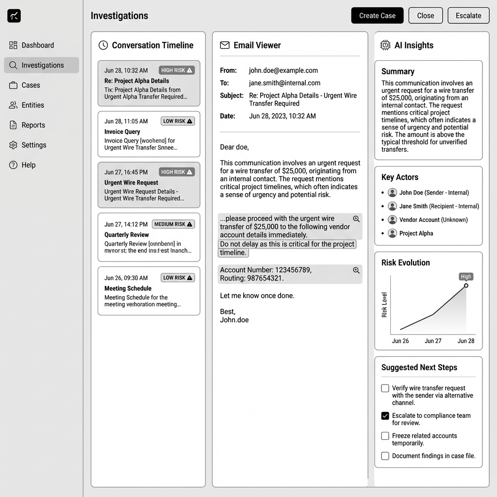

# Investigation Workspace

## Overview

| Attribute | Details |
|-----------|---------|
| **Goal** | Showcase depth beyond simple RAG – this is the platform differentiator |
| **Target Persona** | Marcus Johnson (Surveillance Analyst) |
| **Permission** | `surveillance:read` |

## Three-Panel Layout

| Panel | Content |
|-------|---------|
| **Left: Timeline** | Chronological conversation flow with risk markers |
| **Center: Email Viewer** | Full email with entity highlighting |
| **Right: AI Insights** | Summary, key actors, risk evolution, next steps |

## AI Features

| Feature | Description |
|---------|-------------|
| Conversation Summary | AI-generated synthesis of thread |
| Key Actors | Identified participants with role context |
| Risk Evolution | How risk signals changed over time |
| Suggested Next Steps | AI recommendations for analyst |
| Entity Extraction | People, dates, monetary values highlighted |

## User Stories

- **As a Surveillance Analyst**, I want a unified workspace so that I can investigate without switching between tools.
- **As a Surveillance Analyst**, I want AI-generated conversation summaries so that I can quickly understand long threads.
- **As a Surveillance Analyst**, I want risk evolution timelines so that I can identify when behavior patterns changed.
- **As a Compliance Officer**, I want to see key actors identified so that I can understand organizational exposure.
- **As a Surveillance Manager**, I want suggested next steps so that junior analysts have guidance on complex cases.

## UX Rules

- Three-panel layout is resizable
- Risk markers use consistent color coding
- AI insights update as emails are selected

## Demo Hook

> "Multi-week thread buildup before crisis events. Watch how secrecy language intensifies approaching October 2001. Investigations are conversations, not documents."

## Wireframe

## Technical Implementation

See [API Reference](../technical/api.md#investigations--cases)
