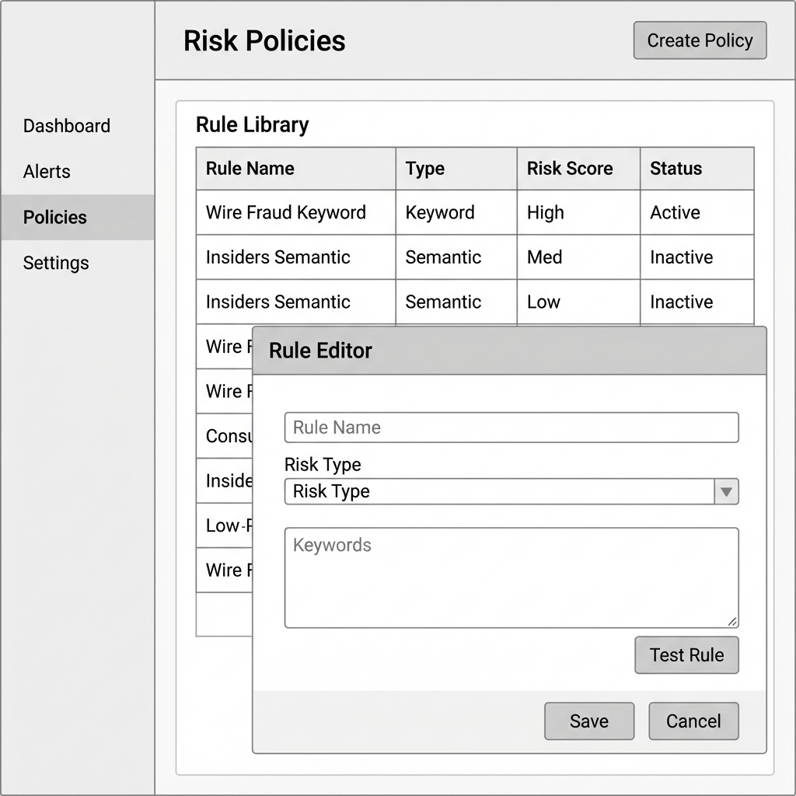

# Surveillance Controls

## Overview

| Attribute | Details |
|-----------|---------|
| **Goal** | Configure and manage the detection logic (Controls) to identify misconduct |
| **Target Persona** | Dr. Priya Sharma (Risk Officer) |
| **Permission** | `controls:manage` |

## Features/Widgets

| Feature | Description |
|---------|-------------|
| **Typology Editor** | Create/Edit detection controls based on specific Risk Typologies. |
| **Risk Detection Engine** | Multi-modal engine supporting Keyword, Regex, and GenAI Semantic matching. |
| **Regulatory Linking** | Link any Surveillance Control to a document in the **[Regulatory Library](./regulatory_library.md)**. |
| **Control Versioning** | Audit trail of active detection logic over time. |

## Data Structure (Schema)

Surveillance Controls are defined using a structured format to ensure consistency across the bank:

```json
{
  "surveillance_control": {
    "risk_typology": "Market Manipulation",
    "risk_indicator": "Load Shifting",
    "regulatory_reference": "FERC Anti-Manipulation Rule",
    "detection_methods": ["Semantic"],
    "status": "Active"
  }
}
```

## Risk Typology & Indicator Matrix

| Risk Typology | Risk Indicator | Detection Technique | Primary Regulation (Catalog) | Enron Examples |
|---------------|----------------|---------------------|------------------------------|-----------------------------|
| **Market Manipulation** | **Gaming Strategies** | Keyword (Exact) | [FERC Anti-Manipulation](./regulatory_library.md) | "Death Star", "Get Shorty" |
| **Market Manipulation** | **Load Shifting** | GenAI (Semantic) | [FERC / CAISO Tariffs](./regulatory_library.md) | Energy arbitrage discussions |
| **Financial Fraud** | **Off-Balance Sheet** | Keyword + Graph | [SOX Section 401](./regulatory_library.md) | "LJM", "Raptor", "SPV" |
| **Conflict of Interest** | **Analyst Pressure** | GenAI (Sentiment)| [Global Research Settlement](./regulatory_library.md) | Trader-Analyst bullying |
| **Evasion & Secrecy** | **Channel Hopping** | GenAI (Intent) | [SEC Rule 17a-4](./regulatory_library.md) | "Call my cell", "Personal email" |

## User Stories

1. **As a Risk Officer**, I want to create a new **Surveillance Control** for "Front Running" and link it to the **SEC Rule 10b-5** in the Regulatory Library.
2. **As a Compliance Head**, I want to view all controls associated with the "Market Manipulation" **Risk Typology**.
3. **As a Surveillance Analyst**, I want to see the specific **Risk Indicator** (e.g., "Load Shifting") that triggered an alert.

## UX Rules

- **Framework Binding**: When creating a control, the user MUST be able to select a document from the Regulatory Library.
- **Explainability**: Controls must explicitly state the **Risk Indicator** and **Typology** in the alert detail.

## Wireframe



## Technical Implementation

- **Storage**: `surveillance_controls` table (Schema matching the JSON format above).
- **Engine**: Hybrid matcher that executes Keyword/Semantic scripts linked to each Control.

See [API Reference](../technical/api.md#surveillance-controls)
