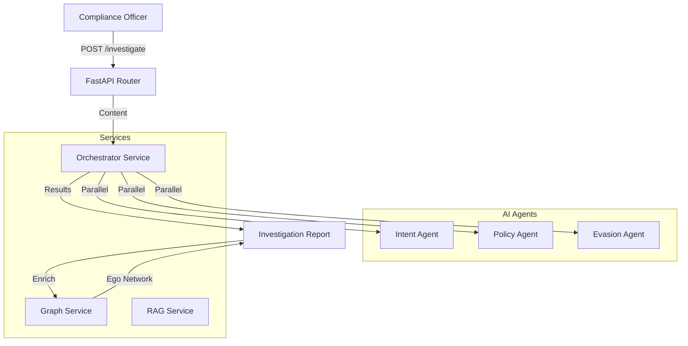

# Architecture

## Data Flow

## Key Components

| Component | File | Description |
|-----------|------|-------------|
| **Router** | `routers/enron.py` | Search, Investigate, Graph endpoints |
| **Service** | `services/orchestrator.py` | Coordinates AI Agents & Case Assembly |
| **Service** | `services/graph.py` | NetworkX Logic (Cliques, Centrality) |
| **Service** | `services/rag.py` | Vector Search over Email Body |
| **Agent** | `agents/intent_agent.py` | Fraud intent detection |
| **Agent** | `agents/policy_agent.py` | Policy violation detection |
| **Agent** | `agents/evasion_agent.py` | Code word detection |
| **Model** | `models/investigation.py` | Investigation entity |
| **Model** | `models/enron_email.py` | Read-only Enron dataset |

## Key Business Rules

- **Multi-Agent Analysis**: Every investigation runs 3 agents in parallel
- **Graph Persistence**: Social graphs built lazily from email metadata
- **Case Management**: High-risk findings promoted to Investigations

## Observability

### Audit Logs

| Event | Payload |
|-------|---------|
| `investigate_email` | `user_id`, `email_id`, `ai_tokens_used` |
| `create_case` | `user_id`, `investigation_id`, `priority` |
| `search_query` | `user_id`, `query`, `result_count` |

### Metrics

- `ai_token_usage` - LLM token consumption per request
- `investigation_latency_ms` - End-to-end investigation time
- `graph_build_duration_s` - Graph construction time

## Testing

### Critical Scenarios

| Scenario | Expected |
|----------|----------|
| Evasion Detection | "Let's take this offline" triggers Evasion Agent |
| Graph Build | Handles disconnected nodes gracefully |
| RAG Search | Returns semantically similar emails |
| Multi-Agent | All 3 agents return within timeout |

### Test Location

- `backend/tests/e2e_api/b2b/use_cases/bank_surveillance/test_enron_api.py`

## Dependencies

- **Internal**: `core.db`, `core.ai`, `modules.b2b.rbac`
- **External**: 
  - OpenAI (LLM for agents)
  - pgvector (Vector search)
- **Env Vars**: 
  - `OPENAI_API_KEY`
  - `DATABASE_URL`
