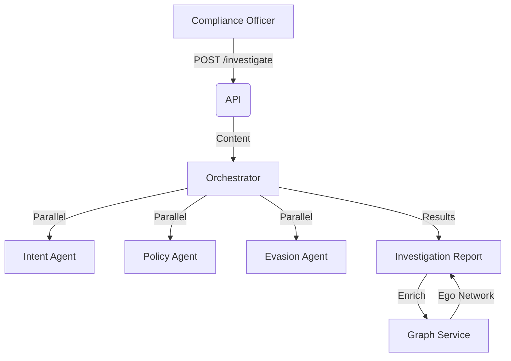

# Architecture

## Data Flow

## Key Components

| Component | File | Description |
| :--- | :--- | :--- |
| **API** | `routers/communications.py` | Message CRUD & Search Endpoints |
| **API** | `routers/investigations.py` | AI Analysis & Agent Coordination |
| **API** | `routers/graph.py` | Network Analysis Endpoints |
| **Service** | `services/orchestrator.py` | Coordinates AI Agents & Case Assembly |
| **Service** | `services/graph.py` | NetworkX Logic (Cliques, Centrality) |
| **Service** | `services/rag.py` | Vector Search over Communications |
| **Model** | `models/investigation.py` | Case Management Entity |
| **Model** | `models/communication.py` | Unified Message Entity (Email/Chat) |

## Dependencies

- **AI/LLM**: `langchain`, `openai` (via Agents)
- **Graph**: `networkx` (In-memory analysis of communication patterns)
- **Vector DB**: `pgvector` (via Postgres 15+)
