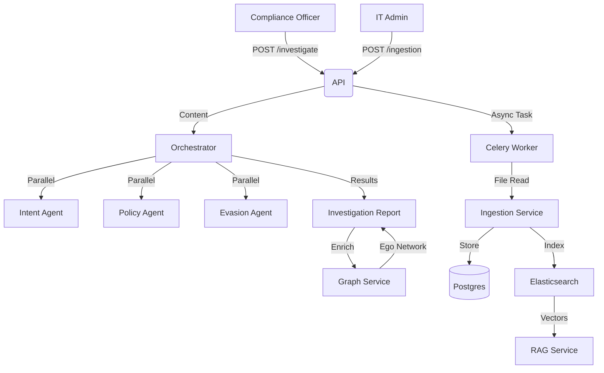

# Architecture

## Data Flow

## Key Components

| Component | File | Description |
| :--- | :--- | :--- |
| **API** | `routers/communications.py` | Message CRUD & Search Endpoints |
| **API** | `routers/investigations.py` | AI Analysis & Agent Coordination |
| **API** | `routers/graph.py` | Network Analysis Endpoints |
| **API** | `routers/ingestion.py` | Ingestion Trigger & Status |
| **Service** | `services/orchestrator.py` | Coordinates AI Agents & Case Assembly |
| **Service** | `services/graph.py` | NetworkX Logic (Cliques, Centrality) |
| **Service** | `services/rag.py` | Vector Search over Communications |
| **Service** | `services/ingestion.py` | ETL Logic for Daily Dumps |
| **Worker** | `tasks/ingestion.py` | Celery Background Task |
| **Model** | `models/investigation.py` | Case Management Entity |
| **Model** | `models/communication.py` | Unified Message Entity (Email/Chat) |
| **Model** | `models/ingestion_log.py` | ETL Job Status Tracking |

## Dependencies

- **AI/LLM**: `langchain`, `openai` (via Agents)
- **Graph**: `networkx` (In-memory analysis of communication patterns)
- **Vector DB**: `pgvector` (via Postgres 15+)
- **Search**: `Elasticsearch` 8.x (Vector Store for RAG via LlamaIndex)
- **Queue**: `Celery` + `Redis` (Async Ingestion)
- **Schedule**: `Celery Beat` (Daily Cron)
