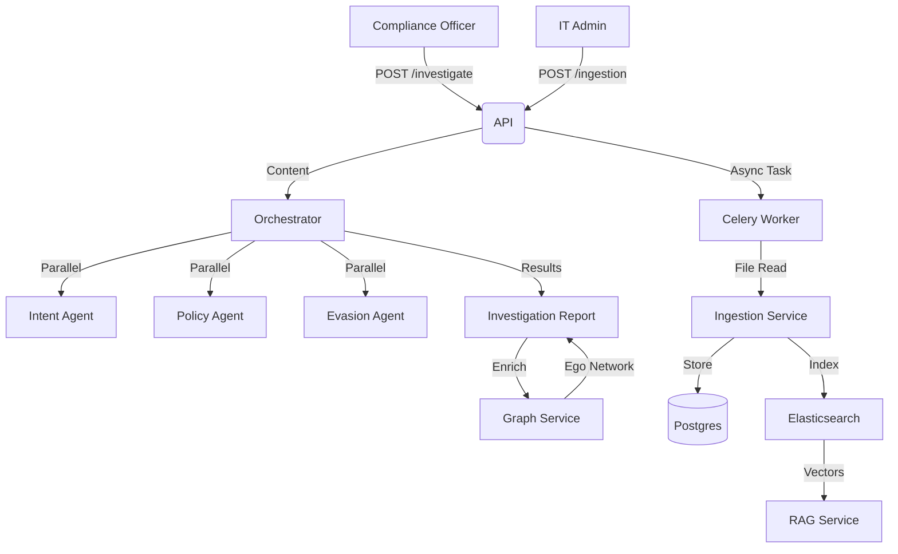

# Architecture

## Data Flow

## Key Components

| Component | File | Description |
| :--- | :--- | :--- |
| **Control Engine** | `services/engine.py` | Executes Risk Indicators against incoming messages |
| **Alerting Service** | `services/alerting.py`| Aggregates Risk Signals into singular Alerts |
| **Risk Signal Model** | `models/signal.py` | Persistent store for "Potential Incidents" |
| **Surv. Control Model**| `models/control.py` | Configuration for Typologies and Indicators |
| **Ingestion Service** | `services/ingestion.py` | ETL Logic + Step 1 Coordination |
| **Worker** | `tasks/ingestion.py` | Celery Background Task (Step 1 & 2) |
| **Model** | `models/investigation.py` | Case Management Entity |
| **Model** | `models/communication.py` | Unified Message Entity (Email/Chat) |
| **Model** | `models/ingestion_log.py` | ETL Job Status Tracking |

## Dependencies

- **AI/LLM**: `langchain`, `openai` (via Agents)
- **Graph**: `networkx` (In-memory analysis of communication patterns)
- **Vector DB**: `pgvector` (via Postgres 15+)
- **Search**: `Elasticsearch` 8.x (Vector Store for RAG via LlamaIndex)
- **Queue**: `Celery` + `Redis` (Async Ingestion)
- **Schedule**: `Celery Beat` (Daily Cron)

## RBAC Resources

Domain-specific resources defined in [`resources.yaml`](../../../../scripts/b2b/use_cases/bank_surveillance/resources.yaml).

| Resource | Category | Description |
|----------|----------|-------------|
| `communications` | Surveillance | Raw message access |
| `rag_search` | Surveillance | Semantic/vector search |
| `alerts` | Surveillance | Alert triage workflow |
| `cases` | Surveillance | Case lifecycle management |
| `investigations` | Surveillance | AI investigation workspace |
| `graph` | Surveillance | Social graph analysis |
| `ingestion` | Engineering | Data pipeline management |
| `audit_logs` | Compliance | Chain of custody |
| `retention_policies` | Compliance | Region-specific retention |
| `regions` | Administration | Geo-fencing control |
| `sensitive_content` | Administration | MNPI/clearance-gated access |
| `cross_region_data` | Administration | Global drill-down access |
| `surveillance_reports` | Reporting | Regulatory reports |
| `analytics` | Reporting | Volume & ops statistics |
| `model_config` | Administration | AI model tuning |

## RBAC Actions

Domain-specific actions defined in [`actions.yaml`](../../../../scripts/b2b/use_cases/bank_surveillance/actions.yaml).

| Action | Description | Applicable Resources |
|--------|-------------|---------------------|
| `search` | Semantic/keyword search | `communications`, `rag_search` |
| `query` | RAG guided questions | `rag_search` |
| `investigate` | Formal investigation workflow | `investigations`, `alerts` |
| `flag` | Mark as suspicious | `communications`, `alerts` |
| `escalate` | Escalate to senior reviewer | `alerts`, `cases` |
| `close` | Close with decision rationale | `alerts`, `cases` |
| `assign` | Assign to analyst | `cases`, `alerts`, `regions` |
| `approve` | 4-eyes approval | `investigations`, `cases` |
| `acknowledge` | Acknowledge alert | `alerts` |
| `analyze` | Graph/network analysis | `graph`, `communications` |
| `trigger` | Trigger ingestion job | `ingestion` |
| `retry` | Retry failed job | `ingestion` |
| `submit` | Submit for review | `surveillance_reports` |
| `export` | Export for regulatory use | `surveillance_reports`, `audit_logs` |
| `train` | Train AI models | `model_config` |
| `configure` | Modify settings | `model_config`, `retention_policies` |
| `grant` | Grant elevated access | `cross_region_data`, `sensitive_content` |
| `redact` | Redact sensitive content | `sensitive_content` |

## RBAC Matrix (Role-Permission Summary)

Roles defined in [`team_roles.yaml`](../../../../scripts/b2b/use_cases/bank_surveillance/team_roles.yaml).

| Role | Tier | Key Permissions | User Story |
|------|------|-----------------|------------|
| **CSO** | Global | Full surveillance + cross-region | Global risk aggregation, drill-down |
| **Head Compliance** | Global | Read-only + audit export | External auditor oversight |
| **Regional Director** | Regional | Full regional surveillance | Cross-border investigation |
| **Surveillance Manager** | Country | Team mgmt + case approval | SLA monitoring, workload |
| **Surveillance Analyst** | Country/Branch | Core workflow: search, flag, investigate | Daily alert triage |
| **Junior Analyst** | Branch | Limited + auto-redacted content | MNPI protection |
| **Ops Maker** | All | Create cases (no approve) | 4-Eyes: Prepare cases |
| **Ops Checker** | All | Approve/close (no create) | 4-Eyes: Review & approve |
| **Compliance Officer** | Country/Branch | Read-only + export | Audit quality |
| **Risk Officer** | Global/Regional | Analytics + retention config | Region policy setup |
| **SurvOps** | Global/Regional | Ingestion + model config | Pipeline health |
| **IT Admin** | Global | Region assign + ingestion | Geo-fencing control |
| **External Auditor** | Global/Regional | Audit logs only (no content) | Chain of custody |
| **Legal Counsel** | Global/Regional | Case evidence export | Legal hold |

