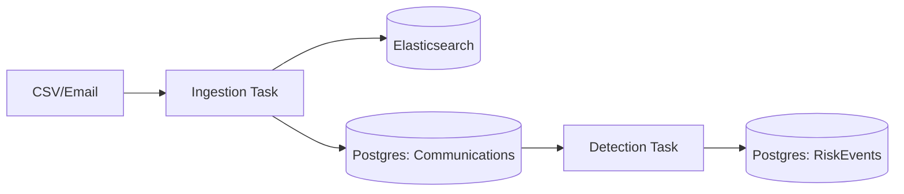
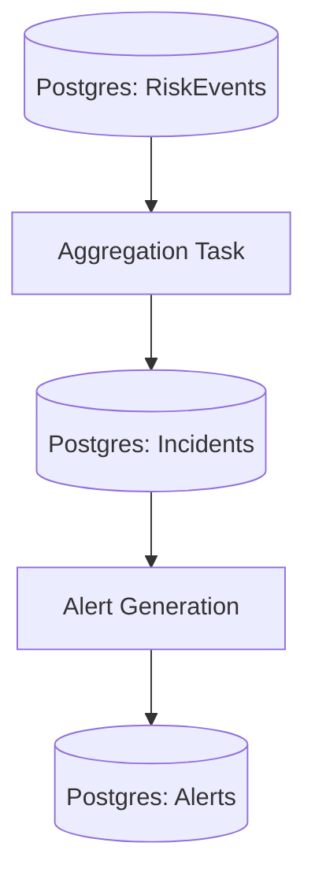
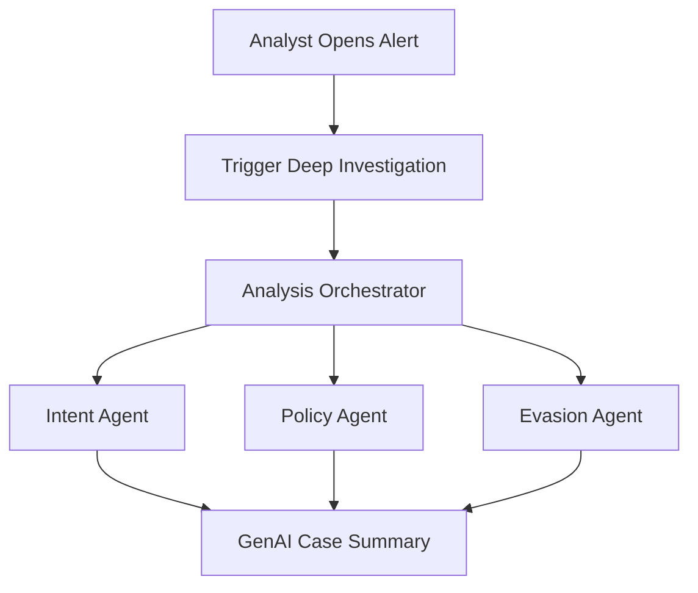

# Architecture

## Data Flow

The platform operates via two decoupled background workflows to transform raw communication data into actionable alerts.

> [!IMPORTANT]
> Workflows are **triggered via REST API** from the UI but **processed asynchronously by Celery workers**. The API returns immediately with a `job_id` for status polling.

### Workflow A: Ingest + Detect
**Goal**: Normalize data and flag individual risky messages immediately.

### Workflow B: Group + Alert
**Goal**: Reduce noise by aggregating signals into logical incidents and analyst-facing alerts.

## Key Components

| Component | File | Description |
| :--- | :--- | :--- |
| **Detection Service** | `services/detection.py` | Executes Risk Indicators (Keyword/Regex) against ES messages |
| **Aggregation Service** | `services/aggregation.py`| Pluggable logic to group RiskEvents into Incidents |
| **Alerting Service** | `services/alerting.py`| Consolidates Incidents into actionable Alerts |
| **RiskEvent Model** | `models/risk_event.py` | Tier 1: Individual match evidence |
| **Incident Model** | `models/incident.py` | Tier 2: Aggregated signals per sender/day |
| **Alert Model** | `models/alert.py` | Tier 3: Investigation work unit |
| **Surv. Control Model**| `models/surveillance_control.py` | Config for Typologies, Indicators, and Detection Methods |
| **Ingestion Service** | `services/ingestion.py` | ETL Logic + Triggering Detection Workflow |
| **Ingestion Worker** | `tasks/ingestion.py` | Celery task for Ingest + Detect workflow |
| **Alert Worker** | `tasks/alerting.py` | **[NEW]** Celery task for Group + Alert workflow |
| **Detection Service** | `services/detection.py` | **[NEW]** Executes Risk Indicators (Keyword/Regex) against ES |
| **Aggregation Service** | `services/aggregation.py` | **[NEW]** Pluggable logic to group RiskEvents into Incidents |
| **Communication Model**| `models/communication.py` | Lightweight reference to ES message |
| **RiskEvent Model** | `models/risk_event.py` | **[NEW]** Tier 1: Individual match evidence |
| **Incident Model** | `models/incident.py` | **[NEW]** Tier 2: Aggregated signals per sender/day |
| **Alert Model** | `models/alert.py` | Tier 3: Investigation work unit (updated) |
| **Intent Agent** | `services/agents/intent.py` | **[DESIGN]** Infers willful misconduct intent |
| **Policy Agent** | `services/agents/policy.py` | **[DESIGN]** Maps signals to regulatory clauses |
| **Evasion Agent** | `services/agents/evasion.py`| **[DESIGN]** Detects surveillance circumvention |

## 3-Tier Data Model Hierarchy

To manage high communication volumes, the system uses a progressive aggregation strategy:

| Layer | Model | Frequency | Grouping / Pivot |
|-------|-------|-----------|------------------|
| **Tier 1** | `RiskEvent` | Once per match | Message + Control |
| **Tier 2** | `Incident` | Per Grouping Policy | Sender + Control + Time Window (e.g. Day) |
| **Tier 3** | `Alert` | Investigation Unit | Multiple Incidents (e.g. "Trader John's weekly risk summary") |

## Tier 4: Agentic Investigation (Advanced AI Analysis)

> [!NOTE]
> High-priority research area: Currently identifying specific bank surveillance use cases for these agents.

For complex Alerts, analysts can trigger a **Multi-Agent Deep Dive** to assemble evidence and infer intent.

### Proposed AI Agents Roles

| Agent | Proposed Role | Potential Use Case |
| :--- | :--- | :--- |
| **Intent Agent** | Understands the "why" behind a message | Detecting willful manipulation vs. fat-finger error |
| **Policy Agent** | Cross-references message with regulatory library | Mapping a chat to a specific MAS/SEC violation clause |
| **Evasion Agent** | Detects attempts to hide communications | Flagging "let's take this to WhatsApp" or code words |

## Dependencies

- **AI/LLM**: `langchain`, `openai` (via Agents)
- **Graph**: `networkx` (In-memory analysis of communication patterns)
- **Vector DB**: `pgvector` (via Postgres 15+)
- **Search**: `Elasticsearch` 8.x (Vector Store for RAG via LlamaIndex)
- **Queue**: `Celery` + `Redis` (Async Ingestion)
- **Schedule**: `Celery Beat` (Daily Cron)

## RBAC Resources

Domain-specific resources defined in [`resources.yaml`](../../../../scripts/b2b/use_cases/bank_surveillance/resources.yaml).

| Resource | Category | Description |
|----------|----------|-------------|
| `communications` | Surveillance | Raw message access |
| `rag_search` | Surveillance | Semantic/vector search |
| `alerts` | Surveillance | Alert triage workflow |
| `cases` | Surveillance | Case lifecycle management |
| `investigations` | Surveillance | AI investigation workspace |
| `graph` | Surveillance | Social graph analysis |
| `ingestion` | Engineering | Data pipeline management |
| `audit_logs` | Compliance | Chain of custody |
| `retention_policies` | Compliance | Region-specific retention |
| `regions` | Administration | Geo-fencing control |
| `sensitive_content` | Administration | MNPI/clearance-gated access |
| `cross_region_data` | Administration | Global drill-down access |
| `surveillance_reports` | Reporting | Regulatory reports |
| `analytics` | Reporting | Volume & ops statistics |
| `model_config` | Administration | AI model tuning |

## RBAC Actions

Domain-specific actions defined in [`actions.yaml`](../../../../scripts/b2b/use_cases/bank_surveillance/actions.yaml).

| Action | Description | Applicable Resources |
|--------|-------------|---------------------|
| `search` | Semantic/keyword search | `communications`, `rag_search` |
| `query` | RAG guided questions | `rag_search` |
| `investigate` | Formal investigation workflow | `investigations`, `alerts` |
| `flag` | Mark as suspicious | `communications`, `alerts` |
| `escalate` | Escalate to senior reviewer | `alerts`, `cases` |
| `close` | Close with decision rationale | `alerts`, `cases` |
| `assign` | Assign to analyst | `cases`, `alerts`, `regions` |
| `approve` | 4-eyes approval | `investigations`, `cases` |
| `acknowledge` | Acknowledge alert | `alerts` |
| `analyze` | Graph/network analysis | `graph`, `communications` |
| `trigger` | Trigger ingestion job | `ingestion` |
| `retry` | Retry failed job | `ingestion` |
| `submit` | Submit for review | `surveillance_reports` |
| `export` | Export for regulatory use | `surveillance_reports`, `audit_logs` |
| `train` | Train AI models | `model_config` |
| `configure` | Modify settings | `model_config`, `retention_policies` |
| `grant` | Grant elevated access | `cross_region_data`, `sensitive_content` |
| `redact` | Redact sensitive content | `sensitive_content` |

## RBAC Matrix (Role-Permission Summary)

Roles defined in [`team_roles.yaml`](../../../../scripts/b2b/use_cases/bank_surveillance/team_roles.yaml).

| Role | Tier | Key Permissions | User Story |
|------|------|-----------------|------------|
| **CSO** | Global | Full surveillance + cross-region | Global risk aggregation, drill-down |
| **Head Compliance** | Global | Read-only + audit export | External auditor oversight |
| **Regional Director** | Regional | Full regional surveillance | Cross-border investigation |
| **Surveillance Manager** | Country | Team mgmt + case approval | SLA monitoring, workload |
| **Surveillance Analyst** | Country/Branch | Core workflow: search, flag, investigate | Daily alert triage |
| **Junior Analyst** | Branch | Limited + auto-redacted content | MNPI protection |
| **Ops Maker** | All | Create cases (no approve) | 4-Eyes: Prepare cases |
| **Ops Checker** | All | Approve/close (no create) | 4-Eyes: Review & approve |
| **Compliance Officer** | Country/Branch | Read-only + export | Audit quality |
| **Risk Officer** | Global/Regional | Analytics + retention config | Region policy setup |
| **SurvOps** | Global/Regional | Ingestion + model config | Pipeline health |
| **IT Admin** | Global | Region assign + ingestion | Geo-fencing control |
| **External Auditor** | Global/Regional | Audit logs only (no content) | Chain of custody |
| **Legal Counsel** | Global/Regional | Case evidence export | Legal hold |

