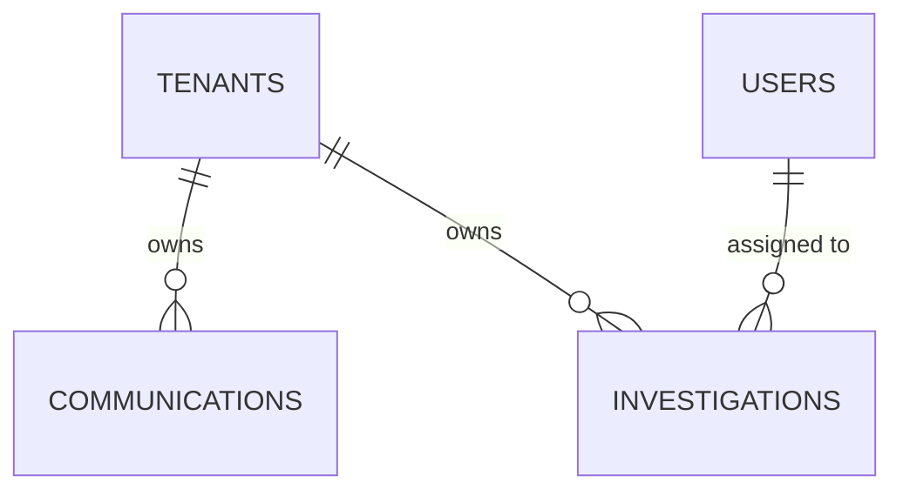

# Database Schema

**Schema**: `bank_surveillance`

## Tables

### communications

**Central Message Store** for all communication types (Email, Chat, Voice).

| Column | Type | Description |
|--------|------|-------------|
| `id` | UUID | Primary key |
| `tenant_id` | UUID | FK to tenants (RLS enabled) |
| `message_id` | VARCHAR | Unique external ID (e.g. email Message-ID) |
| `sub_channel` | VARCHAR | Specific sub-channel (e.g. 'slack-general') |
| `sender` | VARCHAR | Sender address/handle |
| `recipients` | VARCHAR[] | Array of recipient addresses |
| `subject` | VARCHAR | Message subject/thread title |
| `content` | TEXT | Message body content |
| `timestamp` | TIMESTAMPTZ | Message time |
| `embedding` | VECTOR(1536) | OpenAI embedding for RAG |
| `created_at` | TIMESTAMPTZ | Ingestion time |

**Indexes:**
- `idx_communications_tenant_id` on `tenant_id`
- `idx_communications_sender` on `sender`
- `idx_communications_timestamp` on `timestamp`
- `idx_communications_embedding` using IVFFlat for vector search

**RLS Policy:** Enabled, filtered by `tenant_id`

---

### investigations

Active cases requiring human or AI review.

| Column | Type | Description |
|--------|------|-------------|
| `id` | UUID | Primary key |
| `tenant_id` | UUID | FK to tenants |
| `title` | VARCHAR | Investigation title |
| `description` | TEXT | Investigation description |
| `priority` | VARCHAR | high/medium/low |
| `status` | VARCHAR | open/in_review/escalated/closed |
| `assigned_to` | UUID | FK to users |
| `created_by` | UUID | FK to users |
| `created_at` | TIMESTAMPTZ | Creation time |
| `updated_at` | TIMESTAMPTZ | Last update |
| `closed_at` | TIMESTAMPTZ | Closure time |
| `decision_rationale` | TEXT | Required at closure |

**Indexes:**
- `idx_investigations_tenant_id` on `tenant_id`
- `idx_investigations_status` on `status`
- `idx_investigations_assigned_to` on `assigned_to`

---

## Relationships

