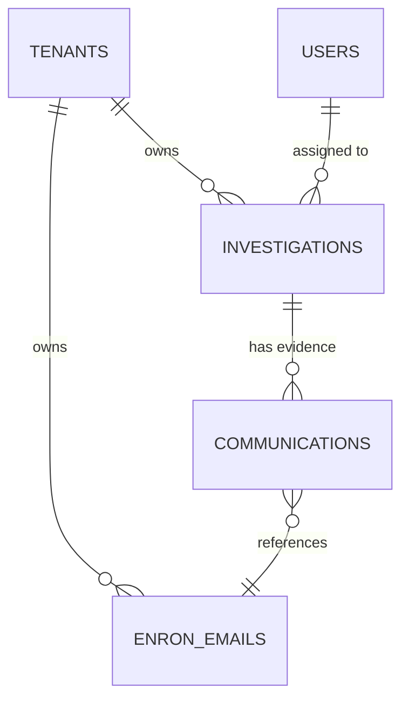

# Database Schema

**Schema**: `bank_surveillance`

## Tables

### enron_emails

| Column | Type | Description |
|--------|------|-------------|
| `id` | UUID | Primary key |
| `tenant_id` | UUID | FK to tenants (RLS enabled) |
| `sender` | VARCHAR | Email sender address |
| `recipients` | TEXT[] | Array of recipient emails |
| `subject` | VARCHAR | Email subject line |
| `body` | TEXT | Email body content |
| `date` | TIMESTAMP | Email date |
| `embedding` | VECTOR(1536) | OpenAI embedding for RAG |
| `created_at` | TIMESTAMP | Ingestion time |

**Indexes:**
- `idx_enron_emails_tenant_id` on `tenant_id`
- `idx_enron_emails_sender` on `sender`
- `idx_enron_emails_date` on `date`
- `idx_enron_emails_embedding` using IVFFlat for vector search

**RLS Policy:** Enabled, filtered by `tenant_id`

---

### investigations

| Column | Type | Description |
|--------|------|-------------|
| `id` | UUID | Primary key |
| `tenant_id` | UUID | FK to tenants |
| `title` | VARCHAR | Investigation title |
| `description` | TEXT | Investigation description |
| `priority` | VARCHAR | high/medium/low |
| `status` | VARCHAR | open/in_review/escalated/closed |
| `assigned_to` | UUID | FK to users |
| `created_by` | UUID | FK to users |
| `created_at` | TIMESTAMP | Creation time |
| `updated_at` | TIMESTAMP | Last update |
| `closed_at` | TIMESTAMP | Closure time |
| `decision_rationale` | TEXT | Required at closure |

**Indexes:**
- `idx_investigations_tenant_id` on `tenant_id`
- `idx_investigations_status` on `status`
- `idx_investigations_assigned_to` on `assigned_to`

---

### communications

| Column | Type | Description |
|--------|------|-------------|
| `id` | UUID | Primary key |
| `investigation_id` | UUID | FK to investigations |
| `email_id` | UUID | FK to enron_emails |
| `added_at` | TIMESTAMP | When linked |
| `added_by` | UUID | FK to users |

**Purpose:** Links emails to investigations as evidence

---

## Relationships

