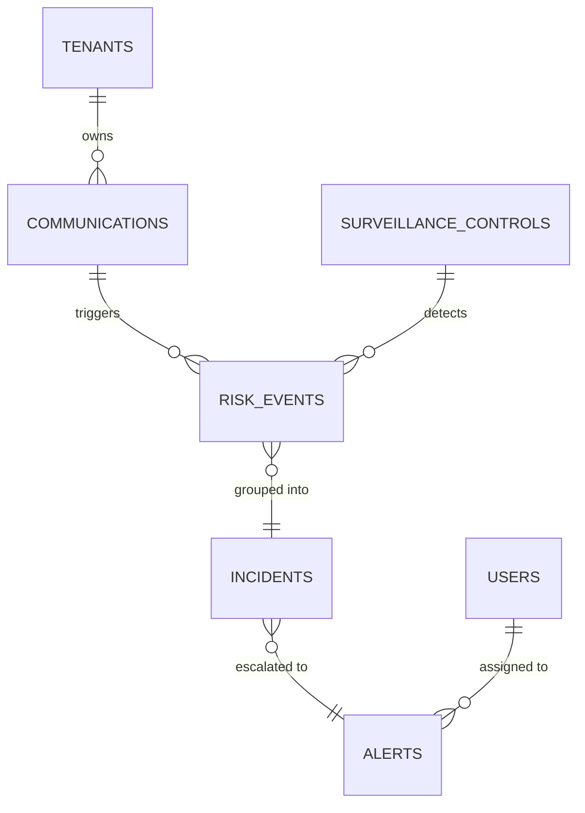

# Database Schema

**Schema**: `bank_surveillance`

## Tables

### communications

**Lightweight Message Reference**. Raw content resides in Elasticsearch.

| Column | Type | Description |
|--------|------|-------------|
| `id` | UUID | Primary key |
| `tenant_id` | UUID | FK to `b2b.tenants` (RLS enabled) |
| `sender` | VARCHAR(200) | Sender address/handle |
| `recipients` | VARCHAR[] | Array of recipient addresses |
| `channel` | VARCHAR(50) | email/chat/voice |
| `timestamp` | TIMESTAMPTZ | Message time |
| `thread_id` | VARCHAR | Grouping ID for conversation view |
| `es_document_id` | VARCHAR | Unique ID in Elasticsearch index |
| `analyzed` | BOOLEAN | Whether detection has run |
| `created_at` | TIMESTAMPTZ | Ingestion time |
| `updated_at` | TIMESTAMPTZ | Last modification |

**Indexes:**
- `idx_comm_tenant` on `tenant_id`
- `idx_comm_sender` on `sender`
- `idx_comm_thread` on `thread_id`
- `idx_comm_es_id` (Unique) on `es_document_id`
- `idx_comm_analyzed` on `analyzed`

**RLS Policy:** Enabled, filtered by `tenant_id`

---

### surveillance_controls

**Risk Detection Configuration**.

| Column | Type | Description |
|--------|------|-------------|
| `id` | UUID | Primary key |
| `tenant_id` | UUID | FK to `b2b.tenants` |
| `risk_typology` | VARCHAR(100) | e.g. "Market Manipulation" |
| `risk_indicator` | VARCHAR(100) | e.g. "Load Shifting" |
| `detection_methods` | JSONB | Keywords, regex, and ML configs |
| `status` | VARCHAR(50) | Active/Inactive |
| `created_at` | TIMESTAMPTZ | Creation time |
| `updated_at` | TIMESTAMPTZ | Last modification |

---

### risk_events (Tier 1)

**Individual Signal Evidence**.

| Column | Type | Description |
|--------|------|-------------|
| `id` | UUID | Primary key |
| `tenant_id` | UUID | FK to `b2b.tenants` |
| `communication_id` | UUID | FK to communications |
| `control_id` | UUID | FK to surveillance_controls |
| `sender` | VARCHAR(200) | Denormalized for aggregation |
| `event_timestamp` | TIMESTAMPTZ | Denormalized for aggregation |
| `match_type` | VARCHAR(50) | keyword/regex/ml |
| `matched_keywords` | JSONB | Evidence: specific words found |
| `matched_snippet` | TEXT | Evidence: context snippet |
| `match_score` | FLOAT | Confidence score (0-1) |
| `incident_id` | UUID | FK to incidents (nullable) |
| `created_at` | TIMESTAMPTZ | Detection time |
| `updated_at` | TIMESTAMPTZ | Last modification |

**Unique Constraint:** `uq_riskevent_comm_control` on `(communication_id, control_id)` — prevents duplicate detections.

---

### incidents (Tier 2)

**Aggregated Signals**.

| Column | Type | Description |
|--------|------|-------------|
| `id` | UUID | Primary key |
| `tenant_id` | UUID | FK to `b2b.tenants` |
| `control_id` | UUID | FK to surveillance_controls |
| `sender` | VARCHAR(200) | Actor identity |
| `incident_date` | DATE | Aggregation window |
| `event_count` | INT | Number of risk events in group |
| `severity` | VARCHAR(20) | Low/Med/High/Critical |
| `status` | VARCHAR(20) | open/reviewed/escalated/closed |
| `alert_id` | UUID | FK to alerts (nullable) |
| `created_at` | TIMESTAMPTZ | Creation time |
| `updated_at` | TIMESTAMPTZ | Last modification |

---

### alerts (Tier 3)

**Analyst Action Items**.

| Column | Type | Description |
|--------|------|-------------|
| `id` | UUID | Primary key |
| `tenant_id` | UUID | FK to `b2b.tenants` |
| `subject` | VARCHAR(255) | Auto-generated: "{Sender} - {Indicator} - {Date}" |
| `status` | VARCHAR(20) | open/investigating/escalated/closed |
| `severity` | VARCHAR(20) | Max severity of linked incidents |
| `assigned_to` | UUID | FK to `b2b.users` |
| `description` | TEXT | Optional notes |
| `created_at` | TIMESTAMPTZ | Generation time |
| `updated_at` | TIMESTAMPTZ | Last modification |

---

## Relationships

---

## Elasticsearch Index: `communications-*`

Message content is stored in ES (not PG) for full-text search and scalability.

| Field | Type | Description |
|-------|------|-------------|
| `id` | keyword | Matches PG `communications.id` |
| `tenant_id` | keyword | For tenant filtering |
| `thread_id` | keyword | For conversation retrieval |
| `sender` | keyword | Sender address |
| `recipients` | keyword[] | Recipient list |
| `subject` | text | Message subject |
| `content` | text | Full message body |
| `timestamp` | date | Message time |
