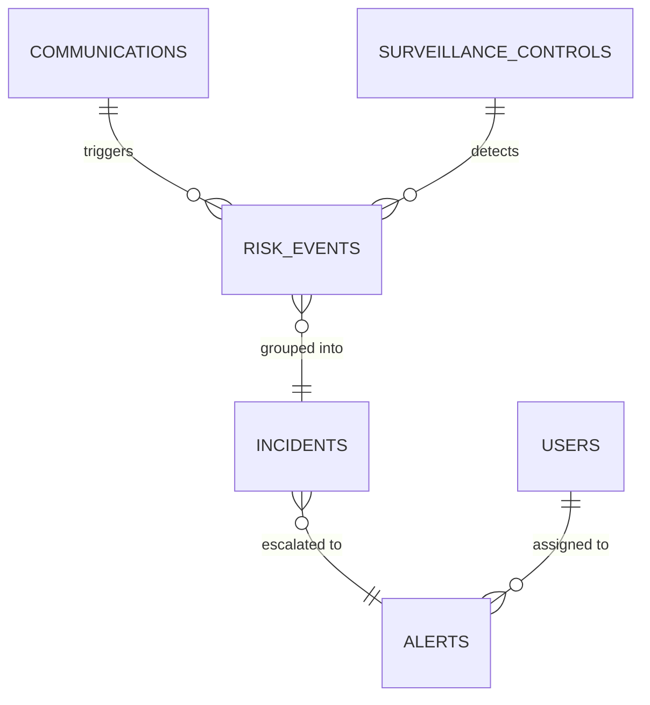

# Database Schema

**Schema**: `bank_surveillance`

## Tables

### communications

**Lightweight Message Reference**. Raw content resides in Elasticsearch.

| Column | Type | Description |
|--------|------|-------------|
| `id` | UUID | Primary key |
| `tenant_id` | UUID | FK to tenants |
| `sender` | VARCHAR | Sender address/handle |
| `recipients` | VARCHAR[] | Array of recipient addresses |
| `timestamp` | TIMESTAMPTZ | Message time |
| `thread_id` | VARCHAR | Grouping ID for conversation view |
| `es_document_id` | VARCHAR | Unique ID in Elasticsearch index |
| `created_at` | TIMESTAMPTZ | Ingestion time |

**Indexes:**
- `idx_comm_tenant` on `tenant_id`
- `idx_comm_sender` on `sender`
- `idx_comm_thread` on `thread_id`
- `idx_comm_es_id` (Unique) on `es_document_id`

---

### surveillance_controls

**Risk Detection Configuration**.

| Column | Type | Description |
|--------|------|-------------|
| `id` | UUID | Primary key |
| `tenant_id` | UUID | FK to tenants |
| `risk_typology` | VARCHAR | e.g. "Market Manipulation" |
| `risk_indicator` | VARCHAR | e.g. "Load Shifting" |
| `detection_methods` | JSONB | Keywords, regex, and ML configs |
| `status` | VARCHAR | Active/Inactive |

---

### risk_events (Tier 1)

**Individual Signal Evidence**.

| Column | Type | Description |
|--------|------|-------------|
| `id` | UUID | Primary key |
| `tenant_id` | UUID | FK to tenants |
| `communication_id` | UUID | FK to communications |
| `control_id` | UUID | FK to surveillance_controls |
| `sender` | VARCHAR | Denormalized for aggregation |
| `event_timestamp` | TIMESTAMPTZ | Denormalized for aggregation |
| `matched_keywords` | JSONB | Evidence: specific words found |
| `matched_snippet` | TEXT | Evidence: context snippet |
| `incident_id` | UUID | FK to incidents (nullable) |

---

### incidents (Tier 2)

**Aggregated Signals**.

| Column | Type | Description |
|--------|------|-------------|
| `id` | UUID | Primary key |
| `tenant_id` | UUID | FK to tenants |
| `control_id` | UUID | FK to surveillance_controls |
| `sender` | VARCHAR | Actor identity |
| `incident_date` | DATE | Aggregation window |
| `event_count` | INT | Number of risk events in group |
| `severity` | VARCHAR | Low/Med/High |
| `alert_id` | UUID | FK to alerts (nullable) |

---

### alerts (Tier 3)

**Analyst Action Items**.

| Column | Type | Description |
|--------|------|-------------|
| `id` | UUID | Primary key |
| `tenant_id` | UUID | FK to tenants |
| `subject` | VARCHAR | Alert title |
| `status` | VARCHAR | open/investigating/escalated/closed |
| `severity` | VARCHAR | Aggregated priority |
| `assigned_to` | UUID | FK to users |
| `created_at` | TIMESTAMPTZ | Generation time |

---

## Relationships

