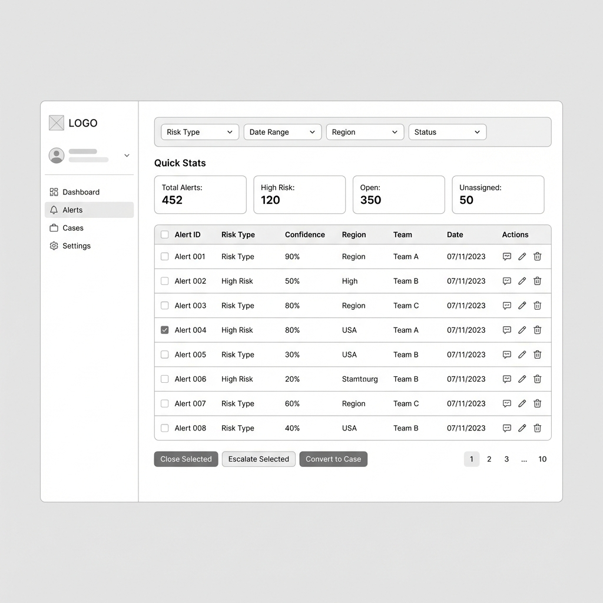
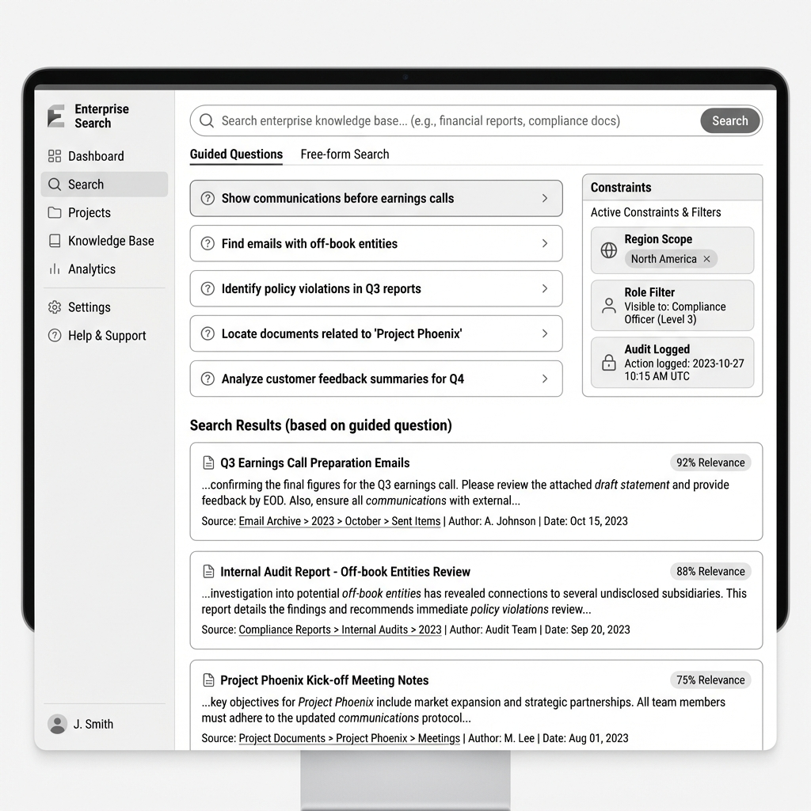

# Wireframes

Clean grayscale wireframes for 5 key pages of the Bank Surveillance platform.

## Pages

### 1. Dashboard

*Executive overview with alerts by region, high-risk cases, emerging risk themes, and region selector.*

### 2. Alerts Management

*Daily analyst workflow with filters, quick stats, bulk actions, and sortable alert table.*

### 3. Investigation Workspace

*Three-panel layout: conversation timeline, email viewer with highlights, and AI insights panel.*

### 4. Search & RAG

*Guided questions and free-form search with constraints panel and relevance-scored results.*

### 5. Case Management

*Case lifecycle with SLA tracking, evidence attachments, internal notes, and action buttons.*

---

## Design Principles

- **Grayscale palette** for clear layout focus
- **Enterprise-friendly** spacing and typography
- **Consistent navigation** across all pages
- **Action-oriented** CTAs and bulk operations
