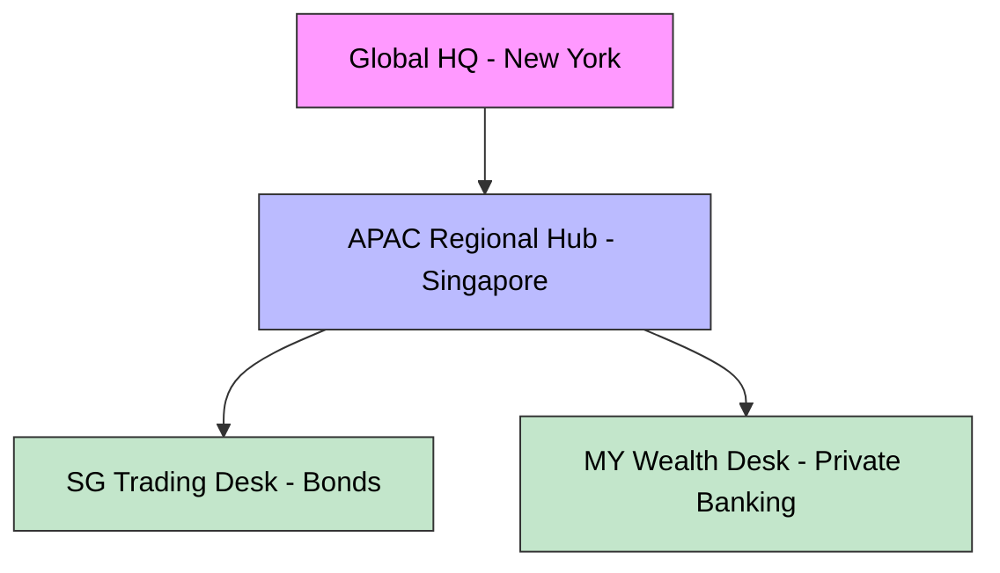
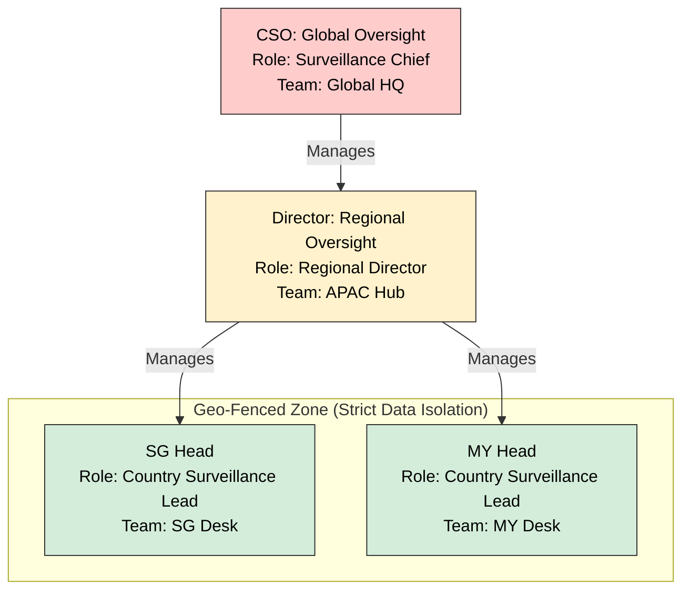

# Bank Surveillance Use Case (Enterprise)

Complete RBAC configuration for Global Bank Surveillance operations, demonstrating **"Multi-Dimensional"** Attribute-Based Access Control (ABAC).

## 1. Target Organization Structure

We are modeling **Worldwide Bank**, a regulated financial institution with a hierarchical structure designed to enforce compliance and data segregation.



*   **Global HQ:** Oversight of all regions (CSO).
*   **APAC Hub:** Management of Asian markets (Regional Director).
*   **Trading Desks:** Isolated operational units (Singapore & Malaysia).


### Scope Levels

| Level | Description | Example |
|-------|-------------|---------|
| **GLOBAL** | Headquarters, cross-border oversight | Global HQ |
| **REGIONAL** | Multi-country management | APAC Hub |
| **COUNTRY** | Single juristiction | Singapore Office |
| **BRANCH** | Local operational unit | SG Trading Desk |

---

## 2. Role Portfolio

We define specific roles to match the bank's operational and compliance needs.

| S.No. | Category | Role Name | Type | Allowed Scope | Description |
| :---: | :--- | :--- | :--- | :--- | :--- |
| 1 | **Leadership** | `surveillance_chief` | **Team** | `GLOBAL` | C-Suite executive (CSO). Assigned to "Global HQ" team. |
| 2 | **Leadership** | `regional_director` | **Team** | `REGIONAL` | Regional management. Assigned to "APAC Hub". |
| 3 | **Leadership** | `head_compliance` | **Team** | `GLOBAL` | Global oversight. Assigned to "Global HQ". |
| 4 | **Desk** | `surveillance_country_lead` | **Team** | `COUNTRY`, `BRANCH` | runs specific desk (e.g., Head of SG). |
| 5 | **Desk** | `surveillance_analyst` | **Team** | `COUNTRY`, `BRANCH` | Standard investigator. |
| 6 | **Operations** | `operations_maker` | **Team** | `GLOBAL`, `REGIONAL` | Can create cases but **cannot approve**. |
| 7 | **Operations** | `operations_checker` | **Team** | `GLOBAL`, `REGIONAL` | Can approve cases but **cannot create**. |
| 8 | **Support** | `surveillance_ops` | **Team** | `ANY` | Surveillance Operations (SurvOps). |
| 9 | **Audit** | `compliance_officer` | **Team** | `COUNTRY`, `BRANCH` | Read-only regulatory oversight. |
| 10 | **External** | `guest_analyst` | **Team** | `COUNTRY`, `BRANCH` | Limited read-only access for auditors. |
| 11 | **Base** | `member` | **System** | N/A | **Safe Default.** Read-only listing of Users/Teams. |

---

## 3. Organizational Fit (Strict 2-Layer RBAC)

We use a **Strict 2-Layer Model** to map these roles. This distinguishes between **Platform Access** (System Role) and **Business Context** (Team Role).

### The "Access Pyramid"



*   **Global Leaders (CSO):** Assigned the `surveillance_chief` role in the **Global HQ** team. (Plugins grant them visibility down the tree).
*   **Regional Directors:** Assigned `regional_director` in **APAC Regional Hub**.
*   **Desk Heads:** Assigned `surveillance_country_lead` in their specific desks (Singapore vs Malaysia).

**Key Change:** "Tenant Roles" no longer exist. Everyone, even the CSO, derives their business authority from their **Team Membership**.

---

## 4. User Roster & Configuration

The `bank_surveillance_bulk_invite.csv` provisions **11 Users** ensuring 100% role coverage.

### A. Leadership (Global Scope)
| User | Email | **Team Role** | Scope | Notes |
| :--- | :--- | :--- | :--- | :--- |
| **Susan Martinez** | `cso@...` | `surveillance_chief` | **Global Surveillance** | Global Oversight |
| **APAC Director** | `director.apac.surv@...` | `regional_director` | **APAC Surveillance** | Regional Oversight |

### B. Desk Operations (Restricted Scope)
| User | Email | Team Role | Scope |
| :--- | :--- | :--- | :--- |
| **SG Head** | `head.sg.surv@...` | `surveillance_country_lead` | **SG Desk** |
| **SG Analyst** | `analyst.sg.wealth@...` | `surveillance_analyst` | **SG Desk** |
| **MY Head** | `head.my.surv@...` | `surveillance_country_lead` | **MY Desk** |
| **MY Analyst** | `analyst.my.wealth@...` | `surveillance_analyst` | **MY Desk** |

### C. Separation of Duties (SoD)
*These users work in the "Special Investigations" (Global) team.*

| User | Email | Team Role | Team Permission |
| :--- | :--- | :--- | :--- |
| **Maker** | `analyst.global.forensic@...` | `operations_maker` | Can **Create**, Cannot Approve |
| **Checker** | `checker.global.forensic@...` | `operations_checker` | Can **Approve**, Cannot Create |

---

### D. Auxiliary & Support Staff
| User | Email | Team Role | Scope |
| :--- | :--- | :--- | :--- |
| **SurvOps** | `surv.ops.apac@...` | `surveillance_ops` | **SG Desk** |
| **MAS Liaison** | `liaison.sg.mas@...` | `compliance_officer` | **SG Desk** |
| **Ext. Auditor** | `guest.auditor@...` | `guest_analyst` | **SG Desk** |

---

## 5. Auxiliary Roles Mapping

Special configurations for non-business users.

### Surveillance Operations (`surv.ops.apac@...`)
*   **Mapping:** Appointed to both SG or/and MY teams.
*   **Invitation Tenant Role:** **Member**
*   **Function:** Monitoring data pipeline health, processing volumes, and failure statistics.
*   **Constraint:** Can **Manage Team Members** (for support access) and **Train Models** but strictly **No Access** to sensitive business data content (Comms, Investigations, Alerts). They focus on the **Data Ingestion Pipelines** dashboard.

### External Auditors (`guest.auditor@...` / `liaison.sg.mas@...`)
*   **Mapping:** `guest.auditor` is assigned `guest_analyst` role. `liaison.sg.mas` is `compliance_officer`.
*   **Invitation Tenant Role:** **Member** (for Liaison) or **Viewer** (for Guest).
*   **Function:** Regulatory review.
*   **Constraint:** "Least Privilege". They can see reports and case details but cannot see raw sensitive comms or PII unless explicitly authorized.

---

## 6. Permissions Matrix

### A. Surveillance Mission Operations (Business)

| Role | Comms | Investigations | Alerts | Subjects (Watchlist) | Reports | Analytics | AI Models |
| :--- | :---: | :---: | :---: | :---: | :---: | :---: | :---: |
| **Chief (CSO)** | ✅ Full | ✅ Full | ✅ Full | ✅ Full | ✅ Full | ✅ Full | ✅ Full |
| **Director** | ✅ Full | ✅ Full | ✅ Full | ✅ Approve | ✅ Full | ✅ Full | 👁️ Read |
| **Lead (STL)** | 👁️ Read | ✅ Full | ✅ Full | ✅ Approve | ✅ Full | ✅ Full | 👁️ Read |
| **Analyst (SA)** | 👁️ Read | ➕ Create | 👁️ Read | ❌ | 👁️ Read | ❌ | ❌ |
| **Maker** | 👁️ Read | ➕ Create | 👁️ Read | ➕ Create | ❌ | ❌ | ❌ |
| **Checker** | ❌ | ✅ Approve | 👁️ Read | ✅ Approve | ❌ | ❌ | ❌ |

### B. Platform & Technical Support (Separation of Duties)

| Role | Users/Teams | Roles/RBAC | Settings | Data Pipelines | AI Models | Billing | Audit Logs |
| :--- | :---: | :---: | :---: | :---: | :---: | :---: | :---: |
| **Owner (IT)** | ✅ Full | ✅ Full | ✅ Full | ❌ | ❌ | ✅ Full | ✅ Full |
| **Admin (IT)** | ✅ Full | ✅ Full | ✅ Full | ❌ | ❌ | ❌ | ✅ Full |
| **SurvOps** | ✅ Manage | ❌ | ✅ Manage | ✅ Full | ✅ Full | ❌ | 👁️ Read |
| **Chief (CSO)** | 👁️ Read | ❌ | ❌ | ✅ Full | ✅ Full | ❌ | 👁️ Read |
| **Member** | 👁️ Read | ❌ | ❌ | ❌ | ❌ | ❌ | ❌ | ❌ |

*Legend: ✅ Full Access, 👁️ Read Only, ➕ Create/Update Only, ❌ No Access*

---

## 7. Configuration Architecture

The RBAC seeding system uses a **Modular Pattern** to keep core definitions clean while allowing domain-specific customizations.

### How it works
1.  **Core Layer (Universal):** The platform loads immutable base roles (`Owner`, `Admin`, `Member`) from the core system.
2.  **Domain Layer (Specific):** The use case loads its unique roles (e.g., `Surveillance Chief`) from `tenant_roles.yaml` with **inline permissions**.

> [!NOTE]
> **No Overlay Files.** Permissions are defined inline in role templates. The legacy "overlay" pattern (`tenant_permissions.yaml`) has been removed in favor of explicit inline permissions.

---

## 8. Specifications: Bulk Invitation Logic

Details on how the `bank_surveillance_bulk_invite.csv` is processed by the system.

### A. CSV Format
The loader expects the following columns:
| Column | Description | Mandatory? |
| :--- | :--- | :--- |
| `email` | User's email address (Must match tenant domain). | **Yes** |
| `name` | Full name (e.g., "Susan Martinez"). | No |
| `team_name`| Name of the team to join.<br>**Strict Check:** Team **MUST exist** in the system. | **Yes** |
| `team_role`| **Team Role** (Context Role). Defines "What you do".<br>Values: `surveillance_country_lead`, `surveillance_analyst`, etc.<br>Default: `team_contributor` | **Yes** |

### B. Logic Rules
1.  **System Role Default:** All bulk invited users are automatically assigned the **Member** system role. To elevate someone to **Admin** or **Tenant Role** (e.g. `surveillance_chief`), you must edit them in the UI after invitation.
2.  **Team Assignment:**
3.  **Strict Validation:** The system **validates** that the team exists. If "New Ops Team" is not found in the DB, the row **FAILS**.
    *   *Pre-Requisite:* Admins must create Teams (and configure Regions) via API/UI **before** running the bulk invite.

### C. Multi-Team Assignment
*   **Limitation:** A user cannot be assigned to multiple teams (e.g., SG *and* MY) in a single CSV row.
*   **Workflow:**
    1.  Invite user to their **Primary Team** (e.g., SG) via CSV.
    2.  After they join, an Admin uses the **Team Members UI** to add them to secondary teams (e.g., MY).

---

## 9. FAQ

**Q: Why do we have two layers of roles (System vs. Business)?**
This "2-Layer RBAC" model separates **Platform Management** from **Business Operations**:
1.  **System Roles (IT):** Control the platform (Billing, Settings, User Management).
2.  **Business Roles (Operations):** Control the work (Investigations, Alerts).
*   *Benefit:* An IT Admin can manage the SaaS tenant without seeing sensitive banking data.

**Q: Where are the "Tenant Roles" like Regional Director?**
*   They are now **Business Roles** (Team Roles) assigned to a high-level team (e.g., "APAC Hub" or "Global HQ").
*   Using Plugins (Hierarchy), a Director in "APAC Hub" gains visibility into child teams ("SG Desk").
*   *Benefit:* Simplifies the model. Everyone has 1 System Role + N Team Roles.

**Q: What can auditors and compliance officers see?**
*   They can *create* nothing and *approve* nothing, only *audit* existing records.

**Q: Is the team structure structurally hierarchical (Nested Teams)?**
*   **Current State:** It is **Structurally Flat** but **Logically Hierarchical**. "SG Desk" and "APAC Hub" are sibling records in the database. Hierarchy is enforced by *who* is assigned *where* (e.g., Director gets "Tenant Role" visibility, Desk Head gets "Team Role" restriction).
*   **Future (Plugin Extension):** Yes! The `teams` table includes a `config_data` JSONB column. A future **"Hierarchy Plugin"** will use `config_data['parent_id']` to enable recursive permissions (e.g., "Grant access to Team X and all its children").

**Q: Why do we have `compliance_officer` in Team Roles if we have a Head of Compliance?**
*   **Head of Compliance (`head_compliance`):** A **Tenant Role** with global power. They oversee the entire bank.
*   **Compliance Liaison (`compliance_officer`):** A **Team Role** for local oversight. This corresponds to an officer physically sitting at the desk (e.g., "Singapore Desk Liaison"). They need access ONLY to that specific team's investigations, not the whole bank.

**Q: What happens to users invited without a team assignment?**
*   **State:** They exist in the system with **0 rows in `team_members`** table.
*   **Access:** They can log in and see the dashboard shell, but have **NO business data access**.
*   **UI Message:** "Welcome! Awaiting team assignment."
*   **Philosophy:** This is a **safe holding state**, not an error. Users remain here until explicitly assigned to a team by an admin.

> [!IMPORTANT]
> **No `__unassigned__` team pattern.** We do NOT create a "Default Team" or "Holding Area" team. Empty team list is the valid unassigned state.

---

## 10. Technical Implementation: Policy Plugins
The system uses a **Plugin Architecture** to enforce specific compliance rules at runtime. These are Python checks that run *after* standard RBAC.

### A. Data Classification Plugin (Clearance)
*   **Mechanism:** `User.Role.clearance_level` vs `Resource.confidentiality_level`.
*   **Logic:**
    1.  User makes a request (e.g., `GET /investigations/123`).
    2.  Plugin fetches the user's **Tenant Role** from the DB (e.g., `surveillance_chief`).
    3.  Plugin reads the role's `clearance_level` integer (Runtime Column).
    4.  **Rule:** If `User.Clearance < Resource.Level`, access is **DENIED** even if RBAC says "Allow".
*   **Source:** `b2b.roles` table has a `clearance_level` column.

### B. Geographic Boundaries Plugin (Geo-Fencing)
*   **Mechanism:** `User.geographic_scopes` vs `Resource.data_region_id`.
*   **Logic:**
    1.  **Enrichment:** On login, the system calculates the user's `geographic_scopes`. This is typically derived from their **Team's configuration** (stored in `Team.config_data['region_id']`).
    2.  **Plugin Check:** The plugin inspects this enriched scope list.
    3.  **Rule:** If `Resource.data_region_id` is NOT in `User.geographic_scopes`, access is **DENIED**.
    *   *Bypass:* Global roles (CSO) are skipped via the `global_roles` config or `bypass_geographic_restrictions` context flag.

### C. Hierarchical Teams Plugin (Manager Access)
*   **Mechanism:** Recursive visibility.
*   **Logic:** Allows a "Regional Director" (Who is in the **APAC Hub** team) to see resources owned by **Child Teams** (SG Desk, MY Desk) without being a direct member of those desks.

---

## 11. Usage

> **[NAVIGATE]** For complete demo setup and execution instructions, please refer to the **[Product Demo Guide](../../docs/demos/README.md)**.

The commands below are for low-level reference only.

```bash
# 1. Reset DB and seed RBAC
make reset-db
make b2b-seed-roles USE_CASE=bank_surveillance

# 2. Create demo tenant
make b2b-invite f=scripts/b2b/use_cases/bank_surveillance/bank_surveillance_demo.json
```

**Fixed Tenant ID:** `b5e1fa40-89f4-50c2-a3f4-4c122000beef`
 


 ### 12. Data Ingestion (Enron Corpus)
Ingest real email data into the demo tenant using the `b2b-domain-worker` container.
*Tool: `ingest_enron_csv.py`*

**For Executive Demo (Risk Spikes):**
```bash
# Ingest "Fraud & Insider Trading" dataset (High Confidence Alert)
# Contains: Accounting Fraud, Cornering/Squeeze, MNPI
docker compose run --rm b2b-domain-worker python /app/modules/domains/b2b/bank_surveillance/scripts/seeds/ingest_enron_csv.py \
  /data/dumps/20011126.csv \
  --tenant-id b5e1fa40-89f4-50c2-a3f4-4c122000beef
```

**For Analyst Demo (Financial Leakage):**
```bash
# Ingest "Market Manipulation" dataset (Pattern Detection)
# Contains: Wash Trading, Spoofing/Layering
docker compose run --rm b2b-domain-worker python /app/modules/domains/b2b/bank_surveillance/scripts/seeds/ingest_enron_csv.py \
  /data/dumps/20010924.csv \
  --tenant-id b5e1fa40-89f4-50c2-a3f4-4c122000beef
```

**For Auditor Demo (Entity Fraud):**
```bash
# Ingest "Special Purpose Entities" dataset (Complex Structures)
# Contains: Off-Balance Sheet, Special Purpose Entity (LJM, Raptor, Chewco)
docker compose run --rm b2b-domain-worker python /app/modules/domains/b2b/bank_surveillance/scripts/seeds/ingest_enron_csv.py \
  /data/dumps/20011022.csv \
  --tenant-id b5e1fa40-89f4-50c2-a3f4-4c122000beef
```

### 4. Incident Generation (Second Workflow)
Aggregate the raw Risk Events into actionable Incidents (Cases).
*Tool: `generate_incidents.py`*

```bash
docker compose run --rm b2b-domain-worker python /app/modules/domains/b2b/bank_surveillance/scripts/seeds/generate_incidents.py \
  --tenant-id b5e1fa40-89f4-50c2-a3f4-4c122000beef