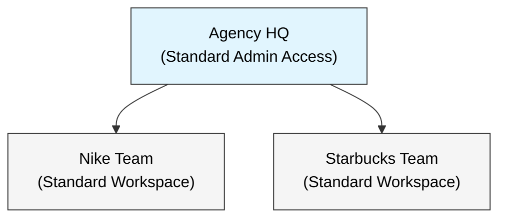

# Marketing Agency Use Case (CreativeEdge)

A standard RBAC configuration for a **Digital Marketing Agency** managing multiple client accounts. 
This use case demonstrates the **Core Platform Capabilities** without advanced compliance plugins.

## 1. Organization Structure

**Merlion Marketing** operates on a simple **Hub-and-Spoke** model:
1.  **Agency HQ:** Management (Owner/Admin) with visibility across all clients.
2.  **Client Teams:** Isolated workspaces for each client (e.g., "Nike Team", "Starbucks Team").



---

## 2. Role Portfolio

Standard SaaS roles. No complex "Clearance Levels" or "Geographic Restrictions".

| Category | Role Name | Type | Description |
| :--- | :--- | :--- | :--- |
| **Admin** | `owner` | **System** | **Full Admin**: Billing, Global Users, Clean-up. |
| **Director** | `account_director` | **Business** | **The Strategist**: Approves campaigns, manages team. |
| **Manager** | `account_manager` | **Business** | **The Organizer**: Manages roster & settings. No approval. |
| **Staff** | `creative_lead` | **Business** | **The Publisher**: Creates & Publishes. No roster mgmt. |
| **Staff** | `content_writer` | **Business** | **The Drafter**: Writes content. Cannot publish. |
| **Client** | `guest_review` | **Business** | **The Client**: Read-only oversight. |

---

## 3. Operational Model (Standard 2-Layer RBAC)

This use case uses the **Default Platform Behavior**:

1.  **System Role (Layer 1):** Determines if you can manage the *Subscriber Account* (e.g., invite users, pay bills).
2.  **Business Role (Layer 2):** Determines what you can do within a *Workspace* (e.g., edit campaigns).

**Why no plugins?**
*   No need for "Top Secret" clearance (everyone in the team trusts each other).
*   No need for "Geo-Fencing" (teams are separated by standard workspace boundaries).
*   No need for "Hierarchical teams" (teams are separated by standard workspace boundaries).


---

## 4. User Roster

| User | Email | System Role | Business Role | Team Context |
| :--- | :--- | :--- | :--- | :--- |

| **Owner** | `owner@merlionmarketing.com` | `owner` | - | All Teams |
| **Director** | `director@merlionmarketing.com` | `member` | `account_director` | Nike Team |
| **Manager** | `manager@merlionmarketing.com` | `member` | `account_manager` | Nike Team |
| **Designer** | `designer@merlionmarketing.com` | `member` | `creative_lead` | Nike Team |
| **Writer** | `copywriter@merlionmarketing.com` | `member` | `content_writer` | Nike Team |
| **Client** | `client@nike.com` | `guest` | `guest_review` | Nike Team |
| **Manager** | `sbux.manager@merlionmarketing.com` | `member` | `account_manager` | Starbucks Team |
| **Client** | `sbux.client@starbucks.com` | `guest` | `guest_review` | Starbucks Team |

---

## 5. Usage

```bash
# Option 1: Full Reset & Seed (Recommended for fresh demo)
make b2b-demo-marketing

# Option 2: Manual Setup (If DB is already running)
make b2b-seed-roles USE_CASE=marketing_agency
make b2b-invite-marketing
```

**Fixed Tenant ID:** `c6f2ea50-92a5-51d3-b4e5-5d233111cafe`
