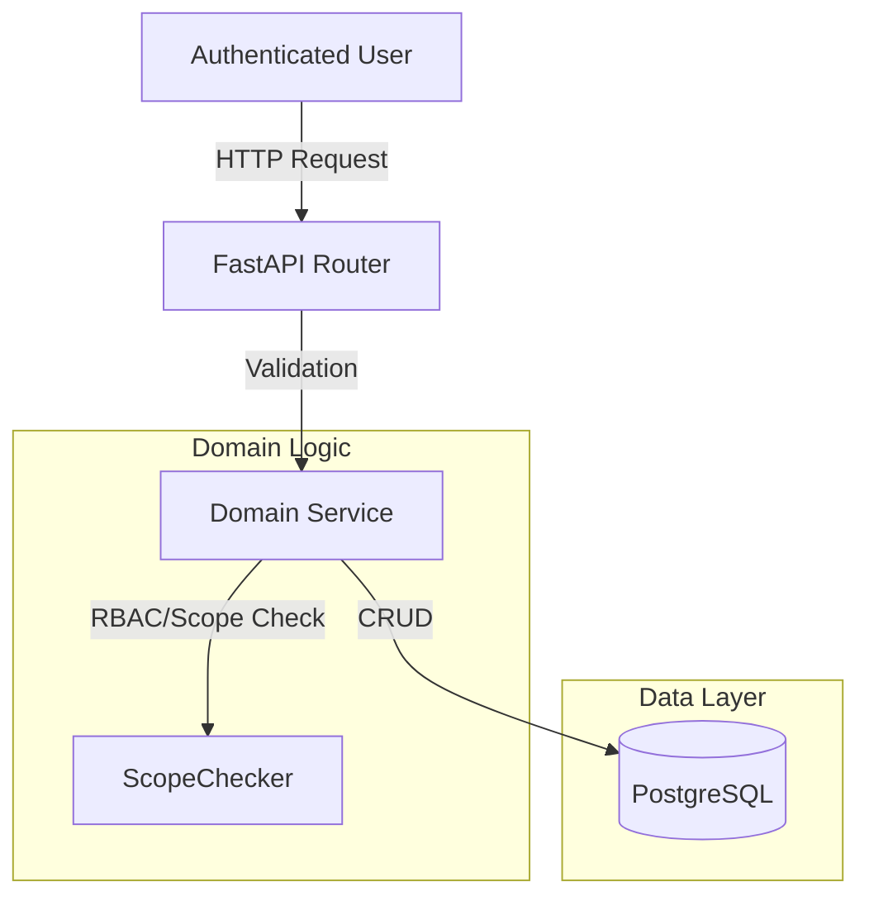

# Task Management (B2B)

## 1. Context
### Goal
Enable B2B teams to organize their work into Projects and Tasks, facilitating collaboration and tracking within a secure, team-scoped environment.

### User Stories
- **As a** Team Manager, **I want to** create Projects, **so that** I can organize my team's work.
- **As a** Team Member, **I want to** create Tasks in a Project, **so that** I can track my deliverables.
- **As a** User, **I want to** comment on tasks, **so that** I can discuss details with my colleagues.

### Key Business Rules
- **Team Isolation**: Projects and Tasks are strictly visible only to members of the specific Team they belong to.
- **Tenant Isolation**: Users from Tenant A cannot see any data from Tenant B.
- **Permission Scoping**: Only users with `projects:write` (Managers) can create projects; Viewers can only read.

## 2. Architecture
### Data Flow

### Key Components
- **Models**: `Project`, `Task`, `Comment`
- **Services**: `projects.py`, `tasks.py`, `comments.py`
- **API**: `/api/b2b/domain/task_management`

## 3. Database Schema
**Schema**: `b2b_project_management`

| Table Name | Description | Key Columns |
| :--- | :--- | :--- |
| `projects` | Workspaces for tasks within a team | `id` (PK), `team_id` (FK), `tenant_id` (FK), `created_by` (FK) |
| `tasks` | Individual work items | `id` (PK), `project_id` (FK), `assigned_to` (FK), `status`, `due_date` |
| `comments` | Discussion threads on tasks | `id` (PK), `task_id` (FK), `parent_comment_id` (FK) |

## 4. API Reference
| Method | Endpoint | Description | Permission |
| :--- | :--- | :--- | :--- |
| **Projects** | | | |
| `GET` | `/api/b2b/domain/task_management/projects` | List projects (scoped to user's teams) | `projects:read`|
| `POST` | `/api/b2b/domain/task_management/projects` | Create new project | `projects:write` |
| `GET` | `/api/b2b/domain/task_management/projects/{id}` | Get project details | `projects:read` |
| `PUT` | `/api/b2b/domain/task_management/projects/{id}` | Update project | `projects:write` |
| `DELETE` | `/api/b2b/domain/task_management/projects/{id}` | Delete project | `projects:delete` |
| **Tasks** | | | |
| `GET` | `/api/b2b/domain/task_management/tasks` | List tasks (filter by project/status) | `tasks:read` |
| `POST` | `/api/b2b/domain/task_management/tasks` | Create task | `tasks:write` |
| `PATCH` | `/api/b2b/domain/task_management/tasks/{id}/status` | Quick status update | `tasks:write` |
| **Comments** | | | |
| `POST` | `/api/b2b/domain/task_management/comments` | Add comment | `comments:write` |
| `GET` | `/api/b2b/domain/task_management/comments/task/{task_id}` | List comments for task | `comments:read` |
| `PUT` | `/api/b2b/domain/task_management/comments/{id}` | Edit comment | `comments:write` |
| `DELETE` | `/api/b2b/domain/task_management/comments/{id}` | Delete comment | `comments:delete` |

## 5. Key Workflows
### Project Creation
1. User submits Project details + `team_id`.
2. Service verifies User is a member of `team_id` (via `ScopeChecker`).
3. Service checks `projects:write` permission for the user in that team context.
4. Project is created in `b2b_project_management.projects`.

### Task Assignment
1. User creates a Task in a Project.
2. `assigned_to` can be set to any valid User ID (logic should ideally restrict to Team members, verified in service).
3. Task inherits `tenant_id` from the Project.

## 6. Dependencies & Configuration
- **Dependencies**:
  - `modules.b2b.services` (User/Team validation)
  - `core.db` (Database session)
- **Env Vars**: None specific.
