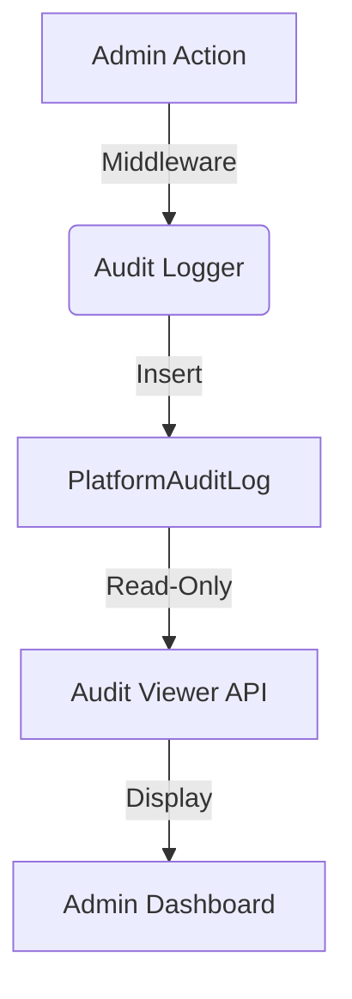

# Audit Logging (Platform)

## 1. Context
### Goal
Provide an immutable, tamper-evident record of all critical system actions performed by Platform Admins for compliance and security forensics.

### Target Platform
- [x] Web
- [ ] Mobile (iOS/Android)
- [ ] Backend API Only

### User Stories
- **As a Compliance Officer**, I want to export logs of all "Impersonation" events to prove we didn't access customer data without cause.
- **As a Security Lead**, I want to see who deactivated a Tenant and when.

### Key Business Rules
- **1. Immutability**: Logs cannot be updated or deleted via API.
- **2. Scope**: records `Action`, `Actor`, `Resource`, `Details`, `IP Address`.
- **3. Retention**: 90 Days hot storage (Postgres), archived to S3 afterwards (Future).

## 2. Architecture
### Data Flow

### Key Components
| Component | File | Description |
| :--- | :--- | :--- |
| **Model** | `models/audit.py` | `PlatformAuditLog` entity |
| **Service** | `middleware/audit.py` | Automatic interceptor (Future) |
| **Viewer** | `routers/audit.py` | Read-only API |

## 3. Database Schema
**Schema**: `platform`

| Table Name | Description | Key Columns |
| :--- | :--- | :--- |
| `platform_audit_log` | Event Stream | `id`, `action`, `actor_uid`, `resource_id`, `created_at` |

## 4. API Reference
**Base Path**: `/api/platform/audit`

### Log Access
| Method | Path | Description | Permission |
| :--- | :--- | :--- | :--- |
| `GET` | `/` | List/Filter logs | `audit:read` |
| `GET` | `/{id}` | detailed JSON payload | `audit:read` |

## 5. UI Requirements
### Components
- **Log Viewer**: Datagrid with filtering by Date Range, Actor, Action.
- **JSON Inspector**: Collapsible view for the `details` JSONB column.

### UX Rules
- **Read-Only**: No edit/delete buttons anywhere.
- **High Density**: Compact rows to scan timeline quickly.

## 6. Observability & Audit
### Metrics
- `count_audit_writes`
- `latency_audit_write`

## 7. Extensions
Not Applicable

## 8. Testing
### Critical Scenarios
- **Auto-Log**: Performing `create_tenant` automatically generates a log entry.
- **Security**: Regular admin cannot delete rows (DB level constraint).

### Test Location
- `backend/tests/e2e_api/platform/test_audit.py`
