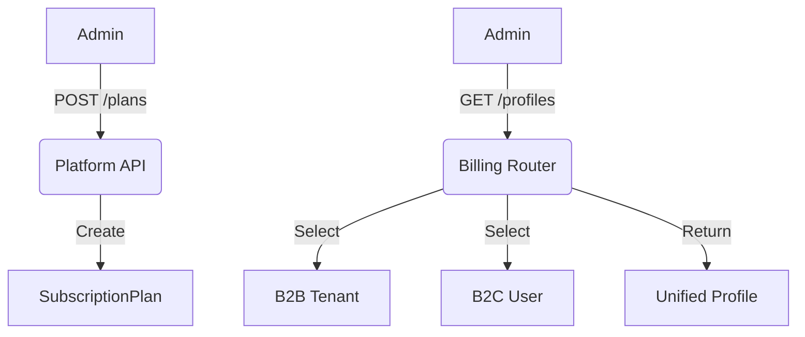

# Platform Billing & Plans

## 1. Context
### Goal
Centralize financial operations for the SaaS platform, allowing admins to manage Plans, Subscriptions, Invoices, and Coupons for both B2B Tenants and B2C Users.

### Target Platform
- [x] Web
- [ ] Mobile (iOS/Android)
- [ ] Backend API Only

### User Stories
- **As a Product Manager**, I want to create a new "Enterprise" Plan with higher limits.
- **As a Support Agent**, I want to refund a customer's invoice or extend their trial.
- **As a Marketing Manager**, I want to issue coupons for a holiday promotion.

### Key Business Rules
- **1. Unified View**: Admins can search for any "Billable Entity" (User or Tenant) by name/email/domain.
- **2. Payment Provider Agnostic**: The system abstracts Stripe/Razorpay details, but admins see the `provider_id`.
- **3. Plan Versioning**: Plans are never deleted, only Archived, to preserve historical data.

## 2. Architecture
### Data Flow

### Key Components
| Component | File | Description |
| :--- | :--- | :--- |
| **Router** | `routers/billing.py` | Profile search, Invoices, Coupons |
| **Router** | `routers/platform_b2b.py` | B2B Plan CRUD |
| **Router** | `routers/platform_b2c.py` | B2C Plan CRUD |
| **Service** | `modules/b2b/services/subscription_service.py` | Underlying logic |

## 3. Database Schema
**Schema**: `b2b` and `b2c` (Federated)

| Table Name | Description | Key Columns |
| :--- | :--- | :--- |
| `b2b_subscription_plans` | Enterprise Tiers | `tier_key`, `monthly_price`, `limits` |
| `b2c_subscription_plans` | Consumer Tiers | `tier_key`, `monthly_price`, `limits` |
| `coupons` | Discounts | `code`, `discount_type`, `valid_until` |

## 4. API Reference
**Base Path**: `/api/platform`

### Billing Operations
| Method | Path | Description | Permission |
| :--- | :--- | :--- | :--- |
| `GET` | `/billing/profiles/search` | Find User/Tenant | `billing:read` |
| `GET` | `/billing/profiles/{id}` | Get unified details | `billing:read` |
| `POST` | `/billing/subscriptions/{id}/cancel` | Force cancel | `billing:write` |
| `POST` | `/billing/invoices/{id}/refund` | Issue refund | `billing:write` |

### Plan Management
| Method | Path | Description | Permission |
| :--- | :--- | :--- | :--- |
| `GET` | `/b2b/plans` | List B2B plans | `billing:read` |
| `POST` | `/b2b/plans` | Create B2B plan | `billing:write` |
| `GET` | `/b2c/plans` | List B2C plans | `billing:read` |
| `POST` | `/b2c/plans` | Create B2C plan | `billing:write` |

## 5. UI Requirements
### Components
- **Plan Builder**: Form to define Features, Limits, and Pricing JSON.
- **Billing Profile View**: A "Customer 360" card showing active sub, invoice history, and quick actions (Refund, Cancel).
- **Coupon Generator**: Tool to create random codes or custom vanity codes.

### UX Rules
- **Formatting**: Always display amounts in human-readable format ($10.00), not cents (1000).
- **Confirmation**: "Refund" actions must require a reason text input.

## 6. Observability & Audit
### Audit Logs
- **Event**: `create_plan`, `archive_plan`, `refund_invoice`, `cancel_subscription`
- **Payload**: `plan_name`, `amount`, `reason`

### Metrics
- `mrr_total` (B2B + B2C)
- `count_active_subscriptions`
- `count_refunds_processed`

## 7. Extensions
Not Applicable

## 8. Testing
### Critical Scenarios
- **Plan Creation**: Plan appears in checkout API immediately.
- **Refund**: Stripe API is called -> Invoice marked refunded -> Email sent.
- **Search**: Can find a B2C user by email and a B2B tenant by domain.

### Test Location
- `backend/tests/e2e_api/platform/test_billing.py`
